79

МИНОБРНАУКИ РОССИИ

ВЛАДИВОСТОКСКИЙ ГОСУДАРСТВЕННЫЙ УНИВЕРСИТЕТ

ИНЖЕНЕРНАЯ ШКОЛА

КАФЕДРА ИНФОРМАЦИОННЫХ ТЕХНОЛОГИЙ И СИСТЕМ

`         `РЕКОМЕНДОВАНО

`									         `к защите

зав. кафедрой ИТС

`          `канд. экон. наук, доцент

`        `\_\_\_\_\_\_\_\_\_\_\_\_Е.В.Кийкова

Бакалаврская работа

Разработка системы управления чек-листами мониторинга оборудования дата-центра

Б-ПИ-20-149390. 521-с. 7. 000. ПЗ

Студент

гр. БПИ-20-02								И. Р. Курдюков

Руководитель

Профессор									В. М. Гриняк

Владивосток 2024

МИНОБРНАУКИ РОССИИ

ВЛАДИВОСТОКСКИЙ ГОСУДАРСТВЕННЫЙ УНИВЕРСИТЕТ

ИНЖЕНЕРНАЯ ШКОЛА

КАФЕДРА ИНФОРМАЦИОННЫХ ТЕХНОЛОГИЙ И СИСТЕМ

УТВЕРЖДАЮ

Заведующий кафедрой

канд. экон. наук, доцент

Кийкова Е. В.

«\_\_\_\_» \_\_\_\_\_\_\_\_\_\_2024

ЗАДАНИЕ

на бакалаврскую работу

Студенту гр. БПИ-20-02 Курдюкову Илье Романовичу

1 Тема работы: Разработка системы управления чек-листами мониторинга оборудования дата-центра

Утверждена приказом по университету \_\_\_\_\_\_ от \_\_\_\_\_\_\_\_\_\_\_\_

2 Срок сдачи работы:     июля 2024 г.

3 Исходные данные по работе: чек-листы обходов на бумажном носителе

4 Содержание бакалаврской работы:

Введение: определить объект исследования, описать решаемые задачи.

1. 1. Обзор предметной области и постановка задачи.

Определить цель и задачи разработки мобильного приложения.

Определить и описать предметную область разрабатываемого приложения.

1. 1. Проектирование системы

Определить архитектуру информационной системы.

Определить архитектуру мобильного приложения

Спроектировать структуру системы, базу данных и пользовательский интерфейс.

1. 1. Разработка информационной системы

Определения требований к системе

Написание сценариев тестирования и создание матрицы покрытия требований тестами

Описание средств разработки

Тестирование

Заключение: сделать выводы по проделанной работе, описать решённые задачи.

Список использованных источников 18: составить список литературы с использованием профессиональных баз данных и профессиональных Интернет-ресурсов.

Приложения: описание безопасности жизнедеятельности, рисунки.

5 Раздаточные материалы для членов ГАК (расчеты, рисунки формата А4) – \_\_\_ экземпляр\_\_

6 Календарный график работ

Введение: 24.04.2024

Первая глава: 01.05.2024

Вторая глава: 15.05.2024

Третья глава: 05.06.2024

Заключение: 13.06.2024

Время консультаций: понедельник 13:30 – 14:30

Электронная почта руководителя: Viktor.Grinyak@vvsu.ru

Телефон руководителя: 8 (423) 240-40-66

7 Срок предоставления ВКР на кафедру: 

8 Консультант по нормоконтролю – \_\_\_\_\_\_\_\_\_\_\_\_\_\_\_\_\_\_\_\_\_\_\_\_\_\_\_\_\_\_\_\_\_\_\_

Дата выдачи задания: 24.04.2024

Руководитель ВКР

канд. техн. наук, профессор 						В. М. Гриняк

Задание получил: 								И. Р. Курдюков

# Аннотация
Выпускная квалификационная работа на тему: Разработка системы управления

чек-листами мониторинга оборудования дата-центра 

Выполнил – Курдюков И. Р.

Руководитель – Гриняк В.М.

Выпускная квалификационная работа выполнена на 79 страниц и содержит 76 рисунков и 2 приложения

Цель выпускной квалификационной работы – разработать систему управления чек-листами мониторинга оборудования дата-центра.

Первый раздел описывает характеристику компании и ее информационной систем, анализ существующих аналогов и обзор видов чек-листов на предприятии.

Во втором разделе проводится проектирование мобильного приложения управления чек-листами мониторинга.

В третьем разделе описывается разработка интерфейса, технические требования, написание сценариев тестирования, матрица покрытия требований тестами, обзор средств разработки, сценарии использования.

В четвёртом разделе проводится анализ затрат на разработку проекта и технико-экономическое обоснование разработки.

Содержание

[Аннотация	4](#__refheading___toc44127_3773368446 "#__RefHeading___Toc44127_3773368446")

[Введение	7](#__refheading___toc1448_2014034274 "#__RefHeading___Toc1448_2014034274")

[1 Общая характеристика предметной области	8](#__refheading___toc1454_2014034274 "#__RefHeading___Toc1454_2014034274")

`    `[1.1 Характеристика предприятия ООО «Кей Поинт»	8](#__refheading___toc1456_2014034274 "#__RefHeading___Toc1456_2014034274")

`    `[1.2 Состояние и стратегия развития информационных технологий в организации	11](#__refheading___toc1488_2014034274 "#__RefHeading___Toc1488_2014034274")

`    `[1.3 Изучение слабых мест предприятия	13](#__refheading___toc1486_2014034274 "#__RefHeading___Toc1486_2014034274")

`    `[1.4 Обзор решений аналогов	13](#__refheading___toc1484_2014034274 "#__RefHeading___Toc1484_2014034274")

`    `[1.5 Описание предметной области	15](#__refheading___toc1482_2014034274 "#__RefHeading___Toc1482_2014034274")

`          `[1.5.1 Чек-лист	15](#__refheading___toc1490_2014034274 "#__RefHeading___Toc1490_2014034274")

`          `[1.5.2 АСДУ	16](#__refheading___toc1494_2014034274 "#__RefHeading___Toc1494_2014034274")

`          `[1.5.3 Система учета оборудования и база данных	17](#__refheading___toc1492_2014034274 "#__RefHeading___Toc1492_2014034274")

`    `[1.6 Знакомство с оборудованием	19](#__refheading___toc1480_2014034274 "#__RefHeading___Toc1480_2014034274")

`    `[1.7 Выводы по главе	19](#__refheading___toc1476_2014034274 "#__RefHeading___Toc1476_2014034274")

[2 Проектирование информационной системы	21](#__refheading___toc1452_2014034274 "#__RefHeading___Toc1452_2014034274")

`    `[2.1 Варианты использования системы	21](#__refheading___toc1474_2014034274 "#__RefHeading___Toc1474_2014034274")

`    `[2.4 Архитектура информационной системы	21](#__refheading___toc1472_2014034274 "#__RefHeading___Toc1472_2014034274")

`    `[2.5 Архитектура мобильного приложения	24](#__refheading___toc2995_449351550 "#__RefHeading___Toc2995_449351550")

`          `[2.5.1 MVC(Model-View-Controller)	25](#__refheading___toc3001_449351550 "#__RefHeading___Toc3001_449351550")

`          `[2.5.2 MVP(Model-View-Presenter)	25](#__refheading___toc2999_449351550 "#__RefHeading___Toc2999_449351550")

`          `[2.5.3 MVVM(Model-View-ViewModel)	26](#__refheading___toc2997_449351550 "#__RefHeading___Toc2997_449351550")

`          `[2.5.4 Выбор архитектуры	27](#__refheading___toc7538_449351550 "#__RefHeading___Toc7538_449351550")

`    `[2.6 Схема потоков данных приложения	27](#__refheading___toc2993_449351550 "#__RefHeading___Toc2993_449351550")

`    `[2.6 Структура мобильной базы данных	31](#__refheading___toc1468_2014034274 "#__RefHeading___Toc1468_2014034274")

`    `[2.8 Проектирование пользовательского интерфейса	33](#__refheading___toc1462_2014034274 "#__RefHeading___Toc1462_2014034274")

`    `[2.9 Выводы по главе	43](#__refheading___toc1460_2014034274 "#__RefHeading___Toc1460_2014034274")

[3 Разработка информационной системы	44](#__refheading___toc1450_2014034274 "#__RefHeading___Toc1450_2014034274")

`    `[3.1 Требования к информационной системе	44](#__refheading___toc77_2027328459 "#__RefHeading___Toc77_2027328459")

`    `[3.2 Описание средств разработки	45](#__refheading___toc3834_2779935773 "#__RefHeading___Toc3834_2779935773")

`    `[3.3 Сценарии тестирования	48](#__refheading___toc15215_1798769088 "#__RefHeading___Toc15215_1798769088")

`    `[3.4 Матрица покрытия требований тестами.	55](#__refheading___toc541_1215257555 "#__RefHeading___Toc541_1215257555")

`    `[3.5 Результаты тестирования	55](#__refheading___toc3896_817455550 "#__RefHeading___Toc3896_817455550")

`          `[3.5.1 Тест создания чек-листа	55](#__refheading___toc3932_817455550 "#__RefHeading___Toc3932_817455550")

`          `[3.5.2 Тест редактирования чек-листа	57](#__refheading___toc3930_817455550 "#__RefHeading___Toc3930_817455550")

`          `[3.5.3 Тест создания запланированного чек-листа	57](#__refheading___toc3928_817455550 "#__RefHeading___Toc3928_817455550")

`          `[3.5.4 Тест автоматического создания чек-листов	58](#__refheading___toc3926_817455550 "#__RefHeading___Toc3926_817455550")

`          `[3.5.5 Тест уведомления о правильном выполнении обхода	58](#__refheading___toc3924_817455550 "#__RefHeading___Toc3924_817455550")

`          `[3.5.6 Тест уведомления о неправильном выполнении обхода	58](#__refheading___toc3922_817455550 "#__RefHeading___Toc3922_817455550")

`          `[3.5.7 Тест просмотра активных чек-листов	58](#__refheading___toc3920_817455550 "#__RefHeading___Toc3920_817455550")

`          `[3.5.8 Тест заполнения чек-листов во время обхода	59](#__refheading___toc3918_817455550 "#__RefHeading___Toc3918_817455550")

`          `[3.5.9 Тест фильтрации чек-листов на экране списка обходов по дате начала	59](#__refheading___toc3916_817455550 "#__RefHeading___Toc3916_817455550")

`          `[3.5.10 Тест фильтрации чек-листов на экране просмотра списка обходов по дате окончания	60](#__refheading___toc3914_817455550 "#__RefHeading___Toc3914_817455550")

`          `[3.5.11 Тест просмотра списка оборудования	60](#__refheading___toc3912_817455550 "#__RefHeading___Toc3912_817455550")

`          `[3.5.12 Тест работы в офлайн режиме с синхронизацией данных	60](#__refheading___toc3910_817455550 "#__RefHeading___Toc3910_817455550")

`          `[3.5.13 Тест поиска чек-листа по номеру и исполнителю	60](#__refheading___toc3908_817455550 "#__RefHeading___Toc3908_817455550")

`          `[3.5.14 Тест фильтрации чек-листов по статусу	61](#__refheading___toc3906_817455550 "#__RefHeading___Toc3906_817455550")

`          `[3.5.15 Тест сканирования QR-кодов для идентификации оборудования	63](#__refheading___toc3904_817455550 "#__RefHeading___Toc3904_817455550")

`          `[3.5.16 Тест добавления комментариев к выполненному чек-листу	63](#__refheading___toc3902_817455550 "#__RefHeading___Toc3902_817455550")

`          `[3.5.17 Тест создания шаблона чек-листа	63](#__refheading___toc3900_817455550 "#__RefHeading___Toc3900_817455550")

`          `[3.5.18 Тест создания шаблона списка задач оборудования	63](#__refheading___toc3898_817455550 "#__RefHeading___Toc3898_817455550")

`    `[3.6 Примеры использования системы	64](#__refheading___toc3894_817455550 "#__RefHeading___Toc3894_817455550")

`    `[3.7 Выводы по главе	71](#__refheading___toc44129_3773368446 "#__RefHeading___Toc44129_3773368446")

[4 Технико-экономическое обоснование эффективности вложений в разработку мобильного приложения	72](#__refheading___toc5978_3261049787 "#__RefHeading___Toc5978_3261049787")

`    `[4.1 Расчет стоимости трудозатрат по проекту	72](#__refheading___toc5976_3261049787 "#__RefHeading___Toc5976_3261049787")

`    `[4.2 Смета прямых затрат на разработку мобильного приложения	73](#__refheading___toc5974_3261049787 "#__RefHeading___Toc5974_3261049787")

`    `[4.3 Финансовая модель проекта	73](#__refheading___toc5972_3261049787 "#__RefHeading___Toc5972_3261049787")

`    `[4.4 Выводы об окупаемости проекта	74](#__refheading___toc5970_3261049787 "#__RefHeading___Toc5970_3261049787")

[Заключение	75](#__refheading___toc2414_3343839399 "#__RefHeading___Toc2414_3343839399")

[Список использованных источников	76](#__refheading___toc544_1215257555 "#__RefHeading___Toc544_1215257555")

[**Приложение А**	78](#__refheading___toc19815_2920207908 "#__RefHeading___Toc19815_2920207908")

[**Приложение В**	80](#__refheading___toc44131_3773368446 "#__RefHeading___Toc44131_3773368446")
**

# Введение
В современном бизнесе обработка и хранение данных становятся ключевыми аспектами деятельности каждой компании. Для небольших предприятий размещение оборудования в собственном здании является экономически обоснованным решением. Однако, для крупных компаний такой подход может быть рискованным из-за возможных простоев при отключении электроэнергии или интернета. В таких случаях необходимы значительные ресурсы для обеспечения надежности, начиная от выбора местоположения и заканчивая созданием дополнительных инфраструктурных систем. Вместо этого, обращение в Центр Обработки Данных (ЦОД), сертифицированный согласно стандартам, таким как Tier от "Uptime Institute", становится более разумным выбором.[1]

ЦОД, как в случае компании "Кей Поинт" с сертификатом Tier III, специализируется на создании надежных пространств для обработки и хранения данных. Их главная задача - обеспечить бесперебойную работу сетевого оборудования. Инженеры ежедневно проводят проверки инфраструктурных помещений, а компания, соответственно, обеспечивает высокую отказоустойчивость.[2]

В моей практике возникла необходимость взаимодействия с инженерами, где стало ясно, что чек-листы для регламентных мероприятий еще в большинстве случаев осуществляются на бумаге. Разработанная мной информационная система призвана автоматизировать этот процесс, заменяя бумажные отчеты электронными. Система предоставляет возможность контроля выполнения задач и уменьшает использование бумажных носителей.

Информационная система, разработанная мной, выступает в роли чек-листа, размещаясь на планшетах, которые сотрудники используют в ходе работы. Они могут легко сканировать QR-коды на оборудовании, сигнализируя о выполнении проверок, и после завершения обхода отправлять отчеты в базу данных. Также система предоставляет инструменты для создания и редактирования чек-листов, уменьшая тем самым необходимость в бумажной документации.

Мобильное приложение будет сообщать главному инженеру о не полностью или вообще не выполненных чек-листах и предоставлять возможность создания шаблонов обходов, для повышения эффективности работы инженерного отдела.

# 1 Общая характеристика предметной области
## 1.1 Характеристика предприятия ООО «Кей Поинт»
Полное наименование: OOO «КЕЙ ПОИНТ»

Краткая информация: дата-центр Key Point - провайдеронезависимый ЦОД уровня отказоустойчивости Tier III по классификации UPTIME Institute.

Основные виды деятельности компании: обеспечение требуемого уровня надежности работы IT-оборудования, размещаемого в машинных залах ЦОД, с точки зрения всех инженерных систем: 

\- физического пространства для размещения;

\- сетей передачи данных;

\- электроснабжения требуемого уровня надежности и качества;

\- температурно-влажностного режима;

\- дистанционного мониторинга и управления инженерными системами;

\- физической защиты;

\- пожарной безопасности;

\- эксплуатационной устойчивости.

Миссия и основные бизнес-цели компании: основной бизнес-целью компании является заработок через аренду места под сетевое и коммуникационное оборудование и оказание разнообразных услуг, а также консультаций по обеспечению его бесперебойной работы во время эксплуатации. Стоит отметить, что проект финансируется, в том числе за счет средств льготного механизма финансирования приоритетных инвестиционных проектов на территории ДФО при поддержке ВЭБ.РФ.

Номенклатура продукции или услуг:

\- аренда стойко-места;

\- инсталляция;

\- аренда стойки 19” 48U;

\- аренда PDU;

\- Smart-Hands (Услуга по технической, организационной, административной и иной помощи Клиенту, в том числе и без непосредственного присутствия Клиента в Дата-центре.);

\- монтаж;

\- кроссировка;

\- организация дополнительного СКУД;

\- организация дополнительной системы видеонаблюдения;

\- организация дополнительного ограждения;

\- предоставление внутристоечного АВР;

\- аренда офисных помещений;

\- аренда вспомогательных помещений;

\- аренда сейфовой ячейки;

\- аренда инфраструктуры для организации кабельных трасс;

\- выдача ТУ.

Описание организационной структуры предприятия с описанием основных подразделений:

Организационная структура представлена в виде диаграммы (рис. 1).

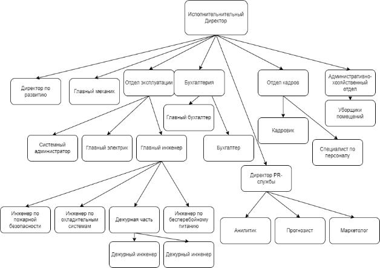

Рисунок 1 – Организационная структура «Кей Поинт»

Отдел эксплуатации занимается тем, что контролирует и обеспечивает бесперебойную роботу оборудования, размещённого в стойках проводя все виды работ на предприятии.

Системный администратор контролирует работу Web-сервера, локальной сети, ПО, сети интернет, рабочих компьютеров и системы видео наблюдения, установленной по периметру. Также он занимается сборкой, монтажом и развёртыванием серверов, на которых впоследствии разворачивает сервисы, базы дынных, системы резервного копирования и клиентские службы.

Холодильщик отвечает за работу кондиционеров, размещённых на всей территории здания и работу охладительных установок, обеспечивающих охлаждение клиентского оборудования, находящегося в стойках.

Инженер по пожарной безопасности вводит в эксплуатацию систему пожарной безопасности на объекте и контролирует её работоспособность.

Главный инженер распределяет сотрудникам задачи по составленному им плану работ или по плану предоставленным начальством, также он отчитывается перед начальством о проделанных ремонтных работах и выполненных задачах. Ещё главный инженер составляет план закупок требуемого оборудования, если, например, его недостаточно для проведения ремонта или обслуживания.

Инженер по бесперебойному питанию контролирует работу ИБП (Источник Бесперебойного Питания) и состояние аккумуляторов, которые будут задействованы в случае отключения электроэнергии в дата-центре.

Дежурная часть в реальном времени контролирует работу ЦОД, реагирует на аварии и устраняют их. Если устранить аварию в короткий срок невозможно, то они информируют главного инженера и то в свою очередь разрабатывает план действий. В отделе находится около 10 инженеров, которые работают парами посменно.

Зона ответственности главного электрика распространяется на: 

\- контролирует работу электросетей;

\- оперативно восстанавливает электроснабжение в случае его отключения или провала напряжения.

Главный механик отвечает за работу вычислительного оборудования. Он также отвечает за составления плана закупок

Бухгалтерия ведет бухучет финансовой и хозяйственной деятельности компании, осуществляет контроль над собственностью предприятия.

Кадровик занимается отбором персонала на должности.

Специалист по кадрам ведёт архив личных дел работников организации, документальным оформлением приема, увольнения и передвижения на другие должности сотрудников компании, воинским учетом, оформлением пенсий, отпусков и графиков.

Исполнительный директор выполняет роль генерального директора. В его обязанности входит: 

\- отслеживание финансов;

\- управление логистикой;

\- контроль производства;

\- закупки компании;

\- управление сотрудниками;

\- подготовка отчетов для генерального директора.

Директор по развитию решает глобальные задачи, выводит компанию на разные рынки, популяризируя её среди клиентов, инвесторов и партнеров, повышая долю прибыли, выполняя другие задачи, которые так или иначе связаны с развитием. Он контролирует процесс выполнение ребрендинга и брендинга, открывает новые филиалы, тестирует сотрудников, решая, кого оставить, а кого отправить на обучение.

К основным обязанностям директора PR-службы относится:

\- создание и курирование кампаний по продвижению фирмы;

\- ведение переговоров со СМИ;

\- создание статей, организация и проведение пресс-коференций;

\- мониторинг рынка конкурентов;

\- проведение анализа по эффективности выполненных мероприятий.

Под руководством директора PR-службы находятся аналитик и маркетолог.

Обязанности аналитика заключаются в:

\- сбор данных;

\- обработка данных;

\- сегментирование больших объёмов данных;

\- анализ данных;

\- представление выводов в понятном виде.

Маркетолог отвечает за:

\- разработка и запуск маркетинговых активностей;

\- систематизация и анализ данных об эффективности рекламы;

\- составление портрета покупателя;

\- анализ рынка и конкурентов;

\- поиск точек роста;

\- создание контент-плана и стратегии продвижения контента.
## 1.2 Состояние и стратегия развития информационных технологий в организации
Степень автоматизации процессов в подразделении компании: степень автоматизации определим с помощью шкалы уровня автоматизации (LOA)(рис.2).[3]

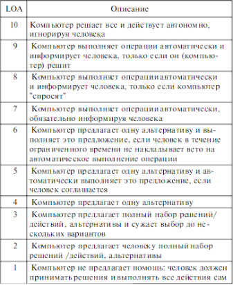

Рисунок 2 - 10 уровней автоматизации (LOA) по Т. Шеридану и В. Вепланку

В компании «Кей Поинт» мониторинг производится с помощью веб-приложения ЦОД-мониторинг. Степень автоматизации данного процесса можно оценить на 6 (рис. 2), так как при срабатывании любого из датчика мониторинга, установленных непосредственно на технических модулях, например, система пожаротушения или система контроля напряжения, подаётся звуковой сигнал, который сигнализирует об аварии и подсвечивает место происшествия. В случае с пожарной системой, при ложном срабатывании датчика из-за высокой влажности, ЦОД-мониторинг предлагает отключить сигнал с данного юнита.

Что касается бухгалтерского и налогового учётов они построены на системе 1С-Бухгалтерия. Данный процесс можно оценить на 3 (рис. 2).

ЦОД исходя из названия покрывает области хранения и обработки больших данных.

Определение уровня зрелости ИТ процессов по стандарту CMMI [4]:

Уровень степени автоматизации процессов по классификации CMMI можно определить, как Управляемый, т. е. степень автоматизации процессов в настоящий момент развивается, она не стабильна.

Уровень покрытия функциональных областей можно определить, как Управляемый, т. е. степень покрытия функциональных областей в настоящий момент стабильна, есть база накопленных знаний.

Уровень зрелости ИТ процессов можно определить, как Установленный, т. е. ИТ-процессы являются определенными, установленными и документированными, не зависящий от отдельных личностей.

Наличие в компании программно-аппаратных комплексов, технических устройств, корпоративных информационных систем и других ИС для эффективного управления предприятием:

В компании Кей Поинт присутствует корпоративная система мониторинга «ЦОД-мониторинг», сеть компьютеров, подключенных к локальной сети и сети интернет, стационарные телефоны, рации, система видеонаблюдения, пакет офисных программ «МойОфис», «1С-Предприятие».
## 1.3 Изучение слабых мест предприятия
Во время прохождения практики я работал с двумя отделами: ИТ-отдел и инженерный отдел. Работа в ИТ-отделе заключалась в установке клиентского или корпоративного оборудования с последующей настройкой. Так же моими задачами была развертка программного ПО, таких как FireSecNT, Netbox, МойОфис.  Во время работы в ИТ-отделе мной не было замечено аспектов, требующих автоматизации. 

Практика в инженерном отделе была в основном связана со слесарными работами: продувка ИБП (источники бесперебойного питания), чистка щитов, сборка коммуникационных стоек и гермозон, прокладывание кабелей питания и связи. Во время работы выяснилось что в обязанности дежурных инженеров входят ежедневные обходы, утренний и вечерний. Обходы не выполняются просто так по всему оборудованию, для каждого дня главный инженер составляет план, печатает и предоставляет дежурной смене. Такой способ не очень удобен из-за того, что главному инженеру приходиться самостоятельно вписывать всё оборудование и список задач с ним в документ, потом отправлять на печать. Дежурным инженерам приходиться ходить с бумагой и искать что-то что можно положить под неё для написания чего-либо или проблемой могут стать потоки воздуха, создаваемые кондиционерами или оборудованием, которые будут загибать её и тем самым мешать отмечать пункты или писать примечания. Тем самым разработка приложения для ведения электронных чек-листов сможет облегчить процесс создания и их выполнения.
## 1.4 Обзор решений аналогов
Для чек-листов существует множество приложений для Android. Такими приложениями являются «Мои дела: Ежедневник-Планер», «Список дел: планер напоминания» и остальные приложения такого рода. Эти приложения не предназначены для обходного чек-листа, тем что отсутствуют специализированные поля и экраны для оборудования. Второй недостаток – сами чек-листы могут храниться только в памяти телефона, что не подходит для хранения и передачи. Также многим приложениям требуется подписка для использования после пробного периода или для разблокировки важных функций, таких как «Подзадачи» в приложении «Мои дела» (рисунок 3).

Рисунок 3 – Магазин в приложении «Мои дела»

Немаловажным является то, что в приложении «Мои дела» для хранения и передачи данных требуется войти в аккаунт. Аккаунт может быть самостоятельно зарегистрирован в приложении, что подразумевает хранение личных данных сотрудников на стороннем сервере, что не безопасно или аккаунт может быть Google, что повлечёт за собой покупку корпоративных аккаунтов, что будет является чрезмерной тратой (рисунок 4).

Рисунок 4 – Экран входа в приложение «Мои дела»

Также в обходном чек-листе «Key Point» зачастую присутствуют повторяющиеся задачи относящиеся к разному оборудованию, было бы удобно если бы приложение имело второй параметр для группировки в данных приложениях этого нет (рисунок 5). Также, как и нет сканера QR-кода для считывания наклеек расположенных на оборудовании и тем самым отслеживая выполнение.

Рисунок 5 – Экран списка задач в приложении «To-do List»

Существует ещё 1С ТоИР, которое соответствует всем требованиям, но его внедрение требует больших средств, также дополнительных вложений потребует настройка приложения под дата-центр (удаление лишнего, добавление нужного функционала). Компания отказалась от данного варианта из-за своей дороговизны.

Из приложения 1С можно подчеркнуть функцию хранения документов к оборудованию внутри карточек (рисунок 6).

Рисунок 6 – Экран создания оборудования в приложении 1С ТоИР

Вывод из разбора конкурентов следующий: конкуренты есть но они не подходят по функционалу к требуемой задаче, а если и соответствуют, то требуют больших вложений средств для их интеграции на предприятие.
## 1.5 Описание предметной области
### **1.5.1 Чек-лист**
Для начала рассмотрим основу приложения, а именно структуру чек-листа. На рисунке 7 представлен чек-лист вечернего обхода.

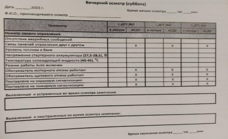

Рисунок 7 — Вечерний чек-лист

На фотографии можно увидеть дату и время начала и конца осмотра. Нужно это чтобы контролировать работу дежурных инженеров. Само содержание чек-листа посвящено ДГУ. ДГУ расшифровывается как дизельгенераторная установка и обычно она находиться не в работе и заводиться только при потери электроэнергии от основных вводов. Всего в ЦОД 2 технологических модуля, B и С, в каждом из низ находиться по 3 ДГУ. В данном чек-листе требуется выполнить осмотр ДГУ в C модуле. В колонке «Параметр» находится глобальный раздел, в данном случае это «Осмотр панели управления», дальше идёт список параметров, которые нужно проверить. Прямо напротив располагаются поля для пометок о выполнении. Они в свою очередь делятся на два типа: в натуре и АСДУ. В натуре означает что нужно лично идти к оборудованию, осматривать его и приборы, потом фиксировать. Колонка АСДУ нужна для проверки данных через ПО, также можно заметить, что там могут находить крестики, они показывают то, что в программе отсутствуют данные по отмеченным пунктам. В самом конце есть два поля для записи замечаний выявленных во время осмотра.
### **1.5.2 АСДУ**
АСДУ расшифровывается как — Автоматизированная Система Диспетчерского Управления. Эта система предназначена для автоматизации и централизированного контроля различных процессов.

На предприятии АСДУ выполняет следующие функции:

\- мониторинг оборудования: система отслеживает состояние оборудования, такого как, системы охлаждения и электроснабжения;

\- контроль энергопотребления: отслеживание энергопотребления для оптимизации роботы ЦОД.

Часть монитора АСДУ представлена на рисунке 8.

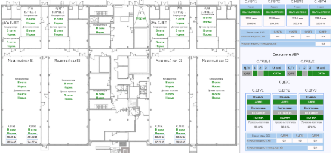

Рисунок 8 — АСДУ

Справа можно увидеть те самые С.ДГУ используемые в чек-листе. Перейдём в них и посмотрим какие данные видят инженеры.(рис. 9)

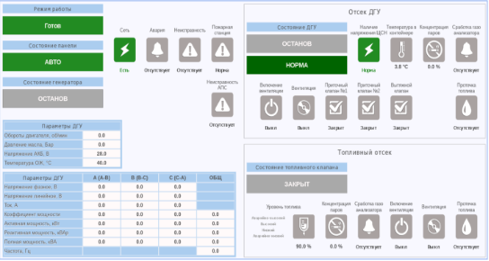

Рисунок 9 — Страница ДГУ в АСДУ

Во время обхода инженеры заходят на оборудование в АСДУ и переписывают данные со страницы. Как можно увидеть все данные для чек-листа, вечернего обхода, по ДГУ имеются и инженеры без проблем могут заполнить требуемые поля.
### **1.5.3 Система учета оборудования и база данных**
На предприятии ЦОД «Кей Поинт» развёрнута система учета оборудования и управления техническим обслуживанием. В эту систему инженеры заносят данные о оборудовании через веб-интерфейс с использованием ПК. Сервер системы учета состоит из 3 частей:

\- веб-сервер;

\- сервер системы учета;

\- база данных системы учета.

В качестве веб-сервера используется Apache[5]. Apache HTTP Server — это свободное программное обеспечение, с помощью которого можно создать веб-сервер. Основными достоинствами Apache считаются надёжность и гибкость конфигурации[6]. Он позволяет подключать внешние модули для предоставления данных, использовать СУБД для аутентификации пользователей, модифицировать сообщения об ошибках и т. д.

Сервер системы учета принимает данные с ввода и сохраняет в базу данных.

В качестве базы данных используется PostgreSQL. PosgreSQL — это реляционная база данных с открытым исходным кодом. Популярностью у разработчиков и администраторов обязана своей исключительной гибкости и целостности. Дополнительно база данных postgreSQL поддерживает как реляционные, так и не реляционные запросы[7]. Эту базу данных мы будем читать и забирать с неё информацию о оборудовании. На рисунке 10 показана структура БД сервера учета.

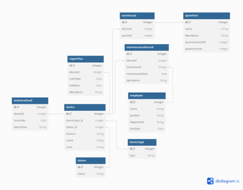

Рисунок 10 — Схема БД сервера учета

Для приложения нужно будет взять информацию из таблиц: device, status и deviceType. Полученные данные приложение будет подставлять в поля при заполнении чек-листа. Все остальные таблицы не понадобятся.
## 1.6 Знакомство с оборудованием
На предприятии «Кей Поинт» для инженерной бригады выделено 2 мобильных устройства изображённых на рисунке 11.

Рисунок 11 – Изображение планшета

Под этот планшет будет разрабатываться дизайн приложения. Планшет марки Sumsung c диагональю 10.5 и разрешением 1920x1080. Операционная система – Andriod 12. Каждый планшет имеет доступ в интернет и подключается к точкам доступа размещённых по всей территории предприятия, но присутствуют зоны, где подключение пропадает, например, подпол или вентиляционное помещение, расположенное на крыше. Из этого можно выделить требование к приложению – возможность работы без подключения к интернету.
## 1.7 Выводы по главе
В рамках главы было описано предприятие и его организационная структура. Было выполнено исследование состояния и стратегии развития информационных технологий на предприятии. Были выявлены слабые места предприятия и способ их решения. Также был произведён анализ решений аналогов. В каждом из них были выделены минусы, плюсы и почему их не стоит использовать на предприятии.

Была описана предметная область, а именно структура чек-листа, АСДУ и система учета оборудования. Также был выполнен обзор оборудования на котором информационная система будет использоваться.
# 2 Проектирование информационной системы
## 2.1 Варианты использования системы
Для описания вариантов использования системы на рисунке 12 представлена диаграмма прецедентов (use-case Diagram)[8].

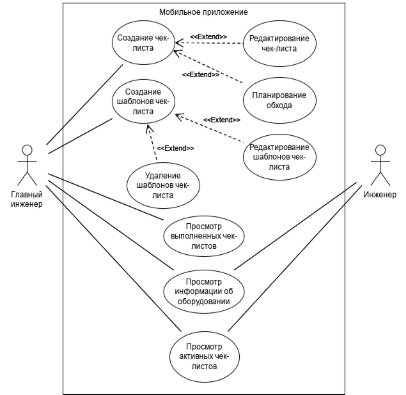

Рисунок 12 – Диаграмма прецедентов

Как показано на диаграмме, приложение могут использовать 2 актёра - главный инженер и инженер.

Главный инженер может создавать чек-листы, редактировать их и планировать выполнение.

Главный инженер может создавать, редактировать и удалять шаблоны чек-листов, это включает в себя и шаблоны списка задач оборудования.

Главный инженер может просматривать списки выполненных и запланированных чек-листов.

Оба пользователя могут просматривать информацию о оборудовании.

Оба пользователя могут просматривать активные чек-листов.
## 2.4 Архитектура информационной системы
Для взаимодействия системы учета и мобильного приложения будет использоваться архитектура «клиент-сервер». Клиент-серверная архитектура – это структурный подход в информационных технологиях, при котором приложение делится на две основные компоненты клиент и сервер[9]. Каждая из этих компонент обладает определённой ролью и выполняет определённые функции:

- клиент отвечает за отправку запросов и обработку полученных данных от сервера;
- сервер отвечает за управление ресурсами, обработку бизнес-логики, управления данными и обеспечения безопасности;

  Причины использования модели клиент-сервер:

  - клиент и сервер могут работать на разных устройствах, что позволяет эффективнее использовать ресурсы и обеспечивать легкость масштабирования системы;

  - сервер содержит централизированное хранилище данных, обеспечивая единый источник правды;

  - защита данных может быть более эффективной, так как сервер может контролировать доступ и права клиентов;

  - распределение обязанностей между клиентом и сервером позволяет оптимизировать производительность, так как сервер может отвечать за обработку данных и клиент за отрисовку интерфейса. Так как в качестве клиента будет использоваться мобильное устройство, данная особенность будет играть весомую роль;

  Есть 2 варианта реализации данной информационной системы. Первый заключается в написании веб-приложения, которое будет располагаться на сервере и подгружать данные по запросу на клиент.

  На рисунке 13 показана архитектура информационной системы с использованием веб-приложения.

  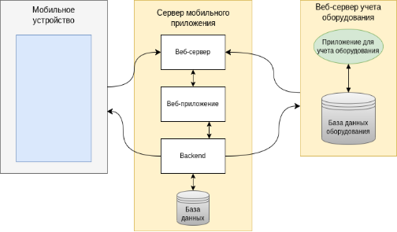

  Рисунок 13 – Архитектура информационной системы с использованием веб-приложения

  Веб-сервер учета оборудования нужен для того чтобы предоставить информацию о оборудовании уже занесенного в систему учета. На сервере учета будут формировать JSON-файлы со списком оборудования и отправляться с помощью http-запроса на сервер мобильного приложения.[10]

  Сервер мобильного приложения состоит из 3 элементов:

  - веб-сервер;

  - веб-приложение;

  - backend;

  - база данных.

  - Веб сервер принимает http-запросы, обрабатывает их и отправляет запрос веб-приложению. Оно в свою очередь получая запрос, подгружает нужную страницу выполняя функции, относящиеся к бизнес логике, если для формирования страницы нужны дополнительные данные хранящиеся в базе данных, например, картинки или файлы, то приложение вызывает методы бэкэнда. Бэкэнд получив запрос выполняет запросы к базе данных, получает данные и отправляет обратно веб-приложению. Так же бэкэнд будет служить для формирования http-запросов и отправки их либо на клиент, либо на сервер учета.

  Использование веб-приложения требует наличие постоянного интернет соединения, что в дата-центре не всегда возможно, из-за наличия мёртвых зон точек доступа. Делаем вывод что данный вариант нас не устраивает.

  Второй вариант заключается в использовании офлайн приложение, которое будет иногда отправлять http-запросы на сервер для получения актуальных данных. Схема данного варианта представлена на рисунке 14.

  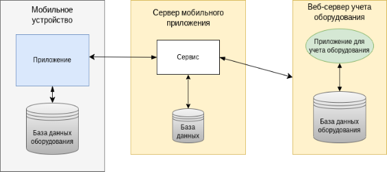

  Рисунок 14 — Архитектура информационной системы с использованием офлайн приложения

  Суть данного решения заключается в использовании сервиса для формирования и отправки запросов. Формировать запросы сервис будет для того, чтобы получить информацию о оборудовании, затем обработать и передать приложению. База данных на сервере будет использоваться для хранения чек-листов полученных от приложения.

  Третий вариант подразумевает под собой использования сервера учёта оборудования.(рис. 15)

  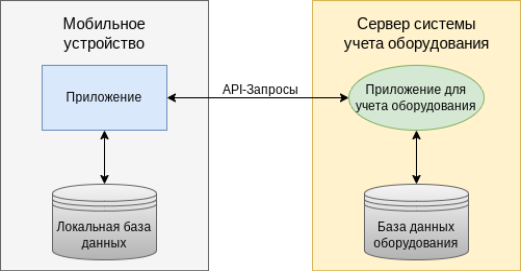

  Рисунок 15 — Архитектура информационной системы без сервера

  Сервер учёта будет обрабатывать запросы и хранить данные о чек-листах в своей базе. На стороне мобильного приложения всё также будет располагаться база данных для работы в офлайн режиме. Третий вариант позволит избавиться развёртки дополнительного сервера.

  Третий вариант более удачный для моего проекта, так как он позволяет использовать приложение в офлайн режиме и позволит уменьшить нагрузку на сеть. На устройстве будет размещена база данных для хранения списка оборудования и чек-листов, которую будет использовать приложение. Это также будет являться минусом, так как хранение базы данных об устройствах будет занимать больше места, чем веб-приложение.

  Взвешивая все за и против, приходим к выводу, что наличие офлайн режима, но увеличение места занимаемым приложением, куда более предпочтительно, чем только онлайн работа и использование меньшего количества памяти устройства. Если выбирать между 2 и 3 вариантом, то предпочтение отдаётся 3, без использования дополнительного сервера.
  ## 2.5 Архитектура мобильного приложения
  Основными видами архитектурных подходов в проектировании программного обеспечения являются MVC, MVP, MVVM. Каждый из этих подходов имеет свои преимущества и недостатки, которые делают его подходящим для определённых сценариев использования.
  ### **2.5.1 MVC(Model-View-Controller)**
  Основная идея этого паттерна в том, что и контроллер и представление зависят от модели, но модель никак не зависит от этих двух компонент.(рис. 16)

  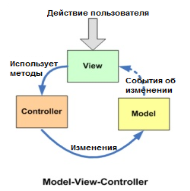

  Рисунок 16 — Архитектура MVC

  MVC разделяет приложение на три основных компонента:

  - Model, управляет данными и бизнес-логикой приложения;

  - View, отображает данные (модель) пользователю;

  - Controller, принимает ввод от пользователя и принимает решения о том, что делать дальше.

  Плюсы:

  - чёткое разделение ответственности между обработкой данных, пользовательским интерфейсом и управляющей логикой;

  - упрощение управления зависимостями и масштабируемость приложения;

  Минусы:

  - вязанность между View и Controller может быть высокой, что затрудняет тестирование;

  - модели могут становиться слишком громоздкими, если в них сосредоточена большая часть бизнес-логики.
  ### **2.5.2 MVP(Model-View-Presenter)**
  Данный подход позволяет создавать абстракцию представления. Для этого необходимо выделить интерфейс представления с определенным набором свойств и методов. Презентер, в свою очередь, получает ссылку на реализацию интерфейса, подписывается на события представления и по запросу изменяет модель. (рис. 17)

  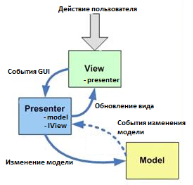

  Рисунок 17 — Архитектура MVP

  MVP похож на MVC, но здесь Controller заменён на Presenter, который берёт на себя задачу посредника между View и Model. MVP разделяет приложение на три основных компонента:

  - Model, содержит данные и бизнес-логику как и в MVC;

  - View, интерактивный интерфейс, который отображает данные (переданные Presenter’ом) и делегирует все действия пользователя Presenter’у;

  - Presenter, работает как посредник между Model и View, извлекает данные из Model и форматирует их для отображения в View.

  Плюсы:

  - разделение интерфейса и логики улучшает тестируемость и поддерживаемость;

  - View становится более глупым, что упрощает её тестирование, так как она не содержит логику, кроме отображения данных.

  Минусы:

  - Presenter может стать узким местом, так как в нём сосредоточена значительная часть логики приложения;

  - сложности с навигацией и обработкой событий в рамках больших проектов.
  ### **2.5.3 MVVM(Model-View-ViewModel)**
  Данный подход позволяет связывать элементы представления со свойствами и событиями View-модели. Можно утверждать, что каждый слой этого паттерна не знает о существовании другого слоя.(рис. 18)

  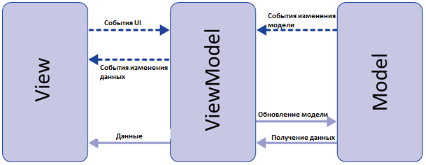

  Рисунок 18 — Архитектура MVVM

  MVVM разделяет приложение на три компонента:

  - Model, управляет бизнес-логикой и данными;

  - View, отображает интерфейс пользователя;

  - ViewModel, представляет собой абстракцию View и содержит логику представления, которая может включать состояния или команды.

  Плюсы:

  - высокая тестируемость, лёгкость в добавлении новых функций и в изменении пользовательского интерфейса без изменения модели;

  - привязка данных (Data Binding) минимизирует код, необходимый для синхронизации UI с источником данных;

  - идеально подходит для реактивных программных моделей и асинхронного программирования.

  Минусы:

  - может быть сложным в понимании и реализации для новых разработчиков;

  - некоторые реализации MVVM могут привести к чрезмерному использованию привязки данных, что усложняет отладку.
  ### **2.5.4 Выбор архитектуры**
  Выбор MVVM для современной разработки Android приложений является оптимальным решением. Этот подход обеспечивает лучшую поддержку разделения логики и интерфейса благодаря механизму привязки данных, который упрощает создание интерактивных интерфейсов без необходимости писать большое количество шаблонного кода. MVVM хорошо интегрируется с архитектурными компонентами Android, такими как LiveData и ViewModel, что делает его идеальным выбором для построения устойчивого и легко тестируемого приложения.
  ## 2.6 Схема потоков данных приложения
  В качестве описательной модели представлена диаграмма потоков данных (рисунок 19).

  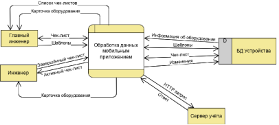

  Рисунок 19 — DFD-диаграмма, концептуальный уровень

  На диаграмме, главный инженер, дежурный инженер и сервер являются внешними ресурсами, а приложение и БД устройства — частью единого целого, то есть информационной системы. В процессе работы в приложение со стороны персонала приходят следующие данные:

  - чек-лист;

  - шаблоны;

  - завершённый чек-лист.

  Главный инженер составляет и загружает его в приложение, после прохода через приложение, он сохраняется в БД и может получен и использован дежурными инженерами. В свою очередь инженеры, начиная обход и выполняя пункт чек-листа, сигнализируют об этом приложению посредством нажатия на кнопку и заполнения необходимых полей данными, например: примечания, статус оборудования, ход выполнения и т. п. После обработки приложением, ход выполнения фиксируется в БД.

  Для простоты и удобства создания чек-листов, будут добавлены шаблоны. Шаблоны чек-листов представляют из себя готовые чек-листы. Шаблоны можно удалять, редактировать и создавать.

  Так же шаблоны будут и у оборудования. Они представляют из себя список задач для каждого конкретного объекта обхода.

  Информация о оборудовании содержит в себе информацию о объектах, размещённых на территории ЦОД, например: местоположение, наименование, маркировка, вид оборудования и т. д.

  В информацию о оборудовании также будет входить степень важности: высокая, средняя и низкая.

  Запрос HTTP и ответ является механизмом обращения к серверу Под ответом может пониматься данные о оборудовании присланные с сервера учета или чек-листы с сервера приложения на котором располагается сервис.

  Спустимся на уровень ниже и рассмотрим структуру более подробно на рисунке 20.

  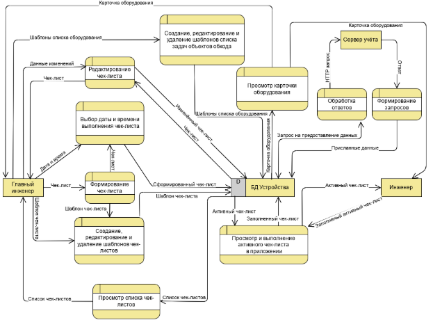

  Рисунок 20 — DFD-диаграмма, логический уровень

  На данной диаграмме раскрывается несколько функций:

  - формирование чек-листа;

  - создание, редактирование и удаление шаблонов чек-листов;

  - выбор даты и времени выполнения чек-листа;

  - просмотр карточки оборудования;

  - просмотр списка чек-листов;

  - просмотр и выполнение активного чек-листа;

  - редактирование чек-листа;

  - создание, редактирование и удаление шаблонов списка задач оборудования;

  - формирование запросов;

  - обработка запросов.

  В функцию формирования чек-листа, передаётся сам чек-лист. Он включает в себя список оборудования и задач к нему. На каждом из этапов можно использовать ранее созданные шаблоны чек-листов или задач оборудования. Также уже готовый чек-лист, можно сохранить как шаблон и повторно создать такой же, но на другую дату.

  После окончания формирования чек-лист передаётся в функцию планирования обхода, которая запрашивает у пользователя дату начала и окончания, время за которое чек-лист должен быть пройден, является не обязательным полем, если оно пустое, то временем выполнения будет считаться сутки. Можно запланировать несколько обходов и они автоматически будут появляться у дежурной смены в заданное время.

  В режиме просмотра карточки, информация о оборудовании будет получена от функции чтения БД. Информацию о оборудовании БД получит от сервера учёта при первом подключении и при изменениях в списке оборудования на сервере.

  Функция просмотра списка чек-листов будет получать чек-листы из БД и предоставлять его главному инженеру.

  Функция редактирования чек-листа нужна для внесения изменений в уже готовый и запланированный чек-лист. Данная функция нужна для внесения внеплановых изменений, так как во время активности дежурной смены (с 9:00 до 18:00) могут появиться дополнительные места для проверки инженерами во время обходов.

  Функция формирования запросов, должна получать команду на получение информации и формировать запрос к сервису при помощи REST API, затем отправлять его в сервис.[11]

  Функция обработки ответов принимает ответ в формате http, обрабатывает его и отправляет на запись в функцию управления БД.

  Процессы создания, редактирования чек-листов и списка задач объектов обхода, взаимодействует только с главным инженером и принимают от него информацию. Сами шаблоны используются при создании чек-листов.

  Функция просмотра и выполнения листа обхода со статусом активный(этот статус означает, что чек-лист уже должен быть в процессе выполнения), доступна только дежурному инженеру. Главный инженер не должен иметь возможность редактирования уже начатого обхода. Каждая выполненная, дежурной сменой задача, фиксируется в БД и отображается на экране, после окончания обхода, на устройство главному инженеру приходит уведомление о статусе выполнения. Статус может быть трёх видов:

  - успешно завершён;

  - завершён не полностью;

  - не завершён.

  Успешно завершён присваивается чек-листу у которого выполнены все пункты без исключений.

  Завершённый не полностью чек-лист имеет несколько не выполненный задач.

  Не завершённый чек-лист — это обход к которому не приступал инженер за всё время его действия.
  ## 2.6 Структура мобильной базы данных
  Мобильная БД нужна для того, чтобы приложение имело возможность работать в автономном режиме. Для этого в мобильной БД будет храниться информация о всём оборудовании в и 6 последних чек-листов. Для отображения всех остальных обходов будет отправлен запрос на сервер.

  Схема базы данных мобильного приложения изображена на рисунке 21.

  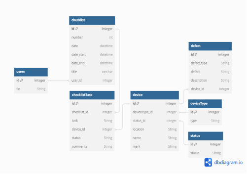

  Рисунок 21 — Структура базы мобильного приложения

  Таблица device хранит в себе информацию о оборудовании. В таблице 1, представлены названия полей, описание и их типы.

  Таблица 1 – описание таблицы device

|Название столбца|Описание|Тип данных|
| - | - | - |
|id|Уникальный идентификатор устройства|Integer|
|deviceType\_id|Уникальный идентификатор типа оборудования|Integer|
|status\_id|Уникальный идентификатор статуса|Integer|
|location|Местоположение оборудования|String|
|name|Наименование|String|
|mark|Маркировка оборудования|String|

Таблица device\_type хранит в себе все возможные типы оборудования. В таблице 2, представлены названия полей, описание и их типы.

Таблица 2 – описание таблицы device\_type

|Название столбца|Описание|Тип данных|
| - | - | - |
|id|Уникальный идентификатор типа устройства|Integer|
|type|Тип устройства (холодильный, генератор, щит)|String|

Таблица status хранит возможные состояния оборудования. В таблице 3, представлены названия полей, описание и их типы.

Таблица 3 – описание таблицы status

|Название столбца|Описание|Тип данных|
| - | - | - |
|id|Уникальный идентификатор статуса|Integer|
|status|Статусы устройства (в работе, выведен из эксплуатации)|String|

Таблица defect хранит в себе дефекты оборудования. В таблице 4, представлены названия полей, описание и их типы.

Таблица 4 – описание таблицы defect

|Название столбца|Описание|Тип данных|
| - | - | - |
|id|Уникальный идентификатор дефекта|Integer|
|defect|Хранит в себе проблему дефекта|String|
|defect\_type|Хранит в себе тип дефекта (критический, значительный, малозначительный)|String|
|description|Описание дефекта, того почему является дефектом, как был выявлен.|String|
|device\_id|Уникальный идентификатор оборудования|String|

Таблица checklistTask хранит список задач для чек-листов. Внешний ключ checklist\_id хранит идентификатор чек-листа, с помощью которого и будет определятся какая задача относиться к чек-листу. В таблице 5, представлены названия полей, описание и их типы.

Таблица 5 – описание таблицы checklistTask

|Название столбца|Описание|Тип данных|
| - | - | - |
|id|Уникальный идентификатор задачи чек-листа|Integer|
|checklist\_id|Уникальный идентификатор чек-листа|Integer|

Продолжение таблицы 5

|task|Задача чек-листа|String|
| - | - | - |
|device\_id|Уникальный идентификатор оборудования|Integer|
|status|Статус задачи (выполнена/не выполнена)|String|
|comments|Комментарии к задаче|String|

Таблица checklist хранит информацию о чек-листе. В таблице 6, представлены названия полей, описание и их типы.

Таблица 6 – описание таблицы checklistTask

|Название столбца|Описание|Тип данных|
| - | - | - |
|id|Уникальный идентификатор чек-листа|Integer|
|number|Номер чек-листа|Integer|
|date|Дата создания чек-листа|date|
|date\_start|Дата и время начала обхода|datetime|
|date\_end|Дата и время конца обхода|datetime|
|title|Заголовок чек-листа|verchar|
|user\_id|Уникальный идентификатор проходившего осмотр|Integer|

Таблица users хранит в себе фамилию, имя и отчество, выполнявшего осмотр. В таблице 7, представлены названия полей, описание и их типы.

Таблица 7 – описание таблицы users

|Название столбца|Описание|Тип данных|
| - | - | - |
|id|Уникальный идентификатор пользователя|Integer|
|fio|Фамилия, имя, отчество выполнявшего осмотр|String|
## 2.8 Проектирование пользовательского интерфейса
Для понимания взаимосвязи экранов интерфейса между собой была разработана User Flow диаграмма (Приложение В). При запуске приложения пользователь попадает на экран входа, после он может перейти либо к списку чек-листов, либо к списку оборудования. На экране списка чек-листов пользователь может либо посмотреть конкретный чек-лист или шаблоны чек-листа, либо приступить к созданию новых шаблонов или чек-листа. При просмотре чек-листа он попадает на экран со списком объектов, для которых требуется выполнить осмотр. При нажатии на объект пользователь попадает на список задач, которые нужно выполнить. Отметка о выполнении ставиться в специальные чек-боксы. При выполнении всех задач он возвращается на экран «Список объектов чек-листа» и нажимает на иконку QR-кода для того, чтобы отсканировать. Сперва можно отсканировать QR соответствующего оборудования, после чего приложение автоматически откроет экран с списком задач. После прохождения всех объектов чек-лист можно завершить, нажатием на кнопку «Завершить», при нажатии которой будет выполнен переход на экран завершения чек-листа на котором будут расположены текстовые поля, после заполнения которых и нажатии на кнопку «Готово», будет выполнен перенос на список чек-листов, поле «Выполнивший» заполнится автоматически исходя из аккаунта который использует дежурный инженер.

Для создания чек-листа, пользователю нужно нажать на кнопку в правом верхнем углу экрана, после чего откроется выпадающий список с пунктами «Создать чек-лист» и «Шаблоны», при нажатии первого, он попадёт на экран «Добавления оборудования», второго, на экран «Шаблоны». На экране «Добавления оборудования» расположены две кнопки: «Добавить» и «Готово», нажатие на кнопку «Готово» завершит создание чек-листа, если нажать на «Добавить», то откроется экран «Список оборудования» включающую в себя строку поиска. Пользователь вводит название или маркировку нужного оборудования, нажатие на него откроет диалоговое окно с вопросом «Использовать шаблон списка задач?», при выборе да откроется экран «Шаблоны списка задач», при выборе нет экран «Список оборудования» закроется, а выбранное оборудование добавится в список для создаваемого чек-листа. Вернёмся к экрану «Добавление оборудования», нужно оборудование добавлено, пользователь выбирает любое и попадает на экран «Добавления задач». На данном экране вписываем нужные задачи и нажимаем на надпись «Готово». После того, как все добавлено завершаем создание. Экран завершения чек-листа имеет поля с датами которые надо заполнить, они отвечают за то в какой день будет отображён чек-лист, также вписываем количество минут на выполнение чек-листа и жмём «Готово». Если чек-лист создан без использования шаблона, то у пользователя спросят - «Создать шаблон по данному чек-листу», если ответить «Да», то появится поля для ввода названия шаблона. Если пользователь закончил создавать чек-лист, то его перенесёт на экран «Список обходов».

При переходе в оборудование, на экране будет список оборудования, при нажатии на любой из объектов списка, будет выполнен переход в карточку оборудования. На экране карточка оборудования будет находиться информация о оборудовании, также список шаблонов задач с возможностями их добавления. При нажатии на один из шаблонов будет открыт экран с «Редактирования шаблона списка задач». При добавлении шаблона будет открыт экран «Создание шаблона списка задач», на котором пользователь должен будет создать списки с нужными ему модулями и заполнить из требуемыми задачами. При заполнении задач, будут предложены варианты ранее использованных для текущего оборудования задач.

Цвета, в которых выполнен дизайн, взяты с главного сайта компании. Экран входа показан на рисунке 22.

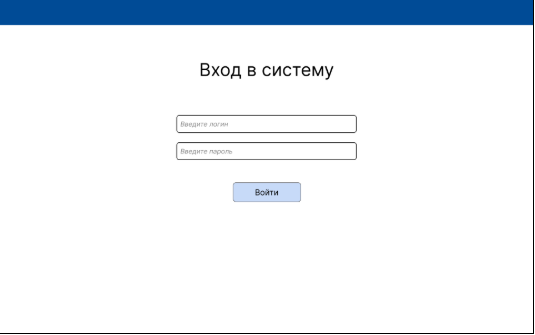

Рисунок 22 – Экран входа приложения

На экране расположены два поля: «Введите логин» и «Введите пароль». Если при нажатии кнопки «Войти», введённые данные совпадают с теми, что находятся в базе, будет выполнен переход на экран «Главный экран» показанный на рисунке 23.

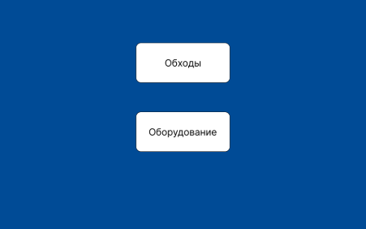

Рисунок 23 – Экран входа приложения

На главном экране будут располагаться кнопки «Обходы» и «Оборудование». При нажатии на кнопки будет выполнен переход на соответствующие страницы.

На рисунке 24 изображена страница обходов.

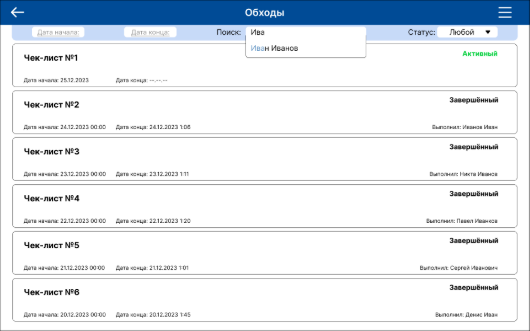

Рисунок 24 - Страница списка чек-листов

На странице будет отображаться история обходов и выделен активный обход, надписью: «Активный». Также на объекте чек-листа будет номер, дата начала и конца. Вверху расположен блок с поиском чек-листов. Искать можно по номеру, тому кто выполнил и дате. Также имеется возможность отфильтровать по статусу. При начале заполнения поля «⁨ФИО сотрудника», будет показана область с возможными вариантами (рис 25).

Рисунок 25 – Поле с возможными вариантами

На заверенных будет написано имя и фамилия выполнившего. Сверху справа расположена кнопка выпадающего списка, при нажатии на которую открывается сам список (рисунок 26).

Рисунок 26 — Выпадающий список

При нажатии на объект будет переход к задачам относящиеся к чек-листу (рисунок. 27).

![ref1]

Рисунок 27 – Список объектов чек-листа

На страницы, перечислены объекты, которые нужно пройти. У каждого объекта есть число сколько всего задач есть и сколько завершено. При нажатии на знак QR-кода будет открыта камера для сканирования. При нажатии на объект будет выполнен переход на страницу задач объекта (рисунок 28). При нажатии кнопки «Завершить» будет открыт экран завершения чек-листа (рисунок 29).

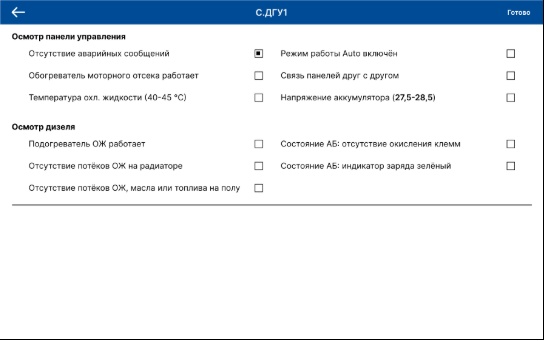

Рисунок 28 – Экран задач объекта

Страница списка задач представляет собой таблицу с флажками напротив каждой задачи. Задачи поделены на группы. Кнопка «Готово», выполнит переход на Экран завершения.(рис. 29)

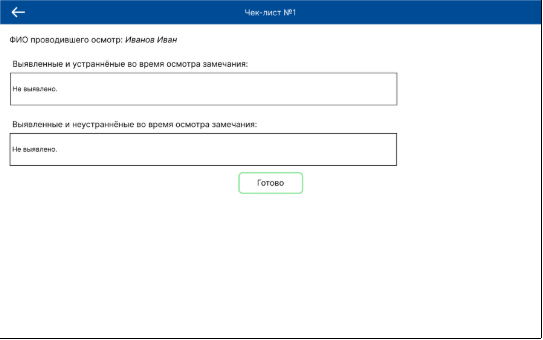

Рисунок 29 – Экран завершения чек-листа

На экране завершения располагается два текстовых поля, где нужно будет указать какие замечания в процессе выполнения появились. Затем нажать на кнопку «Готово».

Экран создания чек-листа изображён на рисунке 30.

![ref2]

Рисунок 30 – Экран создания чек-листа

На экране создания будет располагаться две кнопки – «Добавить» и «Готово». При нажатии на кнопку «Готово» процесс создания будет завершён. Нажатие на кнопку «Добавить» откроет экран списка оборудования (рисунок 37). Нажатие на уже добавленное оборудования, вызовет экран добавления задач (рисунок 32). Если нужно удалить оборудование, то нужно нажать на иконку изображённую на рисунке 31.

Рисунок 31 - Иконка удаления оборудования

Экран добавления задач изображён на рисунке 32.

![ref3]

Рисунок 32 – Экран добавления задач

Экран добавления имеет две области. Первая область это задачи. При нажатии на знак минуса задача удалится. При нажатии на надпись «Добавить», вся введённая информация перейдёт в статический режим и для возобновления редактирования нужно нажать на надпись «Редактировать». Все новые задачи, которые не загрузились автоматически из прошло обхода, вписываются вручную. Тип значения, является выпадающим списком, также как и «Выберите модуль». Нажатие на кнопку «Готово», откроет экран «Завершения создания чек-листа».(рисунок 33)

Рисунок 33 — Экран завершения создания чек-листа

При начале заполнения даты начала и конца откроется календарь в котором можно выбрать нужную дату. На экране расположен список запланированных и активных чек-листов для более корректного выбора даты проведения обхода. Также на экране присутствует флажок с подписью «Создавать до первого неидеального завершения», он отвечает за автоматическое создание чек-листов. При нажатии на кнопку «Готово» будут открыты модальные окна для добавления чек-листа в шаблоны.

` `На рисунках 34 и 35 изображены модальные окна для сохранения текущего чек-листа в шаблоны. Окно вопроса — рисунок 35

Рисунок 35 — Окно вопроса

Рисунок 34 — окно ввода названия шаблона чек-листа.

Рисунок 35 —  Окно ввода названия шаблона чек-листа

После нажатия на кнопку сохранить, будет выполнен переход на экран «Списка чек-листов».

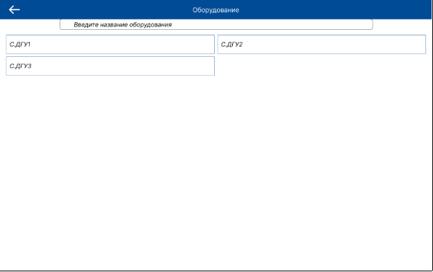

Рисунок 36 – Экран списка оборудования

Экран оборудования имеет строку поиска по названию. Экран списка оборудования выглядит точно также, как и экран добавления оборудования. При нажатии на элемент списка будет открыта карточка соответствующего оборудования (рисунок 37).

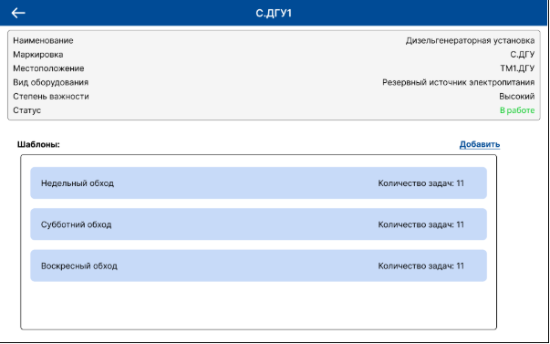

Рисунок 37 – Карточка оборудования

На экране располагается блок с информацией о оборудовании, ниже находится список созданных шаблонов списка задач, и кнопка «Добавить». При нажатии на кнопку «Добавить» откроется экран создания шаблонов списка задач оборудования. (рисунок 38)

![ref4]

Рисунок 38 – Экран создания шаблонов задач чек-листа

Он выглядит также, как и экран «Добавление задач». После заполнения всех задач и нажатия на кнопку «Готово», список сохраниться, после чего будет выполнен переход обратно к экрану «Карточка оборудования».
## 2.9 Выводы по главе
В текущей главе было уделено внимание проектированию информационной системы, а именно, построена диаграмма прецедентов, определена архитектура информационной системы, спроектирована структура мобильного приложения и сервера, определена схема баз данных сервера и структура данных мобильного приложения, разработан пользовательский интерфейс и User Flow.

В самом начале проектирования была сделана диаграмма прецедентов для того чтобы описать различные группы пользователей и их возможности в будущей программе

Для того, чтобы проработать вид будущего приложения был разработан пользовательский интерфейс. Всего будет 11 экранов. Основные эраны отвечают за отображение списка чек-листов, а также экраны объектов и задач чек-листа, которые являются элементами прохождения обходов. Также был смоделирован пользовательская карта, она же User Flow, на котором видно какие шаги придётся сделать пользователю, для того чтобы, попасть на нужный ему экран.
# 3 Разработка информационной системы
## 3.1 Требования к информационной системе
В самом начале разработки были составлены технические требования к разрабатываемому приложению перечисленные ниже:

1\. система должна иметь возможность создавать и редактировать ещё не заполненные чек-листы для обходов;

2\. система должна иметь возможность планирования чек-листов;

3\. система должна иметь возможность поставить автоматическое создание выбранных чек-листов.

4\. система должна уведомлять главного инженера о результате выполнения чек-листа;

5\. система должна обеспечивать возможность просматривать активные чек-листы;

6\. система должна иметь возможность заполнять чек-листы во время обхода(отмечать выполнение задач);

7\. система должна иметь возможность отображать список чек-листов, отфильтрованный по дате создания;

8\. система должна иметь возможность отображать список чек-листов, отфильтрованный по дате окончания;

9\. система должна иметь возможность просмотра списка оборудования;

10\. система должна поддерживать работу в офлайн-режиме с последующей синхронизацией данных при подключении к сети;

11\. система должна иметь возможность поиска чек-листа по номеру и выполнившему;

12\. система должна позволять фильтровать задачи по статусу (активные, завершенные);

13\. система должна обеспечивать сканирование QR-кодов оборудования для идентификации объектов проверки;

14\. система должна предоставлять возможность добавления комментариев к выполненным чек-листам;

15\. система должна иметь возможность создавать шаблоны чек-листов;

16\. система должна иметь возможность создавать шаблоны списка задач оборудования.

## 3.2 Описание средств разработки
Данный раздел описывает процесс разработки и используемые программные средства. Для реализации мобильного приложения были выбраны следующие средства:

– Android Studio;

– Kotlin;

– SQLite.

Android Studio — официальная интегрированная среда разработки (IDE) для разработки приложений Android. Она подходит для взаимодействия на языках Java и Kotlin. С её помощью разработчики создают приложения для мобильных, планшетов, телевизоров, часов и других устройств.[12]

IDE содержит инструменты для разработки, отладки, тестирования и отслеживания производительности приложений. Ниже представлен интерфейс среды находится на рисунке 39.

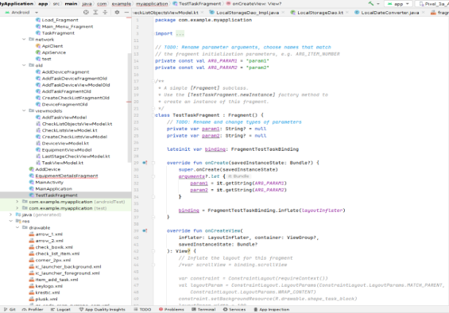

Рисунок 39 — Интерфейс Android Studio

Kotlin — это статически типизированный язык программирования, который создали программисты компании JetBrains, чтобы облегчить процесс разработки и улучшить свою производительность. Kotlin основан на виртуальной машине Java Virtual Machine (JVM), которая служит средой для запуска Java-приложений и даёт мощный инструментарий для создания разнообразных программ.

Особенности и преимущества языка:

– чистый и понятный синтаксис;

– полная совместимость с Java;

– безопасность типов;

– расширения языка;

– поддержка множества платформ.

Kotlin используется для создания мобильных приложений, серверных решений и программ для других платформ. Именно на Kotlin написано всё приложение и его модули. Дополнительно используются библиотеки, которые предоставляют уже готовые решения для упрощения разработки.[13]

Одной из библиотек является Room. Room — это библиотека персистентности для Android, которая является частью проекта Google Android Jetpack Project.

Согласно документации, Room действует как уровень абстракции поверх SQLite, обеспечивая свободный доступ к базе данных и используя при этом все возможности SQLite.

Приложения, работающие с большим объёмом структурированных данных, могут извлечь большую выгоду из их локального хранения. Наиболее распространённым приложением является кэширование соответствующих данных.

Компоненты Room:

– база данных. Содержит владельца базы данных и служит основной точкой доступа к сохраняемым реляционным данным приложения;

– сущность. Таблица в базе данных, представленная сущностью;

– DAO. Этот класс содержит методы для доступа к базе данных.[14]

Все взаимодействие с базой данных устройства, происходит через базу данных Room. Для импорта модуля нужно написать строки типа implementation в файл build.gradle (рисунок 40).

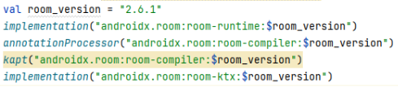

Рисунок 40 — Подключение Room

Для сканирования QR-кодов используется библиотека ZXing (Zebra Crossing).[15] ZXing является одной из самых популярных библиотек для работы с штрих-кодами и QR-кодами в приложениях Android. Для того чтобы добавить библиотеку в проект нужно написать несколько строк в файл build.gradle (рисунок 41).

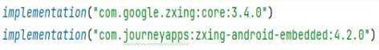

Рисунок 41 — Подключение библиотеки Zxing

Так же модуль требует разрешение на использование камеры. Для его получения нужно внести изменения в файл AndroidManifest.xml (рисунок 42).

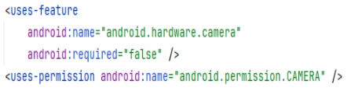

Рисунок 42 — Получение разрешения на использование камеры

В качестве СУБД будет использоваться SQLite, которая является встроенной в систему Android.

Для работой с сетью используются две библиотеки:

– Retrofit;

– Gson.

Retrofit – библиотека для отправки HTTP запросов и обработки ответов, а Gson для преобразования JSON данных в объекты Kotlin и наоборот.[16] Для их подключения нужно внести изменения в файл build.gradle (рисунке 43).

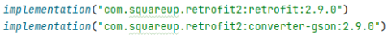

Рисунок 43 — Подключение Retrofit и Gson

Мобильное приложение состоит из следующих модулей:

– формирование чек-листа;

– просмотр карточки оборудования;

– создание шаблонов чек-листов обходов;

– создание шаблонов списка задач оборудования;

– планирование и автоматическое создание чек-листов;

– просмотр чек-листа;

– редактирование чек-листа;

– выполнение задачи в чек-листе;

– база данных;

– формирование запросов;

– обработка запросов.
## 3.3 Сценарии тестирования
Далее, к функциональным требованиям, были сформулированы сценарии тестирования.

Для 1 требования были созданы следующие тесты:

1\. тест создания чек-листа;

2\. тест редактирования чек-листа;

Тест создания чек-листа:

\- войти в систему под пользователем «Главный инженер»;

\- перейти в раздел управления чек-листами путём нажатия на «Создать»;

\- заполнить необходимые данные (название, дата, объекты обхода, задачи) и сохранить;

\- выйти назад и убедиться, что чек-лист отображается в списке.

Ожидаемый результат: чек-лист успешно создан и отображается в списке чек-листов

Тест редактирования чек-листа:

\- войти в систему;

\- перейти к списку чек-листов;

\- выбрать существующий чек-лист из списка;

\- нажать кнопку "Редактировать";

\- изменить данные чек-листа и сохранить;

\- проверить, что изменения отражены в списке чек-листов.

Ожидаемый результат: изменения в чек-листе произошли и сохранились.

Для 2 требования созданы следующие тесты:

3\. тест создания запланированного чек-листа.

Тест создания запланированного чек-листа:

\- войти в систему;

\- перейти к разделу чек-листов;

\- нажать на выпадающий список в правом верхнем углу экрана;

\- выбрать пункт «Создать чек-лист»;

\- пройти все этапы создания(заполнение списка оборудования, заполнение списка задач для оборудования);

\- нажать на поле «Дата начала»;

\- после открытия календаря выбрать нужную дату и закрыть;

\- повторить аналогичные действия с полем «Дата окончания»;

\- ввести время на выполнение обхода;

\- нажать на кнопку «Готово»;

\- убедится, что планирование прошло успешно(окно создания закрылось, сообщения о некорректной или уже выбранной дате не являлись)

\- после окончания создания, в разделе «Обходы», выбрать статус «Запланированный» и убедится, что созданный чек-лист отобразился в списке;

\- дождаться даты и времени начало его выполнения и убедится, что он стал активным и его можно выполнить.

Ожидаемый результат: чек-лист успешно создался и получил статус «Запланированный», когда пришло время его выполнения, перешёл в «Активный» статус и стал доступен для выполнения.

Для 3 требования были созданы следующие тесты:

4\. тест автоматического создания чек-листов.

Тест автоматического создания чек-листов:

\- войти в систему;

\- перейти к разделу чек-листов;

\- нажать на выпадающий список в правом верхнем углу экрана;

\- выбрать пункт «Создать чек-лист»;

\- пройти все этапы создания(заполнение списка оборудования, заполнение списка задач для оборудования);

\- на этапе завершения создания поставить флажок на поле «Создавать до первого неидеального завершения», после чего выбрать дату и время начала, также ввести время на прохождение и завершить создание, нажатием на кнопку «Готово»;

\- дождаться окончания созданного чек-листа;

\- убедится, что после идеального завершения, запланировался новый чек-лист на следующий день и такое же время.

Ожидаемый результат: созданный чек-лист автоматически создастся, спустся сутки и станет доступным для выполнения.

Для 4 требования были созданы следующие тесты:

5\. тест уведомления о правильном выполнении обхода;

6\. тест уведомления о неправильном выполнении обхода.

Тест уведомления о правильном выполнении обхода:

\- войти в систему;

\- перейти к разделу чек-листов;

\- нажать на выпадающий список в правом верхнем углу экрана;

\- выбрать пункт «Создать чек-лист»;

\- пройти все этапы создания(заполнение списка оборудования, заполнение списка задач для оборудования, завершение);

\- дождаться начала выполнения обхода и выполнить его;

\- войти в аккаунт главного инженера и убедится, что ему пришло уведомление о выполнение чек-листа;

\- убедится, что информация в уведомлении соответствует действительности.

Ожидаемый результат: уведомление прийдёт на устройство и отобразит действительную информацию об окончании обхода

Тест уведомления о неправильном выполнении обхода:

\- войти в систему;

\- перейти к разделу чек-листов;

\- нажать на выпадающий список в правом верхнем углу экрана;

\- выбрать пункт «Создать чек-лист»;

\- пройти все этапы создания(заполнение списка оборудования, заполнение списка задач для оборудования, завершение);

\- дождаться начала выполнения обхода и выполнить его;

\- войти в аккаунт главного инженера и убедится, что ему пришло уведомление о выполнение чек-листа;

\- убедится, что информация в уведомлении соответствует действительности и помечено как неправильное.

Ожидаемый результат: уведомление прийдёт на устройство и отобразит действительную информацию об окончании обхода

Для 5 требования были созданы следующие тесты:

7\. тест просмотра активных чек-листов.

Тест просмотра активных чек-листов:

\- войти в систему;

\- перейти к разделу чек-листов;

\- убедиться, что в списке отображаются активные чек-листы.

Ожидаемый результат: чек-листы будут заполнятся в соответствии с действиями пользователя.

Для 6 требования были созданы следующие тесты:

8\. тест заполнения чек-листов во время обхода.

Тест заполнения чек-листов во время обходов:

-войти в систему;

\- перейти к списку чек-листов

\- открыть активный чек-лист;

\- нажать на флажок и убедится что флажок закрасился;

\- отметить выполнение ещё нескольких задач в чек-листе

\- сохранить изменения и выйти обратно;

\- снова открыть чек-лист;

\- убедиться, что выбранные флажки сохранились и отображаются при повторном открытии чек-листа.

\- убрать один из флажков;

\- выйти обратно;

\- снова открыть чек-лист;

\- убедится что снятие флажка сохранилось.

Ожидаемый результат: чек-листы будут заполнятся в соответствии с действиями пользователя.

Для 7 требования были созданы следующие тесты:

9\. тест фильтрации чек-листов на экране просмотра списка чек-листов по дате начала.

Тест фильтрации чек-листов на экране просмотра списка чек-листов по дате начала:

-войти в систему;

\- перейти к списку чек-листов;

\- нажать на поле ввода с надписью дата создания;

\- в появившимся окне выбрать нужную дату;

\- убедиться, что чек-листы отфильтрованы по выбранной дате корректно.

Ожидаемый результат: чек-листы будут отфильтрованы по выбранной дате начала.

Для 8 требования были созданы следующие тесты:

10\. тест фильтрации чек-листов на экране просмотра списка чек-листов по дате окончания.

Тест фильтрации чек-листов на экране просмотра списка чек-листов по дате окончания:

\- войти в систему;

\- перейти к списку чек-листов;

\- нажать на поле ввода с надписью дата окончания;

\- в появившимся окне выбрать нужную дату;

\- убедиться, что чек-листы отфильтрованы по выбранной дате корректно.

Ожидаемый результат: чек-листы будут отфильтрованы по выбранной дате окончания.

Для 9 требования были созданы следующие тесты:

11\. тест просмотра списка оборудования.

Тест просмотра списка оборудования:

\- войти в систему;

\- перейти в раздел «Оборудование»;

\- убедится что список оборудования отображается корректно.

Ожидаемый результат: список оборудования будет доступен и корректно отображаться на экране.

Для 10 требования были созданы следующие тесты:

12\. тест работы в офлайн режиме с синхронизацией данных.

Тест работы в офлайн режиме с синхронизацией данных:

\- отключить устройство от сети.

\- выполнить действия, требующие изменения данных (например, заполнение чек-листа).

\- подключить устройство к сети и убедиться, что синхронизация прошла успешно и изменения отображаются в системе.

Ожидаемый результат: приложение продолжит нормально функционировать без подключения к сети, при подключении к сети синхронизируется с сервером и вернётся в норму.

Для 11 требования были созданы следующие тесты:

13\. тест поиска чек-листа по номеру и исполнителю.

Тест поиска чек-листа по номеру и исполнителю:

\- войти в систему;

\- перейти к экрану списка чек-листов;

\- в поле ввода по центру с надписью «Поиск» ввести начало существующего номера чек-листа;

\- убедится, что на экране остался только чек-лист с совпадающем номером;

\- очистить поле «Поиск» и убедится, что список чек-листов вернулся к изначальному состоянию;

\- ввести фамилию и имя одного из дежурных инженеров;

\- убедится что отображаются только чек-листы у которых поле «Выполнивший» совпадает с введённым текстом;

\- очистить поле «Поиск» и убедится, что список чек-листов вернулся к изначальному состоянию.

Ожидаемый результат: успешно выполнится поиск по номеру и выполнившему чек-лист.

Для 12 требования были созданы следующие тесты:

14\. тест фильтрации чек-листов по статусу

Тест фильтрации чек-листов по статусу:

\- начальная точка: вход в систему выполнен, тестировщик находится на экране списка чек-листов

\- нажать на выпадающий список с подписью «Статус»;

\- в появившимся списке выбрать пункт «Активные»;

\- убедится что отображаются только чек-листы со статусом активные.

Ожидаемый результат: фильтрация успешно сработает, будут отображаться только активные чек-листы.

Для 13 требования были созданы следующие тесты:

15\. тест возможности сканирования QR-кодов для идентификации оборудования;

Тест возможности сканирования QR-кодов:

\- войти в систему;

\- перейти к списку чек-листов;

\- выбрать любой «Активный» чек-лист;

\- в списке объектов осмотра, нажать на иконку QR-кода;

\- убедится в том что открылась камера с инструментом сканирования;

\- навести камеру на QR-код расположенный на оборудовании название которого совпадает с полем названия оборудования на экране списка объектов, иконка которого была нажата;

\- дождаться окончания сканирования;

\- убедится, что на экране списка задач появилась зелёная галка.

Ожидаемый результат: сканирование пройдёт успешно и зафиксируется в чек-листе.

Для 14 требования были созданы следующие тесты:

16\. тест добавления комментариев к выполненному чек-листу;

Тест добавления комментария к выполненному чек-листу:

\- войти в систему;

\- перейти к списку чек-листов;

\- выбрать любой «Активный» чек-лист;

\- перейти к списку задач;

\- нажать на надпись в верхнем правам углу(кнопка «Готово»);

\- если переход на страницу завершения выполнен, то убедится в наличии полей для;

\- заполнить оба поля и нажать на кнопку «Готово»;

\- после перехода на экран списка чек-листов, выбрать чек-лист, который только что был завершён;

\- убедится в отображении тех же комментариев, что были оставлены два шага назад.

Ожидаемый результат: комментарии успешно заполнятся и отобразятся после завершения чек-листа.

Для 15 требования были созданы следующие тесты:

17\. тест создания шаблона чек-листа;

Тест создания шаблона чек-листа:

\- войти в систему;

\- перейти к списку чек-листов;

\- нажать на выпадающий список в правом верхнем углу и выбрать пункт «Шаблоны чек-листов»;

\- нажать на кликабельную надпись «Создать» в правом верхнем углу;

\- выполнить все те действия, что выполняются при создании чек-листа;

\- после того как шаблон был создан, на экране обходов нажать на выпадающий список, затем на пункт «Шаблоны чек-листа»;

\- убедится, что шаблон появился в списке.

Ожидаемый результат: все кнопки сработают, шаблон чек-листа создастся без проблем, после создания отобразится корректно.

Для 16 требования были созданы следующие тесты:

18\. тест создания шаблона списка задач оборудования.

Тест создания шаблона списка задач оборудования:

\- войти в систему;

\- перейти в раздел списка оборудования;

\- выбрать любое оборудование;

\- нажать на кликабельную надпись «Добавить»;

\- заполнить список требуемыми задачами;

\- нажать на кликабельную надпись «Готово»

\- убедится, что шаблон создался и нормально функционирует.

Ожидаемый результат: шаблон создастся без каких-либо проблем и корректно отобразится.
## 3.4 Матрица покрытия требований тестами.
Для отображении степени покрытия требований тестами составлена матрица покрытия требований тестами.(рис. 44)

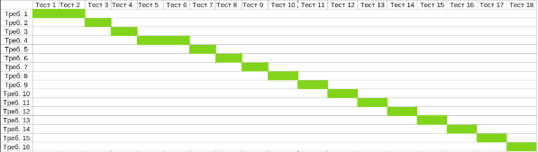

Рисунок 44 — Матрица покрытия требований тестами

На матрице покрытия видно, что все требования покрыты тестами. К первому и четвёртому требованию написано по 2 теста, ко всем остальным по одному, этого вполне достаточно для корректного тестирования.
## 3.5 Результаты тестирования
### **3.5.1 Тест создания чек-листа**
Тест пройден. На рисунке 45 показан предпоследний этап теста.

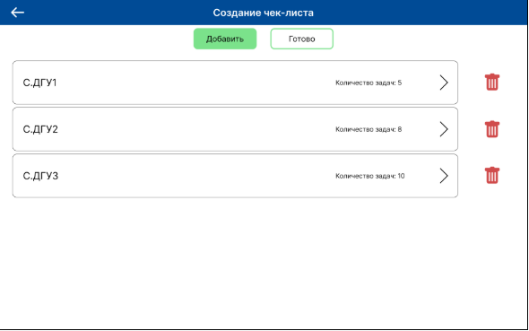

Рисунок 45 — Созданный чек-лист с заполненными данными

На рисунке 45 видно, что всё заполняется и отображается. Далее нажимаем «Готово», чек-лист должен сохраниться и отобразится в списке обходов как «Активный». На рисунке 46 показан результат тестирования.

Рисунок 46- Результат тестирования

Чек-лист появился под номером 7, со статусом «Активный», без даты конца, так как при создании её не указывали. Перейдём в чек-лист и убедимся, что это именно он.(рис. 47)

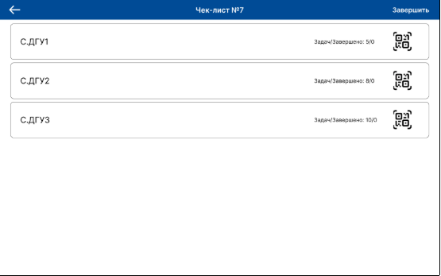

Рисунок 47 — Содержимое чек-листа №7

Из рисунка видно — чек-лист на этапе создания, совпадает с чек-листом во время обхода. Делаем вывод, что тест создания чек-листа успешно пройден.
### **3.5.2 Тест редактирования чек-листа**
Тест пройден. Изменялся созданный в пункте 3.5.1 чек-лист №7. Редактированием являлось удаления С.ДГУ3 из списка. Результат тестирования представлен на рисунке 48.

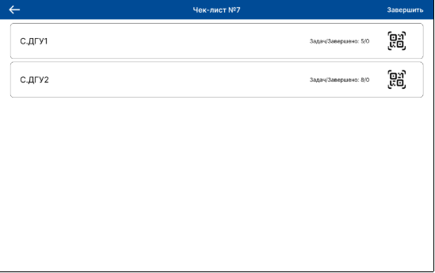

Рисунок 48 — Результат тестирования редактирования чек-листа

На рисунке 48 видно, что после удаления С.ДГУ3, он больше не отображается в активном чек-листе №7. Это означает успешное прохождение теста.
### **3.5.3 Тест создания запланированного чек-листа**
Тест пройден. Выбор даты начала и конца обхода изображён на рисунке 49

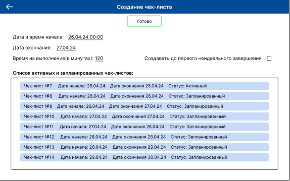

Рисунок 49 — Создание запланированного чек-листа

После создания такого чек-листа он должен отобразится в списке обходов со статусом «Запланированный». На рисунке 50 изображён текущий список обходов.

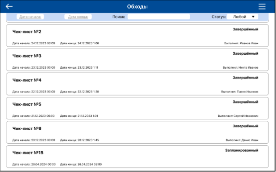

Рисунок 50 — Результат прохождения теста создания запланированного чек-листа

Запланированный чек-листа появился под номером 15 и имеет даты указанные при создании. Это означает успешное прохождение теста.
### **3.5.4 Тест автоматического создания чек-листов**
Тест пройден. После установки флажка «Создавать до первого неидеального завершения» во время создания чек-листа и выполнение всех его задач, он автоматически создался повторно на следующий день. Это является успешным результатом тестирования.
### **3.5.5 Тест уведомления о правильном выполнении обхода**
Тест пройден. Информация о правильном выполнении чек-листа корректно отобразилась. Это является успешным результатом тестирования.
### **3.5.6 Тест уведомления о неправильном выполнении обхода**
Тест пройден. Информация о неправильном выполнении чек-листа корректно отобразилась. Это является успешным результатом тестирования.
### **3.5.7 Тест просмотра активных чек-листов**
Тест пройден. Список чек-листов со статусом «Активный» успешно отобразился, он проиллюстрирован на рисунке 51.

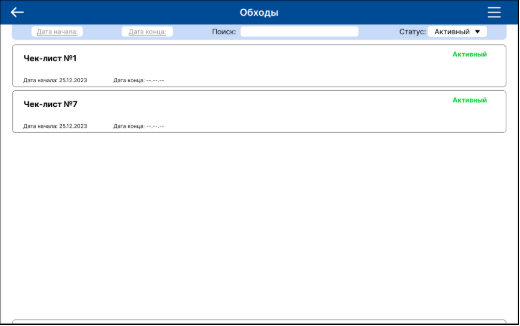

Рисунок 51 — Результат теста просмотра активных чек-листов

При выборе статуса «Активный», отображаются только доступные к прохождению осмотры.
### **3.5.8 Тест заполнения чек-листов во время обхода**
Тест пройден. Все флажки успешно выставляются, при закрытии и открытии чек-листа, прогресс выполнения сохраняется. Это является успешным результатом тестирования.
### **3.5.9 Тест фильтрации чек-листов на экране списка обходов по дате начала**
Тест пройден. Отфильтрованный список чек-листов по дате начала показан на рисунке 52.

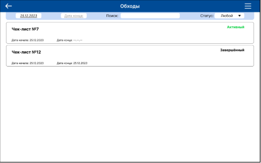

Рисунок 52 — Результат фильтрации списка обходов по дате начала

На рисунке видно, что обходы отфильтрованы по указанной дате (25.12.2023). Это является успешным результатом тестирования.
### **3.5.10 Тест фильтрации чек-листов на экране просмотра списка обходов по дате окончания**
Тест пройден. Отфильтрованный список чек-листов по дате окончания успешно вывелся на экран аналогично списку на рисунке 38. Это является успешным результатом тестирования.
### **3.5.11 Тест просмотра списка оборудования**
Тест пройден. Список оборудования успешно отобразился на экране. Это является успешным результатом тестирования.
### **3.5.12 Тест работы в офлайн режиме с синхронизацией данных**
Тест пройден. При отключении устройства от сети, весь функционал был доступен, приложением можно нормально пользоваться. При подключении устройства к сети данные синхронизовались с сервером. Это является успешным результатом тестирования.
### **3.5.13 Тест поиска чек-листа по номеру и исполнителю**
Тест пройден. Отфильтрованный, по номеру чек-листа, список представлен на рисунке 53.

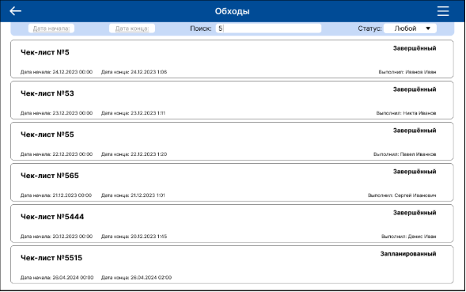

Рисунок 53 — Отфильтрованный по номеру список чек-листов

` `Отфильтрованный, по исполнителю обхода, список представлен на рисунке 54.

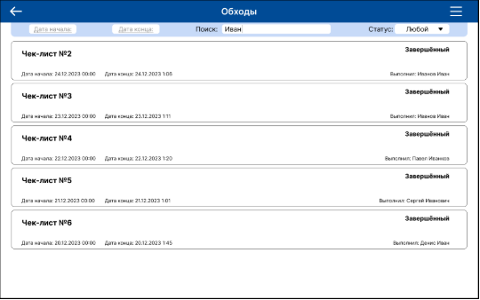

Рисунок 54 — Отфильтрованный по исполнителю список чек-листов

Списки на рисунках 53 и 54 соответствуют действительности, считаем что результат тестирования положительный.
### **3.5.14 Тест фильтрации чек-листов по статусу**
Тест пройден. Результат тестирования фильтра по статусу «Активный» показан на рисунке 55.

Рисунок 55 — Список активных чек-листов

Результат тестирования фильтра по статусу «Запланированный» показан на рисунке 56.

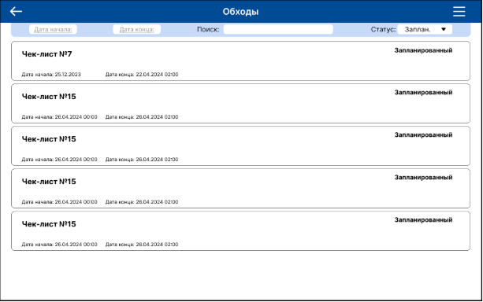

Рисунок 56 — Список запланированных чек-листов

Результат тестирования фильтра по статусу «Завершённый» показан на рисунке 57.

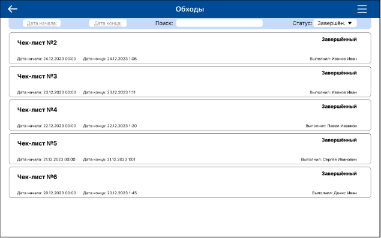

Рисунок 57 - Список запланированных чек-листов

На рисунках 55, 56, 57 выбраны разные статусы для фильтрации. В каждом случае приложение отображает правильный список. Это является успешным результатом тестирования.
### **3.5.15 Тест сканирования QR-кодов для идентификации оборудования**
Тест пройден. Всё оборудование идентифицируется правильно. Многократное открытие камеры, не вызвало никаких ошибок. Это является успешным результатом тестирования.
### **3.5.16 Тест добавления комментариев к выполненному чек-листу**
Тест пройден успешно. Комментарии добавляются и сохраняются корректно. Поля для ввода работают так как требуется.
### **3.5.17 Тест создания шаблона чек-листа**
Тест пройден. На рисунке 58 изображён список шаблонов чек-листов с новым добавленным шаблоном с названием - «Тестовый шаблон». Процесс создания шаблона такой же как и обычного чек-листа.

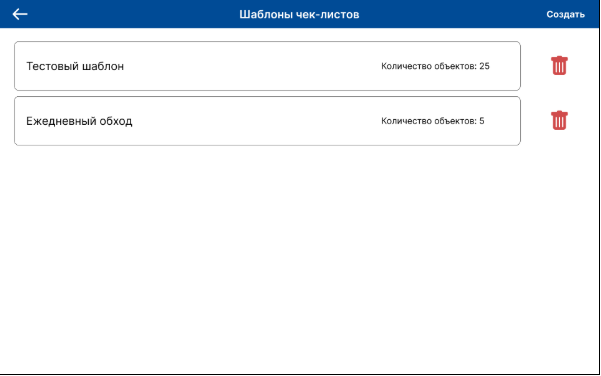

Рисунок 58 — Список шаблонов чек-листов

Тестовый шаблон имеет 25 объектов, что довольно много для среднестатистического обхода. Шаблон успешно сохранился, что говорит о положительном результате теста.
### **3.5.18 Тест создания шаблона списка задач оборудования**
Тест пройден. На рисунке 59 изображён список шаблонов чек-листов с новым добавленным шаблоном с названием - «Тестовый шаблон». Процесс создания шаблона такой же как и добавление задач к оборудованию, при создании обычного чек-листа.

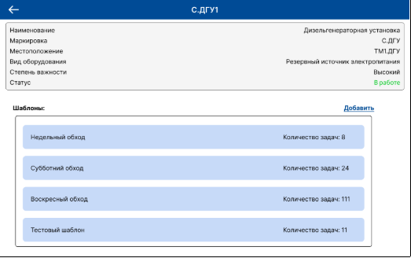

Рисунок 59 — Список шаблонов списков задач оборудования

Тестовый шаблон имеет 11 объектов. Шаблон успешно сохранился, что говорит о положительном результате теста.
## 3.6 Примеры использования системы
Рассмотрим примеры использования системы. Первый вариант использования это прохождение чек-листа. Шаг 1 выбор активного чек-листа. (рис 60)

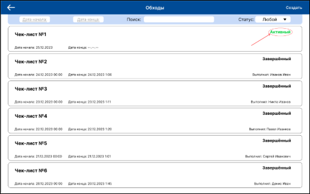

Рисунок 60 — Экран чек-листа с выделенным статусом

Чек-лист, который можно и нужно пройти помечен статусом «Активный», нажимаем на него и попадаем к списку объектов обходов. (рис. 61)

![ref5]

Рисунок 61 — Список объектов обхода

На экране объектов, нажимаем на любой элемент списка. Пусть будет первый. Нажатие инициирует переход на экран задач. (рис. 62)

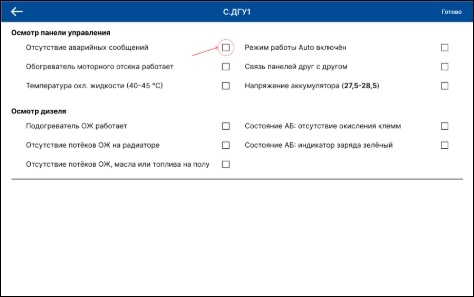

Рисунок 62 — Экран задач объекта

После того как на экране отобразился список задать, можно начинать обход. Когда одна из задач выполнена, на устройстве нужно нажать на флажок и он изменится. (рис 63)

Рисунок 63 — Отметка о выполнении

После выполнения обхода и заполнения всех нужных флажков, нужно нажать на кнопку «Готово», после нажатия откроется экран окончания обхода. (рис 64)

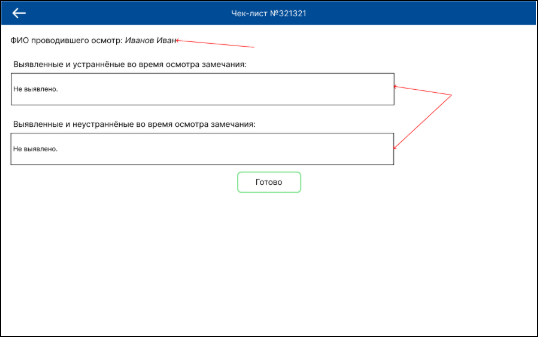

Рисунок 64 — Экран завершения чек-листа

Поля «ФИО проводившего осмотр», заполняется автоматически. Если нужно заполняем поля для ввода и нажимаем «Готово». Как только кнопка была нажата, пользователя вернёт к экрану списка обходов, ранее завершённый чек-лист больше не активный, заполнятся дата конца и выполнивший. (рис. 65)

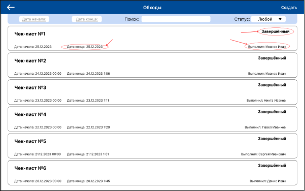

Рисунок 65 — Заполнение полей в списке чек-листа

Рассмотрим пример создания чек-листа. Для того, чтобы начать, на экране списка чек-листов, в правом верхнем углу нажимаем кнопку «Создать». (рис 66)

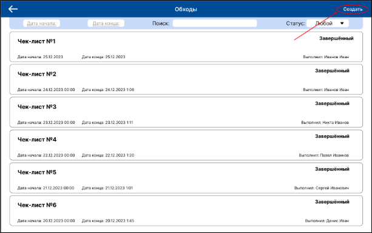

Рисунок 66 — Расположение кнопки нажать в правом верхнем углу

Нажимаем на неё и попадаем на экран добавления оборудования. На нём расположены две кнопки: «Добавить» и «Готово». Жмём добавить. (рис. 67)

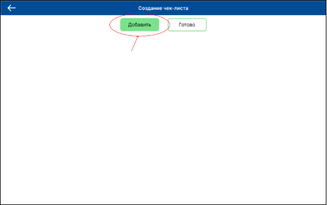

Рисунок 67 — Нажатие кнопки «Добавить»

Открывается экран списка объектов, в поле «Поиск» вбиваем нужный объект и нажимаем на него, после чего выполнится переход обратно на экран создания чек-листа. (рис. 68)

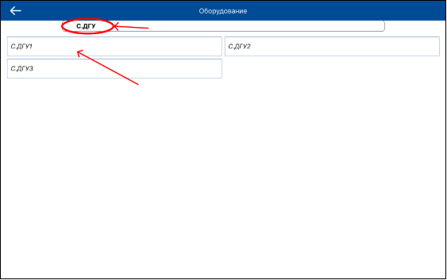

Рисунок 68 — Выбор нужного оборудования

После того как в списке появилось выбранное оборудование, его можно убрать из списка нажатием на иконку мусорного бака или нажатием перейти на экран добавления задач. (рис. 69)

![ref6]

Рисунок 69 — Экран создания чек-листа с добавленным оборудованием

Нажимаем на элемент и попадаем на экран добавления задач. На нём, если по данному оборудованию уже проходили обходы, то предыдущие задачи будут отображены.(рис. 70)

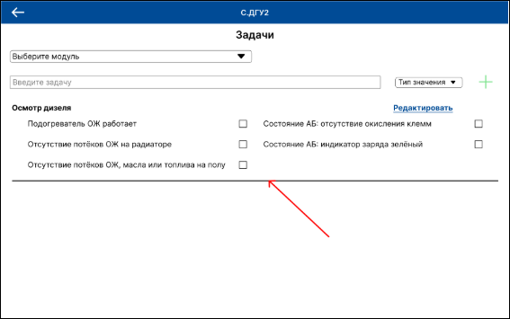

Рисунок 70 — Автоматически загруженный список задачам

При нажатии на «Редактировать», можно будет полностью удалить данный список или удалить несколько задач. Для добавления нового блока нужно выбрать модуль в верхнем выпадающем списке, затем вписать задачу и выбрать её тип, далее нажать на плюс.(рис. 71)

Рисунок 71 — Выбранные параметры

После добавления, блок появиться на экране. Введённые данные всё ещё можно изменить нажатием на «Правка». Вводим нужные задачи и нажимаем «Готово», выполняется сохранение и перенос обратно к списку объектов обхода.(рис. 72)

Рисунок 72 — Добавление задачи в чек-лист

После переноса нажимаем кнопку «Готово».(рис. 73)

Рисунок 73 — Список объектов обхода создаваемого чек-листа

Чек-лист сохранился в базе данных и отображается на экране списка чек-листов. Можно приступать к выполнению.(рис. 74)

Рисунок 74 — Появление чек-листа в списке

Таким образом было рассмотрено два примера использования:

\- для выполнения чек-листов;

\- для создания чек-листов.
## 3.7 Выводы по главе
В данной главе была произведена разработка информационной системы. Были определены основные требования к системе, включая возможность создания и редактирования чек-листов, планирования и автоматического создания чек-листов, что является фундаментом для дальнейшей разработки. Были выбраны и описаны инструменты и технологии, необходимые для реализации проекта, что позволило сформировать четкое понимание технической базы разработки. Разработаны сценарии тестирования, что обеспечило всестороннюю проверку работоспособности системы и гарантировало соответствие системы установленным требованиям. Были рассмотрены примеры использования системы, что позволило наглядно продемонстрировать её функциональные возможности и подтвердить её соответствие реальным потребностям предприятия.

Таким образом, в результате выполнения данной главы была разработана и протестирована информационная система, соответствующая предъявленным требованиям и обеспечивающая необходимую функциональность для эффективного управления процессами на предприятии
##
# 4 Технико-экономическое обоснование эффективности вложений в разработку мобильного приложения
Для оценки затрат необходимых на мобильного приложения требуется произвести оценку трудовых ресурсов и выполнить экономические расчеты перечня работ по разработке.
## 4.1 Расчет стоимости трудозатрат по проекту 
Для определения затрат на разработку мобильного приложения необходимо определить проектную группу. Состав проектной группы представлен в таблице 1.

Таблица 1– Состав проектной группы

|Наименование специалиста|Функциональные обязанности|
| :-: | :-: |
|Android-разработчик|Разработка мобильного приложения|

Для определения заработной платы участников команды были использованы данные заработной платы предоставленные ресурсом hh.ru [17].  В таблице 2 указана величина оплаты труда участников проектной группы с учетом НДФЛ, который составляет 13%, и отчислений на фонд оплаты труда в размере 32%, которые включают медицинское страхование, пенсионные отчисления и социальное страхование. Расчеты представлены с учетом среднемесячного фонда рабочего времени в размере 168 часов.

Таблица 2 – Расчет стоимости трудовых ресурсов

|Наименование специалиста|Оклад руб./мес.|Оклад с учётом НДФЛ (13%), руб.|ЕСН (32%), руб.|Итого ФОТ с учётом ЕСН, руб.|Месячный фонд рабочего времени, час|Стоимость 1 часа работы, руб.|
| :-: | :-: | :-: | :-: | :-: | :-: | :-: |
|Android-разработчик|60000|68950|19200|88150|168|525|

Был сформирован состав работ по проекту. Исходя из состава работ были рассчитаны затраты на каждый этап разработки с учетом стоимости трудовых ресурсов, указанных выше в таблице 2. Произведенные расчеты продемонстрированы в таблице 3.

Таблица 3 – Затраты по этапам

|Этап|Затраты, руб.|
| :-: | :-: |
|Предпроектный анализ|10000|
|Проектирование мобильного приложения|55000|
|Разработка мобильного приложения|365400|
|Тестирование|25000|
|Итого|455400|

В таблице 4 представлен расчет трудозатрат каждого специалиста проектной группы.

Таблица 4 – Расчет трудозатрат специалистов

|Должность|Ставка, руб./ч.|Фактические трудозатраты, час|Фактические трудозатраты, руб.|
| :-: | :-: | :-: | :-: |
|Android-разработчик|525|672|352800|
|Всего:|352800|||

Таким образом, был произведен расчет стоимости трудозатрат по проекту.
## 4.2 Смета прямых затрат на разработку мобильного приложения
Стоимость прямых затрат, которые включают стоимость аппаратного обеспечения, необходимого для разработки мобильного приложения, представлена в таблице 5.

Таблица 5 – Расчет прямых затрат

|Наименование|Цена, руб.|Количество, шт.|Итого, руб.|
| :-: | :-: | :-: | :-: |
|Планшет Samsung Galaxy Tab A8|22000|1|22000|
|Всего|22000|||

Таким образом, была рассчитана стоимость прямых затрат на разработку мобильного приложения.
## 4.3 Финансовая модель проекта
Для экономической оценки реализуемого проекта была построена финансовая модель.

В финансовой модели учтены все виды затрат, связанных с реализацией проекта: инвестиционные, постоянные, переменные, косвенные, фонд заработной платы и социальные отчисления. 

Объём средств, взятых в кредит, для разработки мобильного приложения составляет 800 тысяч рублей. Основные затраты приходятся на оплату труда специалистов.

Мобильное приложения позволяет сократить расходы на печать и автоматизацию работы с чек-листами обходов, что позволит освободить дополнительный час главного инженера, поэтому доход рассчитывается исходя из средств, сэкономленных при использовании мобильного приложения, вместо альтернативных вариантов. Расчеты затрат на проведение тестирования представлен в таблице 6.

Таблица 6 – Затраты на печать

|Наименование|Затраты, руб./мес.|
| :-: | :-: |
|Бумага|600|
|Краска|145|
|Принтер|2250|
|Всего|3000|

Исходя из таблицы 6, при использовании мобильного экономия составит 3 тысячи рублей в месяц. Если брать в расчёт, то что главный инженер получает дополнительный час рабочего времени, получается 25000 тысяч рублей в месяц, если считать что зарплата главного инженера составляет 200000 рублей в месяц Таким образом, была рассчитана экономия средств, отводимых на печать и составление чек-листов. Экономия составляет 28000 тысяч рублей в месяц, что покроет затраты на разработку мобильного приложения приблизительно через год после окончания разработки.
## 4.4 Выводы об окупаемости проекта
Исходя из финансовой модели разработка мобильного приложения окупится через 17 месяцев после окончания разработки, что подтверждает его эффективность и окупаемость.
# Заключение
В рамках дипломной работы была разработана информационная система для управления чек-листами в дата-центре ООО «Кей Поинт». Система направлена на оптимизацию работы инженерного персонала и повышение эффективности обслуживания оборудования. В процессе разработки были изучены слабые места предприятия и предложены решения по автоматизации регламентных мероприятий, что позволяет значительно сократить время на выполнение стандартных процедур и уменьшить вероятность человеческой ошибки.

Основной вклад работы заключается в разработке мобильного приложения, которое реализует функционал электронных чек-листов с возможностью сканирования QR-кодов и добавления замечаний по оборудованию. Применение архитектурного подхода MVVM и использование современных технологий разработки позволили создать надежное и масштабируемое решение, удобное в использовании и поддержке.

Информационная система успешно интегрирована в инфраструктуру предприятия, что демонстрируется на примерах использования системы в рамках организации. Результаты тестирования и эксплуатации подтверждают, что система способствует повышению контроля за выполнением рабочих процессов и обеспечивает высокую отказоустойчивость и точность данных.

Завершение этой дипломной работы не означает окончание развития проекта. В дальнейшем планируется расширение функционала системы за счет внедрения дополнительных модулей для аналитики и управления данными, а также улучшение интерфейса пользователя для повышения его удобства и функциональности.

# Список использованных источников
1. 1. Data Center Tier Certification – Uptime Institute [Электронный ресурс] – Режим доступа: https://uptimeinstitute.com/tier-certification – Дата доступа: 25.08.2023
1. 1. Дата-центр Key Point [сайт] – Режим доступа: https://dc-keypoint.ru/kompaniya-kej-point-primore-2-(vxodit-v-gk-kej-point-grupp)-poluchila-status-rezidenta-tor-«nadezhdinskaya» – Дата доступа: 24.08.2023
1. 1. «Taxonomy the Level of Automation in Production/ Шкалирование уровня автоматизации на производстве» [Электронный ресурс] Режим доступа: https://www.researchgate.net/publication/342451784\_Taxonomy\_the\_Level\_of\_Automation\_in\_Production\_Skalirovanie\_urovna\_avtomatizacii\_na\_proizvodstve – Дата доступа: 24.08.2023
1. 1. ISACA – CMMI Performance solutions – main site [Электронный ресурс] Режим доступа: https://www.cmmiinstitute.com/cmmi/model-viewer/appendices/a – Дата доступа: 20.08.2023
1. 1. Что такое Apache – 2domains [Электронный ресурс] Режим доступа: https://2domains.ru/support/vps-i-servery/shto-takoye-apache – Дата доступа: 21.08.2023
1. 1. Apache – Wikipedia [Электронный ресурс] Режим доступа: https://ru.wikipedia.org/wiki/Apache\_HTTP\_Server – Дата доступа: 21.08.2023
1. 1. PostgreSQL – Wikipedia [Электронный ресурс] Режим доступа: https://ru.wikipedia.org/wiki/PostgreSQL – Дата доступа: 21.08.2023
1. 1. Использование диаграммы вариантов использования UML при проектировании программного обеспечения [Электронный ресурс] // Habr: сайт. – Режим доступа: https://habr.com/ru/articles/566218/ – Дата доступа: 12.11.2024
1. Клиент-серверная архитектура [Электронный ресурс] // Servergate: сайт. – Режим доступа: https://servergate.ru/articles/klient-servernaya-arkhitektura/ – Дата доступа: 12.11.2024
1. Работа с JSON [Электронный ресурс] // MDN Web Docs: сайт. – Режим доступа: https://developer.mozilla.org/ru/docs/Learn/JavaScript/Objects/JSON – Дата доступа: 12.11.2024
1. Введение в REST API — RESTful веб-сервисы [Электронный ресурс] // Habr: сайт. – Режим доступа: https://habr.com/ru/articles/483202/ – Дата доступа: 12.11.2024
1. Как пользоваться Android Studio [Электронный ресурс] - Режим доступа: https://practicum.yandex.ru/blog/kak-polzovatsya-android-studio/#chto-takoe — Дата доступа: 10.04.2024.
1. От Java к Kotlin. Переход на новый уровень разработки [Электронный ресурс] — Режим доступа: https://blog.skillbox.by/kod/ot-java-k-kotlin-perehod-na-novyj-uroven-razrabotki/ - Дата доступа: 11.04.2024.
1. Introduction to Room Persistent Library in Android [Электронный ресурс] — Режим доступа: https://www.geeksforgeeks.org/introduction-to-room-persistent-library-in-android/ - Дата доступа: 07.04.2024
1. How to Read QR Code using Zxing Library in Android? [Электронный ресурс] — Режим доступа: https://www.geeksforgeeks.org/how-to-read-qr-code-using-zxing-library-in-android/ - Дата доступа: 07.04.2024
1. Retrofit with Kotlin Coroutine in Android [Электронный ресурс] — Режим доступа: https://www.geeksforgeeks.org/retrofit-with-kotlin-coroutine-in-android/ - Дата доступа: 07.04.2024
1. 1. HH.ru: [Электронный ресурс] – Режим доступа: https://vladivostok.hh.ru/ - Дата доступа: 07.04.2024

   # **Приложение А**
   **Описание безопасности жизнедеятельности сотрудников ООО «Кей Поинт»**

   Основным объектом в производственных условиях является рабочее место, представляющее собой в общем случае пространство, в котором может находиться человек при выполнении производственного процесса. Рабочее место является основной подсистемой производственного процесса. Согласно СанПиН 2.2.2/2.4.1340-03 (п.3.4) площадь рабочего места пользователей ПЭВМ должна быть S ≥ 6 м2

   Рекомендуемый проход слева, справа и спереди от стола 500 мм. Слева от стола допускается проход 300 мм. Рекомендуемое расстояние от спинки стула до границы должно быть не менее 300 мм. Предусматривается рекомендуемая и допустимая компоновка рабочего места. Рекомендуемая компоновка рабочего места по отношению к оконным проемам – свет падает с левой стороны, допустимая – свет падает с правой стороны. В случае чрезвычайных ситуаций человек, выходя с рабочего места должен двигаться только вперед к двери, не допускается делать никаких поворотов более, чем на 90°. 

   Требования к эвакуационному пути:

1) ширина принимается 0,6 м при одностороннем выходе на эвакуационный путь. При двустороннем выходе ширина увеличивается в два раза и составляет 1,2 м;
1) в рабочих помещениях дверь должна открываться наружу, и при двустороннем движении по эвакуационному пути дверь – двухстворчатая.

   Рабочие места не рекомендуется располагать вплотную к несущим конструкциям, поэтому при расстановке рабочих мест необходимо учитывать дополнительно следующие требования:

1) расстояние от стенки (окна) до границы площади рабочего места – не менее 0,3 м;
1) расстояние от передней стенки помещения до границы первого рабочего места – не менее 0,8 м;
1) расстояние между боковыми поверхностями видеомониторов – не менее 1,2 м;
1) при размещении рабочих мест с ПЭВМ расстояние от задней стенки видеомониторами до спины впереди сидящего должно быть не менее 2,0 м.

   Площадь помещения – 51,6 м2. Рассчитав площадь помещения, определяется объём помещения (Н.1) и объём воздуха, приходящийся на человека (Н.2).

   `	`Vпом=S×h	(Н.1)

   где *V*пом – объём помещения,

   *S* – площадь помещения,

   *h* – высота помещения.

   `	`Vчел=Vпомn	(Н.2)

   где *V*чел – объём воздуха, приходящийся на человека,

   *n* – количество человек.

   При расчете объёма необходимо учитывать:

1) высота производственных помещений – 3,4 м;
1) минимальный объём воздуха на 1 человека при работе с компьютерами в офисах, административных помещениях составляет 20 м3;
1) оптимальный объём воздуха на 1 человека при отсутствии вредностей в воздухе рабочей зоны – 40 м3.

   Объём помещений – 175,44 м3. В помещении находятся 4 человека, объём помещения на человека – 43,86 м3, что соответствует норме. На рисунке Н.1 представлена планировка рабочего помещения и рабочего места, на котором были пройдены практики.

   

   Рисунок Н.1 – Планировка рабочего помещения

   Таким образом, рабочее помещение и рабочее место, изображённые на рисунке Н.1, полностью соответствуют всем нормам.

   # **Приложение В**
   **User Flow диграмма мобильного приложения**

   

[ref1]: Aspose.Words.b5dd8370-83ab-4c10-a22a-4b6b68131e5a.027.png
[ref2]: Aspose.Words.b5dd8370-83ab-4c10-a22a-4b6b68131e5a.030.png
[ref3]: Aspose.Words.b5dd8370-83ab-4c10-a22a-4b6b68131e5a.032.png
[ref4]: Aspose.Words.b5dd8370-83ab-4c10-a22a-4b6b68131e5a.038.png
[ref5]: Aspose.Words.b5dd8370-83ab-4c10-a22a-4b6b68131e5a.061.png
[ref6]: Aspose.Words.b5dd8370-83ab-4c10-a22a-4b6b68131e5a.069.png
