|||2|
| - | :-: | -: |

МИНОБРНАУКИ РОССИИ

ВЛАДИВОСТОКСКИЙ ГОСУДАРСТВЕННЫЙ УНИВЕРСИТЕТ 

ИНСТИТУТ ИНФОРМАЦИОННЫХ ТЕХНОЛОГИЙ И АНАЛИЗА ДАННЫХ

КАФЕДРА ИНФОРМАЦИОННЫХ ТЕХНОЛОГИЙ И СИСТЕМ

РЕКОМЕНДОВАНО

к защите

Заведующий кафедрой

канд. экон. наук, доцент

\_\_\_\_\_\_\_\_\_ Е.В. Кийкова 

БАКАЛАВРСКАЯ РАБОТА

Разработка системы распределения задач на проектах по разработке программ

Б-ИН-20-159691.????-с.??.000.БР

|

Студент
|||
| - | - | - |
|группы БИН-20-01|\_\_\_\_\_\_\_\_\_\_\_\_\_\_\_|В. В. Воскобойников|
|

Руководитель

Доктор техн. наук, профессор 
|

\_\_\_\_\_\_\_\_\_\_\_\_\_\_\_
|

В. М. Гриняк
|
|

Нормоконтролер

………….
|

\_\_\_\_\_\_\_\_\_\_\_\_\_\_\_
|

???
|

Владивосток 2024
4

МИНОБРНАУКИ РОССИИ

ВЛАДИВОСТОКСКИЙ ГОСУДАРСТВЕННЫЙ УНИВЕРСИТЕТ 

ИНСТИТУТ ИНФОРМАЦИОННЫХ ТЕХНОЛОГИЙ И АНАЛИЗА ДАННЫХ

КАФЕДРА ИНФОРМАЦИОННЫХ ТЕХНОЛОГИЙ И СИСТЕМ

УТВЕРЖДАЮ

Заведующий кафедрой

канд. экон. наук, доцент

\_\_\_\_\_\_\_\_\_ Е.В. Кийкова

ЗАДАНИЕ

на бакалаврскую работу

Студенту гр. БИН-20-01 Воскобойникову Владиславу Васильевичу.

**1 Тема работы:** «Разработка системы распределения задач на проектах по разработке программ»

Утверждена приказом по университету № ????-с от ??.??.2024 г.

**2 Срок сдачи работы:** ??.??.2024 г.

**3 Содержание бакалаврской работы:**

*Введение*:** сформулировать постановку проблемы, актуальность темы, объект исследования, предмет исследования, определиться с типом разрабатываемой системы и выделить основные цели и задачи работы.

1. Описание предметной области. Общая характеристика предприятия ООО «ДНС Технологии». Провести исследование состояния и стратегий развития предприятия, а также выполнить анализ существующих в компании программных комплексов;
1. Проектирование системы распределения задач. Описание среды проектирования и основных компонентов;
1. Процесс создания системы распределения задач. Распределение ролей в проекте, выполнение подготовительного этапа к реализации системы. Описание проектного инструментария, среды разработки, рекомендаций по кодированию. Составление сценариев взаимодействия с системой и перечня задач проекта. Описание реализации компонентов системы и их тестирование. Визуальное отображение результата проекта.
1. Технико-экономическое обоснование

*Заключение*: сделать общие выводы по работе, описать, какие задачи были реализованы в ходе выполнения работы, какие особенности деятельности организации выявлены, какова эффективность реализации системы распределения задач на проектах по разработке программ.

*Список использованных источников*: составить список используемой литературы из профессиональных баз данных и профессиональных Интернет-ресурсов.

*Приложения***:** Приложение А «Код компонента Header», Приложение Б «Код компонента «Боковая панель».

Работу следует оформить в соответствии со стандартами ВГУЭС.

**4 Раздаточные материалы** для членов ГАК (???) – ???. 

**5 Календарный график работ**

Описание предметной области:					22.04.2024

Описание проектирования системы распределения задач:	29.04.2024

Описание процесса создания системы распределение задач:	13.05.2024

Составление технико-экономическое обоснование:		27.05.2024

Оформление бакалаврской работы:				10.06.2024

Подготовка презентации:						24.06.2024

Время консультаций: суббота 11:00-12:00

Электронная почта руководителя: Viktor.Grinyak@vvsu.ru

Телефон руководителя: 8 (904) 623-42-35

**6 Срок предоставления ВКР на кафедру:** ??.??.2024 г.

**7 Консультант по нормоконтролю** – ???

Дата выдачи задания: 19.04.2024

Руководитель 
доктор техн. наук,

профессор	\_\_\_\_\_\_\_\_\_\_\_\_\_\_\_\_\_\_\_\_\_\_\_\_\_\_	В. М. Гриняк

Нормоконтролер

??? 	\_\_\_\_\_\_\_\_\_\_\_\_\_\_\_\_\_\_\_\_\_\_\_\_\_\_	???

Задание получил	\_\_\_\_\_\_\_\_\_\_\_\_\_\_\_\_\_\_\_\_\_\_\_\_\_\_	В. В. Воскобойников

**КАЛЕНДАРНЫЙ ПЛАН-ГРАФИК (ДНЕВНИК)**

**подготовки выпускной квалифицированной работы** 

**«ВЛАДИВОСТОКСКИЙ ГОСУДАРСТВЕННЫЙ УНИВЕРСИТЕТ»**

**(ФГБОУ ВО «ВВГУ»)**

С «22» апреля 2024 по «29» июня 2024

<table><tr><th colspan="1" rowspan="2">№ п/п</th><th colspan="1" rowspan="2">Содержание выполняемых работ по программе</th><th colspan="2">Сроки выполнения</th><th colspan="1" rowspan="1">Заключение и оценка руководителя или консультанта</th><th colspan="1" rowspan="2" valign="top">Подпись руководителя или консультанта</th></tr>
<tr><td colspan="1">Начало</td><td colspan="1">Окончание</td></tr>
<tr><td colspan="1">1</td><td colspan="1">Описание предметной области</td><td colspan="1">22\.04.2024</td><td colspan="1">26\.04.2024</td><td colspan="1" valign="top"></td><td colspan="1"></td></tr>
<tr><td colspan="1">2</td><td colspan="1">Описание проектирования системы распределения задач</td><td colspan="1">29\.04.2024</td><td colspan="1">10\.05.2024</td><td colspan="1" valign="top"></td><td colspan="1"></td></tr>
<tr><td colspan="1">3</td><td colspan="1">Описание процесса создания системы распределения задач</td><td colspan="1">13\.05.2024</td><td colspan="1">24\.05.2024</td><td colspan="1" valign="top"></td><td colspan="1"></td></tr>
<tr><td colspan="1">4</td><td colspan="1">Составление технико-экономического обоснования</td><td colspan="1">27\.05.2024</td><td colspan="1">7\.06.2024</td><td colspan="1" valign="top"></td><td colspan="1"></td></tr>
<tr><td colspan="1">5</td><td colspan="1">Оформление бакалаврской работы </td><td colspan="1">10\.06.2024</td><td colspan="1">21\.06.2024</td><td colspan="1" valign="top"></td><td colspan="1"></td></tr>
<tr><td colspan="1">6</td><td colspan="1">Подготовка презентации</td><td colspan="1">24\.06.2024</td><td colspan="1">29\.06.2024</td><td colspan="1" valign="top"></td><td colspan="1"></td></tr>
</table>

Согласовано:

|Студент|

\_\_\_\_\_\_\_\_\_\_\_\_\_\_\_\_\_\_\_\_\_\_\_\_\_

подпись
|

В.В.Воскобойников
|
| - | :-: | - |
|
Руководитель от кафедры

|

\_\_\_\_\_\_\_\_\_\_\_\_\_\_\_\_\_\_\_\_\_\_\_\_\_

подпись
|

В.М. Гриняк
|
#
# Аннотация
Выпускная квалификационная работа на тему: «Разработка системы распределения задач на проектах по разработке программ».

Автор: студент группы БИН-20-01, Воскобойников В.В.

Руководитель: доктор технических наук, профессор Гриняк В.М.

Целью данной ВКР является проектирование и реализация системы, которая способна эффективно обеспечивать распределение задач среди сотрудников компании ООО «ДНС Технологии». В рамках работы решены следующие задачи:

- проведен анализ состояния и стратегий развития информационных технологий в компании ООО «ДНС Технологии». Выявлены основные проблемы и потребности в области управления задачами;
- спроектирована система распределения задач, включающая основные функциональные требования и архитектурные решения;
- реализована и протестирована система распределения задач с использованием современных инструментов и технологий, таких как методология Agile и канбан-доска, тем самым позволив визуализировать процессы и улучшить эффективность выполнения задач;
- составлено технико-экономическое обоснование проекта, показавшее финансовую выгоду от данной системы, а также ее влияние на производительность и организацию работы в компании.

  Работа состоит из 62 страниц, содержит 48 изображений, 37 источников, 6 таблиц и 4 приложения.

# Abstract
Graduate qualification work on the topic: «Development of a task distribution system for software development projects».

Author: student of BIN-20-01 group, Voskoboynikov V.V.

Head: Doctor of Technical Sciences, Professor Grinyak V.M.

The purpose of this work is the engineering and realization of the system, which can effectively ensure the distribution of tasks among the employees of the company «DNS Technologies». Within the framework of the work the following tasks are solved:

- analyzed the state and strategies of information technology development in the company «DNS Technologies». The main problems and needs in the field of task management were identified; 
- designed the concept of the task distribution system including the main functional requirements and architectural solutions; 
- implemented and tested the task distribution system using modern tools and technologies, such as Agile methodology and kanban board, allowing to visualize processes and improve efficiency of task execution; 
- a technical and economic justification of the project was compiled, demonstrating the financial benefits from this system, as well as its impact on productivity and organization of work in the company.

The work consists of 62 pages, contains 48 images, 37 sources, 6 tables, and 4 appendices.

# Содержание
[Введение	4](#_toc168337237)

[1 Описание предметной области	5](#_toc168337238)

[1.1 Общая характеристика предприятия ООО «ДНС Технологии»	5](#_toc168337239)

[1.2 Использование методологии Канбан в системе распределения задач	5](#_toc168337240)

[1.3 Актуальность проекта	6](#_toc168337241)

[2 Проектирование системы распределения задач	8](#_toc168337242)

[2.1 Описание среды проектирования	8](#_toc168337243)

[2.2 Описание главной страницы	9](#_toc168337244)

[2.2.1 Канбан-доска	9](#_toc168337245)

[2.2.2 Поиск по сайту	12](#_toc168337246)

[2.2.3 Личный профиль	14](#_toc168337247)

[2.3 Управление карточками	14](#_toc168337248)

[2.4 История активности	16](#_toc168337249)

[2.5 Представление взаимодействия внутренних и внешних систем в проекте	18](#_toc168337250)

[2.6 Изменения по проекту при его реализации	20](#_toc168337251)

[3 Процесс создания системы распределения задач	21](#_toc168337252)

[3.1 Распределение ролей участников при реализации проекта	21](#_toc168337253)

[3.2 Подготовительный этап к реализации системы распределения задач	23](#_toc168337254)

[3.2.1 Описание проектного инструментария	23](#_toc168337255)

[3.2.2 Выбор и настройка среды разработки	24](#_toc168337256)

[3.3 Использование сценариев Use Case для описания взаимодействия пользователя с системой	27](#_toc168337257)

[3.4 Работа с планировщиком задач SDMS	32](#_toc168337258)

[3.5 Перечень задач проекта	36](#_toc168337259)

[3.6 Рекомендации по кодированию	38](#_toc168337260)

[3.7 Реализация системы распределения задач	39](#_toc168337261)

[3.7.1 Реализация компонента header	39](#_toc168337262)

[3.7.2 Реализация компонента board с функционалом для колонок и карточек	39](#_toc168337263)

[3.7.3 Реализация боковой панели	44](#_toc168337264)

[3.7.4 Реализация темы страницы	47](#_toc168337265)

[3.7.5 Реализация работы с хранилищем (localstorage)	48](#_toc168337266)

[3.7.6 Разработка системы аутентификации пользователя	50](#_toc168337267)

[3.7.7 Системное распределение ролей	50](#_toc168337268)

[3.7.8 Экспорт данных о таблицах	51](#_toc168337269)

[3.7.9 Статистика	52](#_toc168337270)

[3.8 Перечень тестовых сценариев (с матрицей покрытия требований)	53](#_toc168337271)

[3.9 Результаты тестирования	56](#_toc168337272)

[3.10 Визуальный результат проекта	58](#_toc168337273)

[4 Технико-экономическое обоснование	59](#_toc168337274)

[4.1 Расчет затрат на разработку	59](#_toc168337275)

[4.2 Сравнение скорости работы в новой системе и в SMDS.	59](#_toc168337276)

[4.3 Окупаемость проекта	60](#_toc168337277)

[Заключение	62](#_toc168337278)

[Список использованных источников	63](#_toc168337279)

[Приложение А Код компонента Header	66](#_toc168337280)

[Приложение Б Код компонента «Боковая панель»	67](#_toc168337282)

[Приложение В Поддержание здорового образа жизни персонала на предприятии	68](#_toc168337284)

[Приложение Г Обеспечение безопасности жизнедеятельности	69](#_toc168337286)

# `	`Введение	
В условиях постоянно развивающейся IT-индустрии и возрастающих требований руководства к повышению эффективности управления проектами и сотрудниками, создание систем, обеспечивающих быстрое и удобное распределение задач, является особенно актуальным. Использование старых неоптимальных продуктов приводит к снижению производительности, увеличению временных затрат на разработку и, в конечном итоге, к потере конкурентоспособности на рынке.

Из-за этого возникла необходимость в разработке новой, удобной системы распределения задач, отвечающей всем требованиям и потребностям компании. Объектом исследования является процесс управления задачами в проектах по разработке программного обеспечения, а предметом исследования – непосредственно разработка системы, которая позволит автоматизировать и оптимизировать этот процесс.

Основные цели проекта включают в себя:

- анализ текущего состояния информационных технологий в компании ООО «ДНС Технологии» и выявление проблем в управлении задачами;
- проектирование системы распределения задач, которая соответствует требованиям компании и спецификам её работы;
- реализация системы распределения задач в соответствующие сроки;
- оценка эффективности внедрения системы.

  Выполнение поставленных целей позволит закрепить знания и навыки, полученные в процессе обучения, и собрать необходимый материал для выполнения выпускной квалификационной работы. 

1. # Описание предметной области
   1. ## Общая характеристика предприятия ООО «ДНС Технологии»
      Компания ООО «ДНС Технологии» является одним из лидеров на российском рынке информационных технологий [1]. Выросшая из небольшого подразделения, она стала крупным разработчиком программного обеспечения и поставщиком IT-услуг. Постоянный фокус на инновации и непрерывное совершенствование рабочих процессов сделали её незаменимым партнером для множества организаций в различных областях.

      С численностью сотрудников более 600 человек [2] она демонстрирует не только свои масштабы, но и высокий уровень профессионализма. Широкий спектр компетенций позволяет команде опытных специалистов внедрять передовые технологии, обеспечивая надёжность и эффективность разработанных решений. Сотрудники компании обладают глубокими знаниями и навыками, что позволяет им успешно реализовывать сложные и масштабные проекты.

      Основная деятельность «ДНС Технологии» сосредоточена на разработке и внедрении информационных систем и активно работает в других направлениях. Компания предоставляет аутсорсинговые IT-услуги, активно поддерживает развитие IT-образования, сотрудничая с обучающими центрами, а также проводя собственные образовательные инициативы. Это способствует подготовке новых специалистов и повышению квалификации текущих сотрудников, что в конечном итоге отражается на качестве предоставляемых услуг.

      Уникальность подхода компании к проектам заключается в стремлении к быстрой реализации нового функционала и в гибкости при адаптации к потребностям клиентов. Использование методологии Agile [3] позволяет компании оперативно реагировать на изменения в бизнес-среде, минимизируя риски и увеличивая эффективность проектов. Это обеспечивает возможность быстро адаптироваться к изменениям требований и потребностей клиентов, что особенно важно в условиях динамичного рынка.

      Такой комплексный подход позволяет организации занимать лидирующие позиции на рынке, быть примером эффективной и ответственной работы в сфере IT. Стремление к инновациям, внимание к качеству и профессионализму делают компанию надёжным партнёром и примером для других компаний в индустрии. 
   1. ## Использование методологии Канбан в системе распределения задач
      Методология Канбан, все чаще и чаще применяемая в управлении проектов и задач, представляет из себя эффективный инструмент, способствующий организации рабочего процесса и повышению производительности команды [4].  Она основана на принципе визуализации работы на специальной канбан-доске, состоящей из колонок и задач, где каждая колонка отображает определенный этап выполнения задачи. Это позволяет руководителю и его команде четко видеть текущее состояние проекта и задач, отслеживать прогресс и выявлять возможные проблемы.

      Так, в методологии Kanban каждая задача представлена карточкой, которая перемещается по колонкам в соответствии с ее текущим состоянием, например, «Новая», «На реализацию», «В разработке» и так далее. Также, как один из вариантов отображения приоритета задач, их можно перемещать внутри одной колонки, передвигая вверх и вниз.  Такой механизм распределения позволяет контролировать поток работы, оптимизировать загрузку членов команды в зависимости от важности задач и выявлять задержки в процессе выполнения. Это значительно упрощает работу над проектами в целом.

      Кроме того, использование методологии Канбан способствует открытой коммуникации в команде. Каждый член команды видит, как идут дела у него и всех его коллег в реальном времени, что способствует более эффективной координации усилий и предотвращению возможных задержек или перекрытия в работе.

      Таким образом, использование методологии Канбан является оптимальным решением для реализации системы распределения задач на проектах.
   1. ## Актуальность проекта
      Большинство компаний для удобного и эффективного управления проектами, задачами и сотрудниками использовали сервис Trello. Trello представлял собой облачную программу для управления командными и персональными проектами по упомянутой методологии канбан [5]. Продукт позволял структурировать и визуализировать задачи в едином месте, тем самым упрощая многие рабочие процессы.

      Однако ни для кого не секрет, что компания Atlassian (одна из разработчиков Trello) присоединилась к санкциям против России и в октябре 2022 года и перестала быть доступной пользователям из России [6]. 

      Компания «ДНС Технологии» тоже пользовалась данным сервисом (рисунок 1), и для них произошедшая ситуация оказала негативное влияние на работу. Резкое исчезновение данного инструмента при разработке позволило понять о важности использования таких систем в производственных целях. Необходимо было найти альтернативу, в которой бы существовали все необходимые функции, а также была возможность встраивать нужные именно для компании операции.

      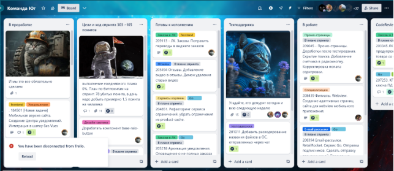

      Рисунок 1– Пример использования Trello командой «Юг»

      Не так давно от руководства компании было принято решение о создании собственного веб-приложения, который бы полностью смог заменить используемый ранее сервис Trello. Таким образом, текущая тема дипломной работы очень актуальна для компании «ДНС Технологии». Она позволит возобновить ранее привычную работу с канбан-досками, но уже на основе собственного приложения, а также реализовать продукт с основным требуемым функционалом. 

      Такое решение предоставляет компании больше контроля над проектом, адаптируя его под уникальные потребности и процессы, которые специфичны для «ДНС Технологии». С уверенностью можно сказать, что создание собственного приложения также даст возможность не только заменить утраченные возможности Trello, но и развить инновационные инструменты, способные оптимизировать и улучшить рабочие процессы компании.

1. # Проектирование системы распределения задач
   1. ## Описание среды проектирования
      При проектировании системы распределения задач использовался онлайн-сервис Figma (рисунок 2).

      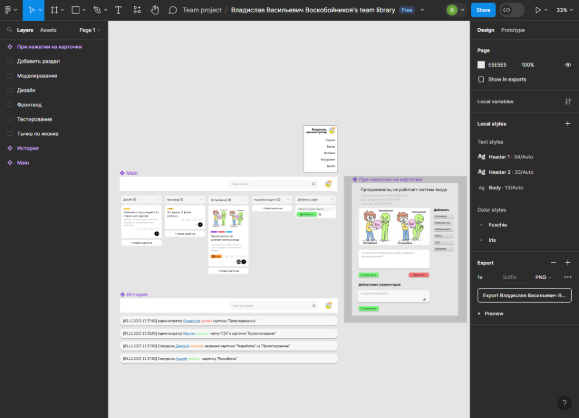

      Рисунок 2 – Интерфейс онлайн-сервиса Figma

      Figma - это браузерный инструмент для совместного проектирования пользовательских интерфейсов, позволяющий совместно создавать прототипы сайтов. Пользователи могут сотрудничать и обмениваться шаблонами, дизайнами и виджетами с миллионами пользователей по всему миру [7].

      Figma позволяет работать в режиме реального времени. Это значит, что в любой момент можно отправить ссылку на наработки руководителю, а тот, в свою очередь, без скачивания каких-либо программ может оценить текущую работу и дать свои рекомендации. Кроме того, есть возможность добавлять в свои проекты интерактивные элементы, такие как функции прокрутки и наведения курсора, что позволяет убедиться в том, что веб-страницы выглядят так, как надо. Это позволяет создавать рабочие прототипы веб-страниц, которые можно легко протестировать, что дает возможность быстро получить обратную связь. Figma даже позволяет экспортировать некоторое количество кода, упрощая работу фронтенд разработчика в будущем.
      ## 2.2 Описание главной страницы 
      Главная страница системы распределения задач состоит из следующих взаимосвязанных частей (рисунок 3):

- канбан-доска;
- поиск по сайту;
- личный профиль.

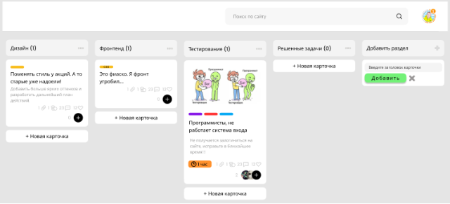

Рисунок 3 – Пример главной страницы

Рассмотрим каждую часть по отдельности.
### **2.2.1 Канбан-доска**
Канбан-доска представляет из себя бесконечное количество разделов и карточек. Добавить необходимый раздел можно, нажав на соответствующую кнопку и введя название раздела (рисунок 4).

Рисунок 4 – Кнопка создания раздела

Около названия раздела имеется собственный счетчик, позволяющий определить количество существующих на данный момент карточек в каждой колонке. Для компании эта функция является полезной, так как она помогает определить загруженность каждого раздела и решить, на что необходимо обратить внимание.

Будет реализована возможность изменения или удаления раздела, а также возможность отметить раздел как раздел с готовыми задачами для подсчета сторипоинтов [8]. Для этого необходимо нажать на три точки и выбрать интересующую функцию. Порядок разделов также можно поменять, передвинув мышкой определенный раздел в нужное место.

Создание карточки в любом разделе происходит при нажатии на кнопку «+ Новая карточка». Появляется возможность ввести заголовок карточки, после чего добавить ее, нажав на специальную кнопку. Если необходимо отменить добавление, то можно нажать на крестик и действие отменится (рисунок 5).

Рисунок 5 – Кнопка «+ Новая карточка» и ее функционал

В каждой карточке может храниться следующая информация (рисунок 7):

- заголовок карточки;
- описание карточки;
- картинка;
- метки;
- участники;
- сторипоинты;
- срок выполнения;
- вложения;
- комментарии;
- реакции.

` `

Рисунок 6 – Рабочая карточка

Заголовок и описание карточки позволяют понять основную проблему, над которой необходимо поработать. Картинка может содержать визуальную составляющую текущей проблемы (однако никто не запрещает использовать смешные или милые картинки, чтобы разбавить тяжелые будние дни программиста). Также, можно непосредственно в самой карточке добавлять или удалять участников, для этого необходимо нажать на «+» (рисунок 7).

Рисунок 7 – Список участников с возможность их изменения

Неотъемлемой частью любой эффективной и удобной канбан-доски являются метки. Метки - это инструмент, позволяющий организовывать и структурировать задачи в проекте. С их помощью можно без труда определить, в каком сервисе или на каком разделе сайта появилась задача, а также необходимый язык программирования для ее решения. Будет создано необходимое количество меток, каждая из которых будет обладать своим цветом. Таким образом, в самой карточке можно выбрать нужные метки – они будут отображаться над названием в виде цветного прямоугольника, при наведении курсором на него будут отображены их названия (рисунок 8).

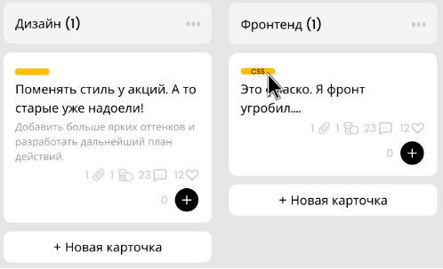

Рисунок 8 – Примеры отображения меток в карточках

Под описанием находится вся необходимая численная информация о карточке (рисунок 9), а именно:

- информация об оставшеемся время. Позволяет более грамотно распоряжаться своим временем и решать задачи к назначенному сроку. Чем меньше останется времени до отведенного конца на задачу – тем ярче будет выделено время;
- информация о количестве прикрепленных материалов. Позволяет понять, вложены ли в основную карточку какие-нибудь дополнительные материалы. При нажатии на иконку появляется возможность выбрать определенный дополнительный материал и скачать;
- информация о количестве сторипоинтов за задачу. Story Points – относительная мера сложности или трудоемкости задачи в методологии Agile. Так, сотрудник может определить, насколько трудоемка поставленная задача. Команда же может узнать, достигли ли они необходимое количество сторипоинтов, благодаря их подсчету;
- информация о количестве комментариев.  Позволяет определить, насколько обсуждаема та или иная задача. Коммуникация позволяет быстро накидать идеи по решению проблемы, задать интересующий вопрос, на который могут ответить. Ну, или же определить, из-за кого же на самом деле упал весь сайт;
- информация о количестве человек, добавивших карточку в избранное. Позволяет определить, сколько человек заинтересованы в решении существующей проблемы;
- информация о количестве участников. Позволяет определить, какое количество людей принимает участие в решении поставленной задачи. 

  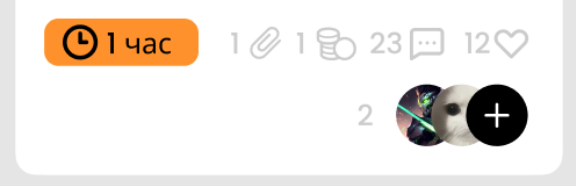

  Рисунок 9 – Численная информация

  Основной причиной выбора именно таких элементов для карточек является текущая потребность компании «ДНС Технологии». 
  ### **2.2.2 Поиск по сайту**
  Одним из важнейших модулей на сайте является поиск. Он жизненно необходим в случае, если задач или разделов огромное количество, а тебе необходимо найти что-то определенное. Для этого было решено разместить в header’е модуль поиска по сайту (рисунок 10).

  

  Рисунок 10 – Модуль поиска по сайту

  Помимо простого поиска по тексту, планируется реализовать поиск, состоящий из фильтров. Основных фильтров будет несколько:

- «участник:». Позволяет определить карточки, в которых принимает работу определенный сотрудник;
- «в:». Позволяет осуществлять поиск в определенном разделе;
- «метка:». Позволяет выбрать карточки, в которых есть необходимая метка;
- «от:». Позволяет определить задачи, поставленные определенным сотрудником;
- «в течение». Позволяет определить задачи, созданные в определенном диапазоне времени.

  Фильтры можно совмещать, сужая круг поиска. Примером реализованного поиска по фильтрам может служить поиск в приложении Discord (рисунок 11) [9]. 

  

  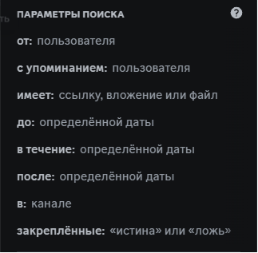

  Рисунок 11 – Пример работы поиска в приложении Discord

  Данный способ поиска поможет сотрудникам быстро и, главное, без каких-либо проблем найти всю необходимую информацию в системе. 
  ### **2.2.3 Личный профиль**
  Возле модуля поиска будет находиться иконка сотрудника, при нажатии на которую появляется блок с кнопками, позволяющими получить основную информацию личного профиля (рисунок 12).

  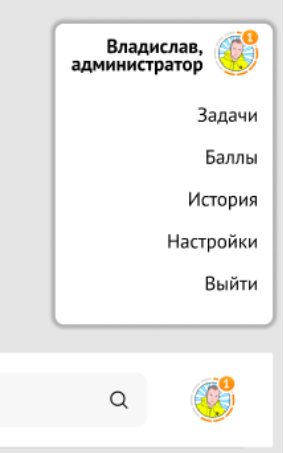

  Рисунок 12 – Иконка сотрудника и появляющийся блок

  Таким образом, можно перейти в разделы и получить информацию о текущих и избранных задачах, баллах (или же сторипоинтах) сотрудника, истории действий, доступной лишь администраторам системы распределения задач, а также возможность личных настроек системы и переключения с одной учетной записи на другую.
  ## 2.3 Управление карточками
  После создания карточки, ее необходимо настроить. Для этого, при нажатии на карточку появляется интерфейс управления (рисунок 13). В данном интерфейсе настраиваются все нужные нам элементы.

  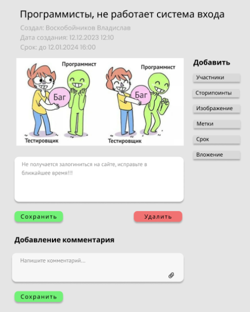

  Рисунок 13 – Интерфейс управления карточками

  В самом начале располагается название карточки, которое можно изменить, нажав на текст и введя новое название. Ниже находится автоматически созданная информация о дате создания карточки и её владельце. Данная информация позволяет определить, в чем состоит задача, к какой группе и разделу сайта относится и насколько свежа проблема.

  Далее следуют функциональные элементы, такие как кнопки «Участники», «Сторипоинты», «Изображение», «Метки», «Срок», «Вложение», кнопка сохранения изменений, кнопка удаления карточки, кнопка сохранения комментария, а также текстовые поля для описания карточки и написания комментария (рисунок 14). 

  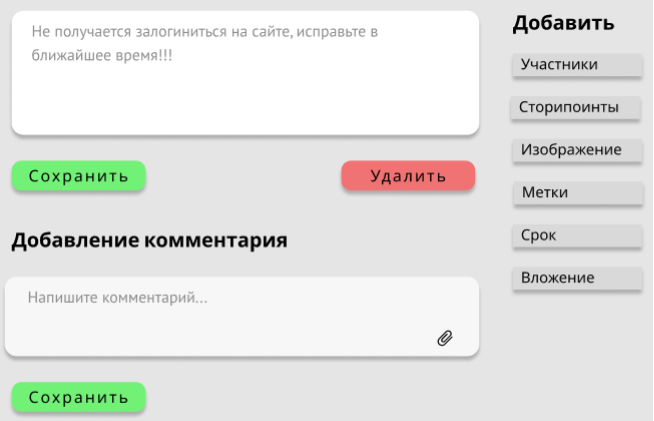

  Рисунок 14 – Основные функциональные элементы интерфейса управления

  Данный функционал позволяет полностью настроить содержание карточки, а именно:

- более подробно расписать суть поставленной задачи;
- добавить или удалить участников в текущем задании;
- оценить выполняемую задачу в сторипоинтах;
- прикрепить изображение к карточке;
- добавить необходимые метки, относящиеся к задаче;
- обозначить срок выполнения задачи;
- приложить необходимые файлы, которые помогут в решении задачи;
- оставить комментарий по выполненной работе с возможностью прикрепления файла;
- сохранить изменения или комментарий;
- удалить карточку в случае необходимости.

  Таким образом, был спроектирован пользовательский интерфейс управления карточками.
  ## 2.4 История активности
  Для мониторинга активности сотрудников необходимо создать простой и удобный раздел. Была спроектирована страница с историей активности (рисунок 15).

  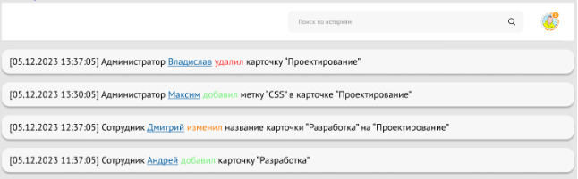

  Рисунок 15 – Пример страницы с историей активности

  Каждый раз, когда сотрудник вносит изменения в системе распределения задач, информация о них сохраняется на странице. К этой информации относится:

- дата и время изменения;
- роль человека на сайте;
- имя сотрудника с возможностью перейти в профиль;
- какое действие было совершено. Основных действия всего три: удалил (выделяется красным), изменил (выделяется желтым) и добавил (выделяется зеленым);
- объект или объекты, над которыми проводились изменения.

  Благодаря поиску, который работает по тому же принципу, как и на главной странице, не составит проблем найти нужную информацию по изменениям.

  Также, для удобства планируется реализовать систему, позволяющую отследить все действия, совершенные с определенной карточкой. Для этого необходимо будет нажать по интересующей карточке правой кнопкой мыши и выбрать «История карточки». При нажатии появится список со всеми изменениями.

## 2.5 Представление взаимодействия внутренних и внешних систем в проекте
Для отображения взаимодействия компонентов проекта (канбан-доски) между собой и с другими системами, целесообразно использовать диаграмму (рисунок 44). Данная диаграмма позволяет визуализировать архитектуру приложения, включая его основные модули и технологии, а также взаимодействие с внешними сервисами. Это особенно полезно при проектировании и документировании сложных систем, так как позволяет лучше понять структуру приложения, выявить потенциальные узкие места и спланировать дальнейшее развитие проекта.

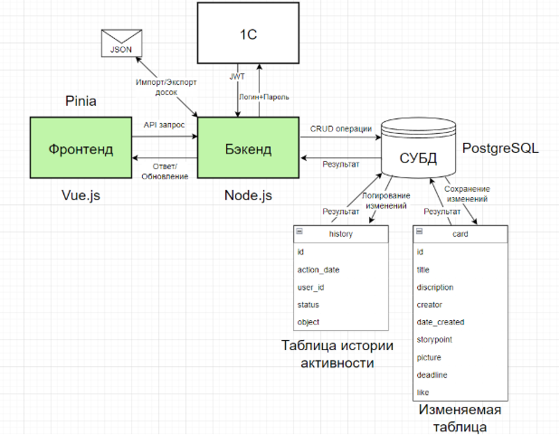

Рисунок 44 – Взаимодействия системы распределения задач 

Для хранения всей необходимой информации в БД была определена следующая структура (рисунок 45):

- таблица «section», имеющая идентификатор раздела и его название;
- таблица «card», имеющая всю необходимую информацию о карточках (название, описание, создателя карточки, дату создания, количество сторипоинтов, ссылка на картинку, запланированная дата выполнения задания, количество лайков);
- связующая таблица «card\_in\_section», позволяющая определить, к какому разделу относится карточка;
- таблица «user», в которой хранится вся информация о сотруднике предприятия «ДНС Технологии»;
- связующая таблица «members\_in\_card», позволяющая определить участников определенного задания;
- таблица «comment», в которой хранится полная информация о комментарии: кем оставлен, в какой карточке, какой текст и какой файл прикреплен (если он имеется);
- таблица «history», в которой хранится вся информация об изменениях на главной странице;
- таблица «tag», в которой хранятся названия всех видов меток;
- связующая таблица «tag\_in\_card», позволяющая определить, какие именно метки относятся к карточке;
- таблица «file», хранящая в себе ссылки на вложения;
- связующая таблица «file\_in\_card», позволяющая определить, какие именно файлы относятся к карточке;

  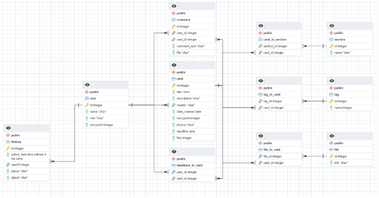

  Рисунок 45 – ER-диаграмма структуры БД

  Стоит отметить, что структура базы данных была спроектирована также с учетом последующих доработок, которые заявлены на реализацию уже за пределами текущего проекта.

  ## 2.6 Изменения по проекту при его реализации
  В дальнейшей работе можно заметить, что начальная концепция проекта и его реализация потерпели значительные изменения. Убран некоторый функционал, изменился интерфейс, переделана логика проекта.

  Данные изменения имеют несколько весомых причин, связанных в первую очередь с новыми бизнес-стратегиями, пересмотром приоритетов и дополнительными требованиями заказчика:

- крайняя необходимость минимально рабочего продукта в связи с сжатыми сроками проекта. Методология Agile предусматривает возможные случаи, когда сроки на разработку проекта сжаты и необходимо сосредоточиться на основных функциях, отложив второстепенные задачи на следующие итерации. Данное решение позволит быстрее создать готовый продукт, который можно будет в дальнейшем расширять.
- оптимизация пользовательского интерфейса. Спустя промежуток времени аналитически было выявлено, что некоторые запланированные функции (например, лайки и комментарии к задаче) не так востребованы пользователями, как предполагалось изначально, и от них на текущий момент можно отказаться. Только после введения проекта в эксплуатацию можно сказать об их необходимости. Данное решение позволяет сосредоточиться на критически важных функциях.

  Таким образом, был скорректирован дальнейший подход к проекту, выделены сотрудники на поддержание разработки, составлен и согласован перечень требуемых задач. Подробнее об этом рассказывается далее.

1. # Процесс создания системы распределения задач
   1. ## Распределение ролей участников при реализации проекта
      Для успешного выполнения проекта, по методологии Agile, важно четко определить роли и обязанности каждого его участника. Распределение ролей обеспечивает эффективное взаимодействие между друг другом, снижает возможные риски и значительно повышает качество результата, делая его более объективным [10]. В данном проекте можно выделить следующих стейкхолдеров: заказчик, руководитель, разработчик, код-ревьюер, тестировщик и отдел сопровождения. Рассмотрим все этапы разработки проекта, выделив их основные роли и обязанности. 

      Заказчик запускает процесс, связываясь с руководителем проекта. В ходе обсуждения согласовываются требования и предполагаемый результат. После этого руководитель начинает разбивать проект на более мелкие задачи, оценивая их по сложности и объему работы и распределяя между разработчиками. Руководитель является ответственным лицом перед заказчиком, и в каждом спринте рассказывает ему о продвижении разработки проекта.

      После распределения задач между разработчиками, каждый начинает работу над своей частью проекта. Не обязательно работа должна заключаться именно в реализации нового функционала: это может быть и рефакторинг существующего кода или исправление существующих ошибок. Каждый из разработчиков использует средства контроля версий Git для обеспечения синхронизации кода с другими разработчиками. Это также позволяет отслеживать изменения в коде и предотвращает параллельные изменения в одной и той же функции.

      По завершении работы над своей задачи разработчик отправляет код на код-ревью. Код-ревьюер тщательно изучает представленный код, анализируя его структуру, читаемость и соответствие нормам кодирования. После проведения код-ревью, разработчику предоставляют обратную связь, указывая на ошибки и предлагая возможные варианты их решения. Этот этап необходим не только для выявления неявных ошибок, но и для того, чтобы разработчик мог набраться опытом в программировании, принимая во внимание советы и рекомендации более опытных коллег.

      После успешного прохождения код-ревью и внесения всех необходимых поправок, разработчик отправляет текущую версию своего кода тестировщику. Тестировщик проверяет корректность работы функционала, выявляя возможные ошибки. Если все тесты проходят успешно, тестировщик подтверждает готовность функционала к использованию.

      Затем разработчик отправляет задачу на установку в продакшн, где отдел сопровождения берет на себя дальнейшую ответственность. Он устанавливает задачу в соответствии с требованиями и проверяет корректность выполнения в продакшене. После успешной установки задача считается выполненной. В случае, если у заказчика не появятся дополнительные требования к задаче – ее можно считать закрытой.

      Визуальное распределение ролей можно увидеть на рисунке 16.

      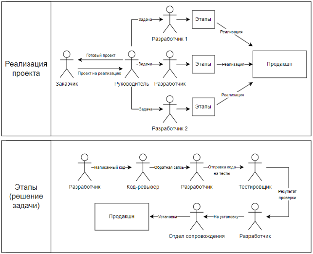

      Рисунок 16 – Взаимодействие между участниками проекта

      Таким образом, грамотное распределение ролей среди участников проекта играет ключевую роль в быстрой реализации проектов без каких-либо глобальных ошибок и потери качества. 

   1. ## Подготовительный этап к реализации системы распределения задач
      1. ### **Описание проектного инструментария**
         Для реализации проекта по созданию канбан-доски было решено использовать следующий инструментарий:

- Vue.js. Прогрессивный фреймворк JavaScript [11] для создания пользовательских интерфейсов. Он отлично подходит для разработки веб-приложений, так как обладает простым синтаксисом, легковесным ядром и мощной системой компонентов. Таким образом, можно использовать Vue.js для создания интерактивных компонентов канбан-доски, управления состоянием приложения и реактивных обновлений интерфейса.
- Vite. Инструмент для быстрой сборки веб-приложений [12]. Он предоставляет среду разработки с быстрым временем перезагрузки и быстрым стартом благодаря использованию модульной сборки на основе ES модулей и быстрой рекомпиляции с помощью современных инструментов, таких как Rollup. Vite позволяет быстро создавать и тестировать компоненты без необходимости предварительной сборки всего проекта. В использовании с Vue.js, Vite может значительно ускорить процесс разработки канбан-доски, обеспечивая моментальную перезагрузку в браузере при внесении изменений в код.
- Node.js. Среда выполнения JavaScript. Позволяет запускать его на стороне сервера [13].  Использование Node.js пригодится для создания серверной части вашего приложения, обработки запросов от клиентов, взаимодействия с базой данных и другими операциями, требующих серверной логики.
- Pinia [14]. Библиотека управления состоянием для Vue.js. Она предоставляет простой и интуитивно понятный способ управления состоянием приложения. Используя Pinia, можно легко организовать данные канбан-доски и синхронизировать их между компонентами Vue.js.
- Tailwind CSS. Инструментарий для создания пользовательского интерфейса, который основан на применении классов для стилизации элементов [15]. Он предоставляет широкий набор готовых стилей и компонентов, которые можно легко настраивать и расширять. Tailwind CSS идеально подходит для быстрой разработки пользовательского интерфейса канбан-доски, так как он позволяет быстро применять стили к элементам внутри блоков и создавать адаптивный дизайн.

  Итак, используя Vue.js для создания интерфейса канбан-доски, Vite для сборки,  Node.js для создания серверной логики, Pinia для управления состоянием приложения и Tailwind CSS для стилизации интерфейса, получаем мощный и эффективный инструментарий, позволяющий полностью реализовать проект.
  1. ### **Выбор и настройка среды разработки**
     Для реализации системы канбан-досок необходимо определиться, в какой программе и на каком языке разрабатывать данную систему распределения задач.  

     Существует два вида программного обеспечения, предназначенные для разработки приложений, тестирования и релиза – IDE (Integrated Development Environment) и редактор кода [16]. Стоит понимать разницу между ними и иметь четкое представление, что необходимо выбрать для успешной реализации текущего проекта.

     Для этого нужно выделить основные функции, необходимые для удобного написания кода и тестирования сайта:

- подсветка синтаксических конструкций кода. Благодаря использованию различных цветов и шрифтов, облегчается чтение и визуальное восприятие исходного кода;
- статический анализ кода. Позволяет проанализировать синтаксические и типовые ошибки в коде без его компиляции. Таким образом, данная функция поможет выявить базовые ошибки еще при стадии разработки;
- возможность смотреть на изменения страницы при работе с кодом в режиме реального времени. Не очень хочется каждый раз что-либо запускать, перезагружать и прочее лишь для того, чтобы посмотреть на результат измененного кода;
- emmet. Неотъемлемое дополнение для любого фронт-энд разработчика. Позволяет намного ускорить верстку сайта, создавая шапку документа, стили, теги, скрипты, ссылки и множество других блоков при помощи специальных сокращений. Поэтому было решено, что IDE или редактор обязан содержать это дополнение.

  Основным преимуществом IDE бесспорно можно выделить немалое количество функций, которое не встретить в более простых инструментах, особенно при создании веб-приложений [17]. В IDE все эти все эти функции объединяются в единую платформу. Однако не стоит забывать, что такое преимущество может в то же время оказаться и большим недостатком, ведь основная проблема IDE в их перегруженности: зачастую большинство возможных инструментов мы не используем, однако их существование может негативно сказаться на работе. Так, сложные функции, встроенные в IDE и о существовании которых мы можем даже и не знать, скорее замедлят процесс, чем сделают его эффективнее.

  С другой стороны, существуют редакторы кода [18], которые изначально содержат минимальный функционал, необходимый лишь для написания кода. Все дополнительные функции находятся в сотнях написанных плагинах. В этом и секрет редакторов кода: если вы не хотите тратить гигабайты памяти и время, скачивая IDE с предустановленным функционалом, который, как вы считаете, в своем большинстве и не нужен, то вы можете установить любой из редакторов кода и добавить нужные на ваш взгляд расширения, тем самым настроив всё именно под себя и под поставленную задачу.

  Таким образом, было решено использовать Visual Studio Code [19].  На официальном сайте [20] заявлено, что это редактор кода, однако можно считать, что VSCode - это что-то между обычным редактором кодом и IDE. Совершенно бесплатный, включает в себя инструменты запуска и отладки, содержит систему контроля версий и поддерживает большинство необходимых языков программирования. В то же время простой, работает намного быстрее, чем обычные IDE, в то же время включает в себя весь необходимый для реализации функционал, который может дополняется расширениями. В целом, идеально подходит для небольших web-проектов.

  Первым делом необходимо установить Visual Studio Code [21] и Node.js [22]. После их установки, при запуске VSCode появляется экран приветствия (рисунок 17). 

  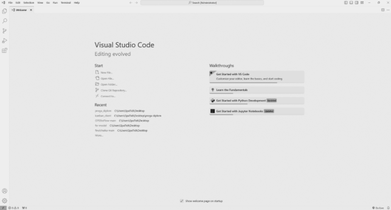

  Рисунок 17 – Экран приветствия Visual Studio Code

  Была создана папка (в данном случае на рабочем столе), в которой и будет находиться проект, условно названная «scienceproject». В VSCode была выбрана созданная папка. Для дальнейшей работы потребуется терминал. Чтобы его открыть, необходимо в строке меню (верхний левый угол) выбрать «Terminal -> New Terminal», либо воспользоваться сочетанием клавиш «CTRL+SHIFT+`». В появившемся терминале была введена команда «npm init vite@latest» [23]. Эта команда предназначена для быстрого развертывания проекта, создавая шаблонный проект. После ввода команды запускается цепочка вопросов, позволяющая настроить проект под определенную задачу. В первую очередь попросят выбрать название приложения. После ввода названия необходимо выбрать фреймворк, с которым будет выполняться работа в дальнейшем – в данном случае Vue. При выборе варианта между TypeScript и JavaScript выбрано было второе. После некоторого времени появился шаблонный проект со всеми необходимыми папками и файлами (рисунок 18).

  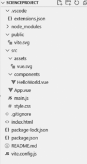

  Рисунок 18 – Содержимое папки проекта

  Для того, чтобы видеть конечный результат написанного кода, необходимо запустить локальный сервер. Для этого в командной строке необходимо ввести «npm run dev». После выполнения команды отображаются ссылки, перейдя по которым можно отследить корректность работы кода. В случае, если все сделано верно, появится шаблон стартовой страницы Vite + Vue (рисунок 19).

  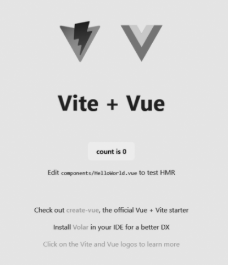

  Рисунок 19 – Стартовая страница Vue

  Просматривая содержимое в файлах, можно заметить, что синтаксис никак не подсвечивается – сплошной черный код. Для решения этой проблемы необходимо перейти во вкладку плагинов (Extensions (Ctrl+Shift+X)) и установить любое подходящее расширение, например, Vetur [24]. Он и отвечает за подсветку синтаксиса для файлов vue. Наглядно увидеть изменения можно на рисунке 20.

  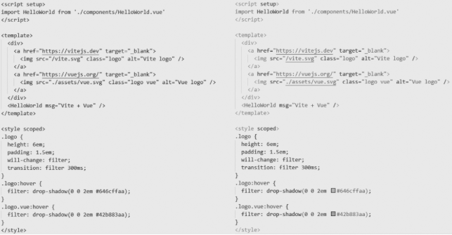

  Рисунок 20 – Отображение кода ДО и ПОСЛЕ установки плагина

  Таким образом, была завершена первоначальная настройка проекта, сделано все для комфортной работы над проектом. Необходимо лишь догрузить необходимые библиотеки с помощью команды в консоли «npm install», и можно приступать к реализации проекта. 
  1. ## Использование сценариев Use Case для описания взаимодействия пользователя с системой
Одним из немаловажных компонентов для успешной реализации проекта является правильно и понятно описанное взаимодействие с системой. На помощь приходит использование так называемых «Use Case» - это описание сценариев взаимодействия пользователей с системой, которые позволяют разработчикам и другим участникам проекта понять, как системе следует реагировать на изменения и как должна работать в целом [25].

Использование Use Case упрощает работу в будущем по нескольким причинам:

- определение требований. Use Case помогают формулировать функциональные требования к системе, что обеспечивает точное понимание того, что нужно реализовать и каким образом.
- улучшение коммуникации. Благодаря Use Case создается некий общий, легкий для восприятия язык для всех участников проекта (заказчики, пользователи, разработчики, тестировщики, менеджеры), тем самым снижается риск недопонимания и неправильного толкования требований.
- планирование разработки. Use Case разбивают проект на управляемые части, что позволяет поэтапно реализовывать, тестировать и интегрировать каждую часть системы.
- ориентация на пользователя. Use Case являются одним из способов сфокусировать внимание не только на технических деталях проекта, но и на потребностях пользователей. Это позволяет создавать приложения, которые идеально подходят для решения реальных первостепенных проблем, что в конечном итоге приводит к созданию более полезных и интуитивно понятных функций.
- упрощение тестирования. Use Case служат основой для создания тест-кейсов, позволяя проверять выполнение всех сценариев использования системы в соответствии с ожиданиями.
- документация и справочник. Use Case могут послужить своеобразным вики для разработчиков, предоставляя подробное описание того, как и что работает в системе. Это особенно полезно для новых членов команды или для напоминания текущим разработчикам.

  Разберем несколько примеров сценариев взаимодействия с системой:

- аутентификация пользователя (таблица 1). Стандартная функция, позволяющая определять сотрудников для дальнейшего взаимодействия с ними (распределение ролей и задач, разделение на команды);

  Таблица 1 – Use Case «Аутентификация пользователя»

  |Категория|Содержание|
  | :-: | :-: |
  |Основное действующее лицо|Любой пользователь канбан-доски.|
  |Гарантии успеха|Пользователь авторизован на свой аккаунт/пользователь не смог войти в чужой аккаунт.|
  |Триггер|Открытие страницы в браузере при отсутствующем.|
  |Описание сценария|
1 Пользователь вводит данные и отправляет форму.

2\. Введенная информация отправляется на сервер через API.

3\. Сервер сверяет логин и пароль, создаёт JWT токен и отправляет его обратно пользователю.
|

  Продолжение таблицы 1

  |Категория|Содержание|
  | :-: | :-: |
  |Описание сценария|4\. Токен сохраняется на клиенте (например, в localStorage или cookies) для реализации последующего функционала.|
  |Расширение к сценарию|
3\.1.1 Сервер не находит указанный логин и сообщает об этом системе.

3\.1.2 Система возвращает пользователю ошибку.

3\.1.3 Пользователь возвращается к шагу 1.

3\.2.1 Указанный пользователем пароль не совпадает с паролем аккаунта в базе. 

3\.2.2 Система возвращает пользователю ошибку.

3\.1.3 Пользователь возвращается к шагу 1.
|

- отображение досок согласно ролям пользователя (таблица 2). Позволяет предоставлять пользователю лишь необходимую ему информацию;

  Таблица 2 – Use Case «Отображение досок согласно ролям пользователя»

  |Категория|Содержание|
  | :-: | :-: |
  |Основное действующее лицо|Авторизованный пользователь канбан-доски.|
  |Гарантии успеха|Пользователь видит только те доски и функции, которые соответствуют его роли.|
  |Триггер|Пользователь открывает страницу с канбан-доской после успешной аутентификации.|
  |Описание сценария|
1\. Пользователь открывает страницу канбан-доски.

2\. Система проверяет наличие и валидность JWT токена.

3\. Система извлекает информацию о пользователе из токена.

4\. Система определяет роль пользователя (администратор, пользователь).
|

  Продолжение таблицы 2

  |Категория|Содержание|
  | :-: | :-: |
  |Описание сценария|
5\. Система определяет команду, в которой работает пользователя.

6\. Система запрашивает доступные доски и функции с учетом роли и команды пользователя.

7\. Система отображает пользователю доступные доски и функции согласно его роли.
|
  |Расширение к сценарию|
2\.1. Токен отсутствует или недействителен.

2\.1.1. Система перенаправляет пользователя на страницу аутентификации.

5\.1. Ошибка при запросе данных о досках.

5\.1.1. Система отображает сообщение об ошибке и предлагает повторить попытку позже.
|

- перемещение задачи с одного столбца на другой (таблица 3). Один из способов управления задачами, позволяющий изменять ее статус.

  Таблица 3 – Use Case «Перемещение задачи с одного столбца на другой»

  |Основное действующее лицо|Авторизованный пользователь канбан-доски.|
  | - | - |
  |Гарантии успеха|Задача перемещена в другой столбец, информация обновлена на сервере и у других пользователей.|
  |Триггер|Пользователь перетаскивает задачу и отпускает её в другом столбце.|
  |Описание сценария|
1\. Пользователь захватывает задачу из одного столбца и переносит её в другой.

2\. Система проверяет наличие и валидность JWT токена.

3\. Система отправляет запрос на сервер для обновления статуса задачи (указание нового столбца).
|

  Продолжение таблицы 3

  |Категория|Содержание|
  | :-: | :-: |
  |Описание сценария|
4\. Сервер обрабатывает запрос, обновляет информацию о задаче в базе данных.

5\. Сервер возвращает подтверждение успешного обновления.

6\. Система обновляет интерфейс, отображая перемещенную задачу в новом столбце.
|
  |Расширение сценария|
2\.1. Токен отсутствует или недействителен.

2\.1.1. Система перенаправляет пользователя на страницу аутентификации.

4\.1 Ошибка при обновлении информации на сервере.

4\.1.1 Сервер возвращает сообщение об ошибке.
|

  Таким образом, использование Use Case является опциональным инструментом при разработке программного обеспечения. Они позволяют на более понятном языке общаться с заказчиком, обеспечивая ясное и точное понимание требований. Благодаря Use Case можно структурированно и подробно описывать функционал системы, что помогает создавать именно тот продукт, который нужен пользователю. Неудивительно, что такой подход упрощает процесс разработки, улучшает коммуникацию между всеми участниками проекта, а также способствует составлению полного перечня задач проекта.

  1. ## Работа с планировщиком задач SDMS
     В компании DNS Software Development Management System (система управления разработкой программного обеспечения) [26], или же сокращенно SDMS, стала незаменимым инструментом для организации рабочих процессов (рисунок 21). Ее внедрение было ответом на необходимость гибкости и прозрачности в управлении проектами, которые становились все более сложными с ростом компании. Переход на SDMS в сентябре 2017 года полностью заменил использование сторонних приложений, таких как Redmine, которые не давали возможности компании развивать из-за своей ограниченности.

     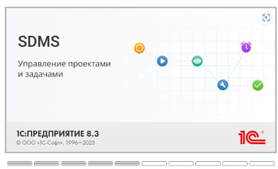

     Рисунок 21 – Система управления разработкой программного обеспечения

     SDMS, разработанная на платформе 1С:Предприятие 8.3, обладает множеством функций, включая управление задачами и проектами, анализ трудозатрат и финансовых расчетов. Благодаря ее возможностям формирования отчетов, руководство может отслеживать работу сотрудников и принимать решения, опираясь на количественные и качественные показатели выполнения задач и проектов.

     Одним из ключевых преимуществ SDMS, как уже было подмечено ранее, является его гибкость, которая позволяет адаптировать систему под специфические потребности компании. Кроме того, SDMS способствует более эффективному взаимодействию между отделами и повышает уровень прозрачности внутренних процессов.

     Реализация SDMS в компании не прошла без проблем. В ходе эксплуатации выявлялись как недочеты, так и серьезные проблемы, которые, например, из-за неправильно написанного кода, приводили к удалению важных файлов и остановке работы всего подразделения. Тем не менее, благодаря грамотному подходу к управлению проектом и оперативной поддержке со стороны разработчиков, большинство проблем были успешно устранены.

     Стоит также кратко рассмотреть саму работу с SDMS. Для этого, в пример возьмем задачу «З0000230030. Чекаут. Финал. Восстановить отправку в RetailRocket», назначенную фуллстэк разработчику Рындину Андрею Александровичу.

     Перейдя на задачу, сразу попадаем в раздел «Свойства» (рисунок 22), в котором содержится вся необходимая информация по ней: состояние текущей задачи, ответственный за выполнение, основание заявления в спринт, заказчик, назначение, к какой относится команде разработчиков, оценка работы по временной шкале и по стори поинтам, а также сроки выполнения всех этапов жизненного цикла задачи.

     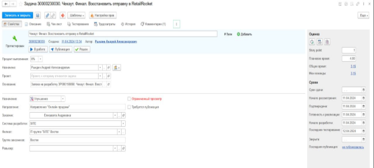

     Рисунок 22 – Раздел «Свойства» в задаче

     В разделе «Описание» (рисунок 23) раскрыта основная проблема, на решение которой как раз и направлена задача, планируемый способ ее решения, возможности тестирования, а также содержатся основные файлы, иллюстрирующие проблему или содержащие примеры требуемого решения.

     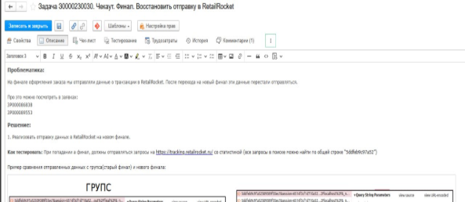

     Рисунок 23 – Раздел «Описание» в задаче

     Раздел «Чек-лист» затрагиваться не будет, т.к. большинство команд его в принципе не используют из-за отсутствия необходимости. По задумке, чек-лист бы позволял отслеживать прогресс выполнения задачи, однако, благодаря остальным разделам, прекрасно можно обходиться и без него. 

     Раздел «Тестирование» (рисунок 24) необходим для поддержания связи между разработчиком и тестировщиком. Здесь разбираются основные проблемы, найденные при тестировании, указывается, на что стоит обратить внимание при работе с кодом в будущем, а также обсуждаются организационные моменты при проверке. Помимо этого, в нем можно увидеть плановое и фактическое время тестирования, ФИО исполнителей. 

     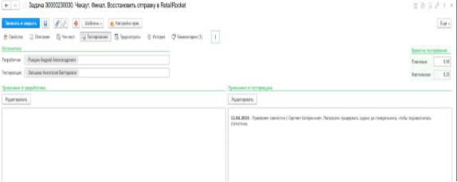

     Рисунок 24 – Раздел «Тестирование» в задаче

     Для отслеживания трудозатрат, в разделе «Трудозатраты» (рисунок 25) отмечается количество времени (в часах), затраченное на выполнения определенного этапа. Позволяет руководителю определить проблемные места у сотрудников при разработке.

     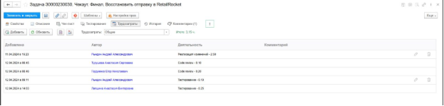

     Рисунок 25 – Раздел «Трудозатраты»

     История изменений (рисунок 26) позволяет видеть все изменения по задаче, а также основные этапы при ее решении. 

     

     Рисунок 26 – Раздел «История»

     В разделе «Комментарии» отмечается какая-либо дополнительная информация, например, изменения в техническом задании, ссылка на request кода, куда были слиты изменения или результаты исследования.

     Именно в SDMS был составлен основной перечень задач, отслеживалось их выполнение, а также происходило взаимодействие между участниками проекта.

     Несмотря на все свои преимущества, SDMS имеет и некоторые недостатки. Так, используя SDMS для составления задач на реализацию в текущем проекте, был выявлен ряд неудобств, таких как непонятный, загроможденный ненужной информацией интерфейс, усложняющий навигацию, а также неиспользуемые элементы.

     Следует предположить, что из-за особенностей работы с платформой 1С [27] и несоответствующего современным требованиям дизайна, у руководства и возникло желание попробовать перейти с SDMS на новое, современное и удобное решение – канбан-доску.

  1. ## Перечень задач проекта
     Для успешного выполнения проекта стоит четко выделить основные задачи для реализации. Это позволит не запутаться при работе, какой функционал необходимо было реализовать, какие задачи выполнены, а какие – еще нет. Для этого был составлен перечень задач проекта, включающий в себя номер блока, номер задачи, короткое и подробное описание задачи. Ознакомиться с перечнем можно в таблице 4.

     Таблица 4 – Перечень задач проекта

<table>     <tr><th valign="top">№ блока</th><th valign="top">№ задачи</th><th valign="top">Краткое описание задачи</th><th valign="top">Подробное описание задачи</th></tr>
     <tr><td valign="top">1</td><td valign="top">З0000229348. Канбан. Реализовать компонент «Header».</td><td valign="top">Требование заказчика. Header.</td><td valign="top">Требуется разработать верхний блок страницы, содержащий логотип компании «ДНС», название текущей доски, кнопку «меню» для работы с информацией о системе, кнопку добавления новой задачи.</td></tr>
     <tr><td rowspan="2" valign="top">
2

</td><td valign="top">З0000229418. Канбан. Реализовать рабочее пространство (компонент «Board»).</td><td valign="top">Требование заказчика. Доска.</td><td valign="top">Создание компонента board, имеющий в себе возможность добавления/изменения/удаления колонки и обрабатывающий случаи пустой доски или отсутствующих досок в целом. </td></tr>
     <tr><td valign="top">З0000229449. Канбан. Реализовать компонент «Column».</td><td valign="top">Требование заказчика. Колонка.</td><td valign="top">Необходима реализация компонента «Колонка», состоящая из карточки с отображением названия колонки и всех карточек, принадлежащие ей. </td></tr>
</table>

     Продолжение таблицы 4

<table>     <tr><th valign="top">№ блока</th><th valign="top">№ задачи</th><th valign="top">Краткое описание задачи</th><th valign="top">Подробное описание задачи</th></tr>
     <tr><td valign="top"></td><td valign="top">З0000229671. Канбан. Реализовать компонент «Card».</td><td valign="top">Требование заказчика. Карточка.</td><td valign="top">Необходима реализация компонента «Карточка», добавление возможности перемещения, изменения и удаления. Реализация атрибутов id, title, description, status в данном компоненте.</td></tr>
     <tr><td rowspan="2" valign="top">
3

</td><td valign="top">З0000229833. Канбан. Реализовать компонент «Sidebar».</td><td valign="top">Требование заказчика. Боковая панель.</td><td valign="top">Реализация боковой панели. На панели необходима информация о количестве текущих досок,   кнопок перемещения по доскам и кнопку создания новой доски.</td></tr>
     <tr><td valign="top">З0000229955. Канбан. Реализовать темы страницы.</td><td valign="top">Требование руководителя. Светлая/темная тема.</td><td valign="top">Реализация возможности изменения цветовой гаммы. Добавление switch-кнопки на боковой панели, отвечающую за изменение гаммы.</td></tr>
     <tr><td valign="top">4</td><td valign="top">З0000230024. Канбан. Реализовать работу с хранилищем (localstorage).</td><td valign="top">Требование руководителя. Localstorage.</td><td valign="top">Реализации хранения информации о сессии (досок, темы и userid) у каждого пользователя.</td></tr>
</table>

     Важно понимать, что проект основан на методологии Agile и представленный перечень задач не является окончательным. В процессе разработки и реализации проекта непременно будут возникать новые задачи, требующие внимания и решения. 

  1. ## Рекомендации по кодированию
     На предприятии действуют регламенты, которые помогают обеспечить унифицированный стиль кода в разных командах. Это значительно упрощает взаимодействие между всеми участниками проекта. 

     Во время разработки frontend приложения, в частности при работе с JavaScript файлами, существует автоматическая проверка при помощи инструмента ESLint [28], который выявляет ошибки при отклонении от регламента. Основной набор правил из регламента включает в себя следующее: 

- написание переменных в camelCase;
- отступом является табуляция;
- все присвоения выравниваются пробелами для удобного чтения;
- стиль переноса строк – unix;
- сравнение переменных происходит в yoda стиле;
- использование одинарных кавычек (за исключением строк, содержащих одинарные кавычки);
- использование пробел перед/после ключевых слов (if, else, for, as, from и др.);
- пустая строка между членами класса (свойствами, атрибутами);
- пустая строка перед return;
- необходимость создания модели запросов/ответов и маппинга данных;
- использование let/const вместо var;
- избегание использования неопределенных переменных;
- использование точки с запятой;

  Хотя регламент представляет собой рекомендации, а не обязательные правила, его следование все же рекомендуется. Это способствует быстрой адаптации к чужому коду, тем самым улучшая процесс разработки и поддержки проектов.
  1. ## Реализация системы распределения задач 
     1. ### **Реализация компонента header**
        Был создан компонент «Header.vue». Он состоит из двух блоков, разделенных серой полоской (рисунок 27):

- блок, содержащий логотип компании «ДНС»;
- блок, содержащий название доски, кнопку «+ Новая задача», а также выпадающее меню с функциями сбора статистики и выхода.

  

  Рисунок 27 – блок Header

  Благодаря использованию Tailwind CSS, был также реализован адаптив хедера под мобильные устройства (рисунок 28). Для этого было добавлено маленькое квадратное лого, убрано название у кнопки и около названия была добавлена стрелочка с выпадающим меню, функционал которого будет раскрыт позже.

  

  Рисунок 28 – блок Header для мобильной версии

  Реализованный код можно посмотреть в приложении А. Компонент «Header» вызывается в самом начале шаблона корневого компонента vue – «App.vue».
  1. ### **Реализация компонента board с функционалом для колонок и карточек**
Этот компонент представляет из себя доску с колонками и обладающий функционалом добавления новых карточек и колонок, а также поддержкой интерактивного перемещения задач между колонками. Каждая колонка содержит блок названия этапа с количеством карточек, сами карточки и кнопку создания новой карточки. Колонки и карточки создаются в цикле «v-for» на основе существующих данных. После их создания отображается кнопка «+ Добавить новую колонку» с необходимым функционалом. Каждая задача может быть выбрана для отображения дополнительной информации, редактирования или удаления. Карточки являются перетаскиваемыми элементами, что позволяет изменять их положение внутри колонок или перемещать между колонками. Цикл создания карточки и её анимации взаимодействия между другими элементами находятся в компоненте TransitionGroup (рисунок 29).

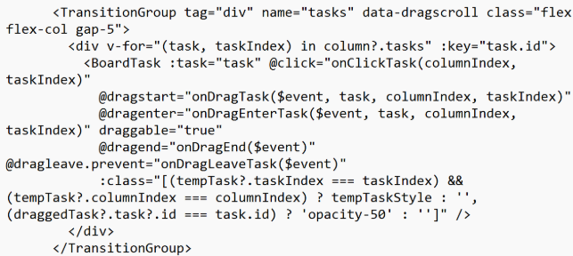

Рисунок 29 – Код компонента TransitionGroup

За корректное перемещение карточек отвечают отработчики событий «@dragstart», «@dragenter», «@dragend» [29] и соответствующие методы. Пример реализации одного из методов вы можете увидеть на рисунке 30.

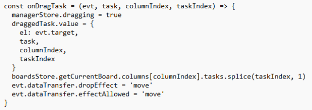

Рисунок 30 – Метод обработки события @dragstart

На рисунке 31 изображена доска с двумя колонками и тремя карточками, а также продемонстрирован эффект при перемещении задания из одной колонки в другую.

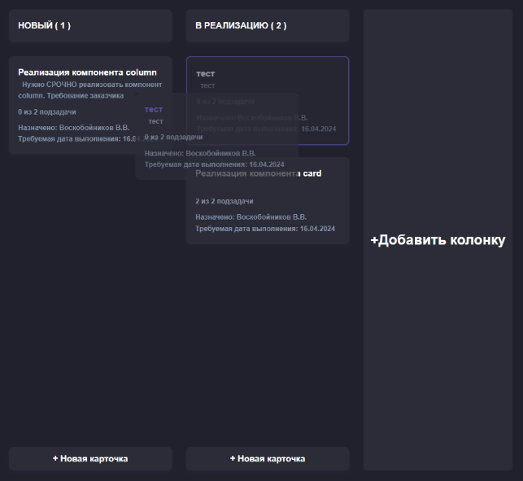

Рисунок 31 – Перемещение карточки в board

При нажатии на карточку появляется модальное окно, затемняющая остальной интерфейс (рисунок 32). В нем можно увидеть всю информацию о задаче: наименование задачи, кто создатель, на кого назначена, дата создания, планируемая дата выполнения, описание, подзадачи и текущее состояние.

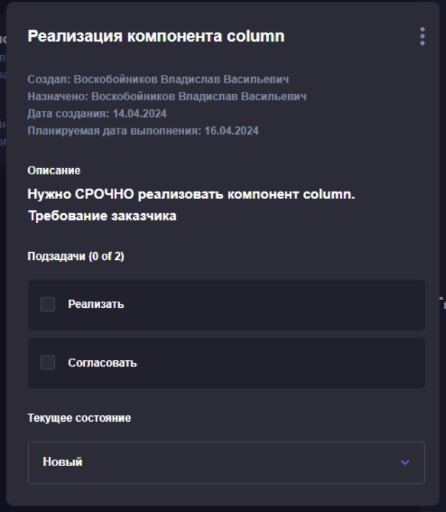

Рисунок 32 – Модальное окно просмотра информации о карточке

В модальном окне имеется функционал по удалению и изменению (рисунок 33) карточки.

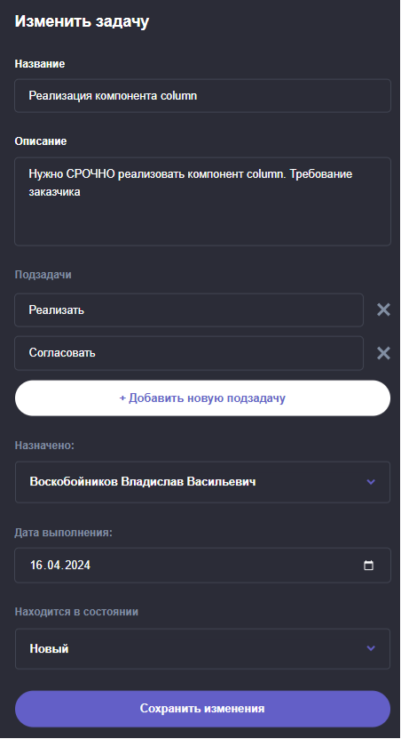

Рисунок 33 – окно изменения задачи

При попытке удаления задачи появляется предупреждающее окно (рисунок 34).

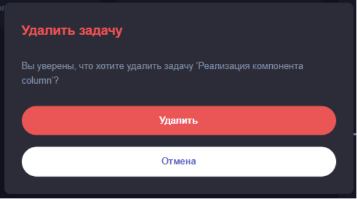

Рисунок 34 – Предупреждающее окно при удалении задачи

Таким образом, было полностью реализовано требование №2 от заказчика по созданию рабочих досок, колонок и карточек. Однако не стоит забывать, что работа над ними будет продолжаться в дальнейшем, дополняя их различным функционалом.
1. ### **Реализация боковой панели**
   Боковую панель можно разделить на четыре основных блока:

- описательный блок. Содержит поясняющую надпись для следующего блока, а также хранит информацию о количестве существующих на данный момент досок;
- блок с досками. Каждое название представляет из себя кнопку, позволяющую перейти в необходимый раздел. Рядом с названием расположена шестеренка, открывающая форму, в которой можно изменить необходимую доску.  Под всеми существующими названиями находится кнопка, позволяющая добавить новую доску. Для этого в модальном окне, который по функционалу и виду никак (кроме названия) не отличается от окна для изменения, необходимо ввести название доски и колонок (рисунок 35);
- переключатель светлой/темной темы. Позволяет поменять оформление всей страницы. Более подробно про реализацию такой возможности будет рассказано позже;
- кнопка «убрать боковую панель». Позволяет скрыть боковую панель для освобождения рабочего пространства на экране, что бесспорно является полезной функцией.

  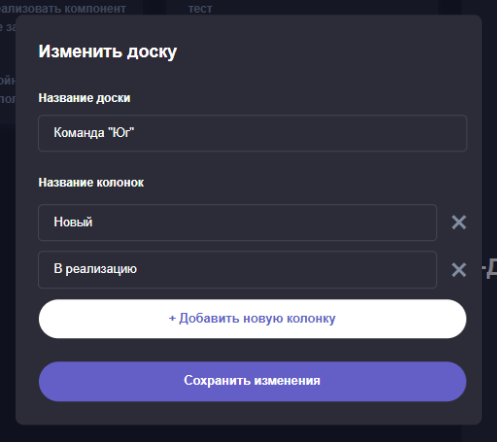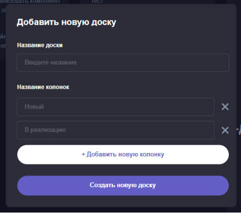

  Рисунок 35 – Форма создания/изменения новой доски

  Увидеть, как выглядит боковая панель целиком, вы можете на рисунке 36.

  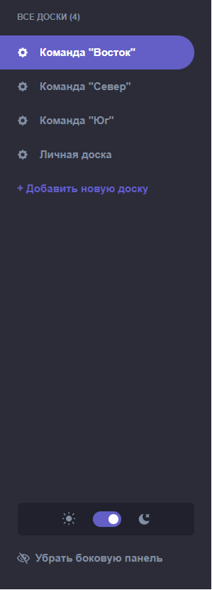

  Рисунок 36 – Боковая панель

  Был реализован адаптив боковой панели под мобильные устройства. Для этого, как указывалось ранее, в хедере была создана стрелочка, при нажатии на которую всплывает окно, выполняющее все вышеперечисленные функции обычной панели (рисунок 37). 

  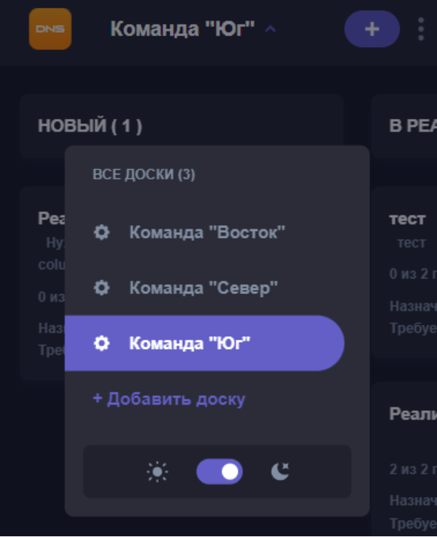

  Рисунок 37 – Адаптивная версия компонента Sideboard для мобильных устройств

  Реализацию десктопной версии компонента боковой панели в виде кода можно посмотреть в приложении Б.
  1. ### **Реализация темы страницы** 
     Благодаря Tailwind CSS, можно просто реализовывать светлую/темную темы, а также настраивать адаптив. Перед тем, как описывать способ создания темной темы, разберемся в создании стилей для элементов в целом. Для этого разберем следующий фрагмент кода для визуализации боковой панели (рисунок 38):

- bg-white. Устанавливает белый цвет фона для элемента;
- min-h-[calc(100vh-80px)]. Устанавливает минимальную высоту, создавая тем самым боковую панель на весь экран;
- w-64 lg:w-[300px]. Устанавливает ширину элемента 64 пикселя для мобильных устройств и ширину 300 пикселей для широких экранов;
- pb-10. Отвечает за отступ снизу элемента в 10 пикселей. Тем самым кнопка «Убрать боковую панель» не уходит за экран;
- hidden sm:flex sm:flex-col. Скрывает элемент только на мобильных устройствах;
- border-r border-r-lines-light. Устанавливает правую границу элемента с цветом «lines-light» в светлой теме.

  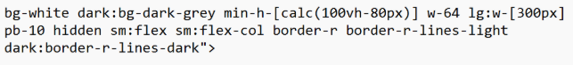

  Рисунок 38 – Часть стилизации боковой панели

  Некоторые стили были пропущены неспроста. Так, можно перейти к основной фиче проекта – темная тема. Префикс «dark:» как раз и отвечает за реализацию различных тем на странице [30]. Благодаря Tailwind CSS можно буквально для каждого элемента выбрать два стиля отображения – светлый и темный. Для комфортной работы со стилизацией компонентов можно настроить конфиг (tailwind.config.js). Например, он позволяет именовать цветовые палитры как удобно разработчику (рисунок 39).

  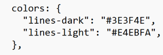

  Рисунок 39 – Определение цветовой палитры названиями

  Пример использования таких названий можно увидеть в части стилизации боковой панели.
  1. ### **Реализация работы с хранилищем (localstorage)**
     Pinia позволяет сохранять данные в локальном хранилище браузера. Это хранилище имеет название – localstorage. Благодаря такому хранилищу удобно взаимодействовать с различными компонентами, ведь все они будут обращаться к одной информации [31]. 

     Так, в boards.js объявлено хранилище вида JSON [32] с ключом boards, имеющее значение всех досок, колонок и карточек, а также содержащее информацию о выбранной доске, колонки и карточки (рисунок 40). Существует также хранилище с ключом theme, запоминающее текущую тему у пользователя.

     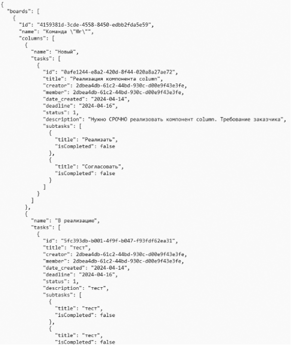

     Рисунок 40 – Пример части хранимой информации в файле data.json

     Реализация с локальным хранилищем упрощает задачу по взаимодействию клиента с сервером и сайтом. 
  1. ### **Разработка системы аутентификации пользователя**
     Для распределения ролей и задач необходимо как-то выделять каждого пользователя. Для этого необходимо реализовать систему аутентификации пользователя.

     Для хранения информации воспользуемся уже знакомым LocalStore. Создадим в папке stores новое хранилище «auth.js». Оно будет состоять из:

- информации о пользователе «authUser»;
- вычисляемого свойства «user», позволяющего посмотреть имеющуюся информацию о пользователе;
- два метода «getToken()» и «getUser()», позволяющие получить токен и информацию пользователя от сервера.

  Теперь определим хранилище в «App.vue». Для этого импортируем созданное хранилище, объявляем аргумент – уникальный id хранилища и вызываем метод «getUser()» внутри события жизненного цикла «onMounted()». Таким образом, в случае, если пользователь не будет залогинен, то информация о досках и задачах ему будет недоступна.

  При вводе логина и пароля, отправляется запрос на сервер 1С. Если значения верны, то генерируется и возвращается JWT-токен – специальный формат, который позволяет безопасно передавать данные между клиентом и сервером [33]. Он состоит из трех частей: 

- заголовка, в котором хранится информация о токене, тип и алгоритм шифрования;
- полезная нагрузка, в ней находятся необходимые данные в виде JSONа (рисунок 41);
- подпись, позволяющая проверить подлинность токена.

  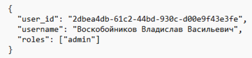

  Рисунок 41 – Полезная нагрузка JWT-токена

  Благодаря токену получаем необходимую информацию о пользователе. Теперь при работе с системой любое действие будет выполняться от имени авторизованного пользователя.

  Данное решение позволило реализовать более сложные операции, такие как отображение задач пользователю, связанных с его командой, и ограничение возможностей использования некоторого функционала.
  1. ### **Системное распределение ролей**
     В данном проекте роли распределяются по двум основным критериям: принадлежность к командам и уровень доступа. Это позволяет обеспечить безопасность и целостность хранимой информации, значительно снижая риски использования системы и вмешательства в чужие проекты.

     Каждый пользователь принадлежит к определенной команде, что определяет доступ к доскам и задачам, связанным с их проектами.  Пользователь видит только доски своей команды, взаимодействовать с чужими досками он не может.

     Система предусматривает два уровня доступа: администратор и обычный пользователь. 

     Администраторы (в основном ими будут являться тимлиды) имеют максимальные права доступа. Они могут просматривать и управлять всеми досками, что крайне важно для взаимодействия с другими командами. Админы могут создавать, изменять и удалять карточки и доски, а также управлять пользователями, обеспечивая необходимое распределение задач на пользователей. Они также могут получать необходимую информацию о системе, которая будет описана далее.

     Обычные пользователи имеют ограниченный доступ. Пользователи не могут редактировать и удалять элементы системы, что предотвращает случайные ошибки и упрощает контроль за выполнением задач. Однако такие действия как перемещения карточек, изменения их состояния или отметка выполнения подзадачи все еще доступны.

     Такое системное распределение ролей позволяет обеспечить четкую структуру управления проектами, повысить безопасность данных и улучшить эффективность работы команд. Тимлиды получают полный контроль над процессом, а обычные пользователи могут сосредоточиться на выполнении своих задач, не отвлекаясь на избыточную информацию и функции.
  1. ### **Экспорт данных о таблицах**
     Реализован экспорт данных о таблицах. Данная кнопка, как и кнопка статистики, находится в компоненте header и доступна только для администраторов. Для этого нужно нажать на три точки и выбрать нужную операцию (рисунок 42). 

     
     Рисунок 42 – Выпадающее меню для работы с информацией о системе

     При нажатии на кнопку необходимо в открывшемся диалоговом окне указать директорию для сохранения файла и его название. Дальше отправляется запрос на сервер, который в ответе содержит всю информацию о таблицах системы в формате JSON. Полученный файл сохраняется на локальном компьютере.
  1. ### **Статистика**
     Для оценки производительности команд был реализован функционал по сбору статистики системы. При нажатии на кнопку «выгрузить статистику», сервер начинает «парсить» JSON-файл с текущими данными о всех досках и задачах. В результате работы предоставляется следующая информация:

- название доски;
- количество задач (Всего);
- количество выполненных задач (Всего);
- количество просроченных задач (Всего);
- количество задач (Пользователь);
- количество выполненных задач (Пользователь);
- количество просроченных задач (Пользователь);

  Сам JSON выглядит следующим образом (рисунок 43).

  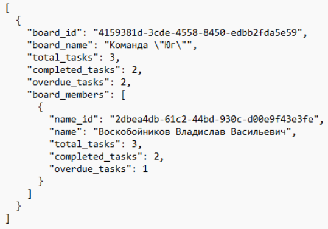

  Рисунок 43 – JSON-файл со статистикой

  Данный файл отправляется в ClickHouse [34] для дальнейшего хранения и анализа. 

  1. ## Перечень тестовых сценариев (с матрицей покрытия требований)
     В процессе разработки программного обеспечения важно не только реализовать поставленные требования, но и убедиться, что весь разработанный функционал работает корректно и соответствует задачам или сценариям использования. Для этого необходимо провести тестирование всех компонентов системы. Одним из инструментов для организации и контроля полноты тестирования является матрица покрытия требований [35].

     Использование матрицы покрытия требований позволяет обеспечить полноту тестирования. Она помогает наглядно удостовериться, что все требования были протестированы. Это снижает вероятность пропуска важных функций или сценариев использования, которые могут привести к ошибкам в работе программы. В то же время матрица способствует выявлению избыточности в тестировании, когда один и тот же функционал проверяется в разных частях системы. Это позволяет оптимизировать процесс тестирования, устраняя повторяющиеся тесты и концентрируя усилия на проверке уникальных сценариев.

     Ниже приведена часть таблицы с тест-кейсами, благодаря которым мы и можем создать матрицу покрытия требований.

     Таблица 5 – Тест-кейсы программы

     |№ теста|Описание тестового сценария|Номер покрываемых требований|
     | :-: | :-: | :-: |
     |TEST\_UI\_1|Тестирование основного интерфейса пользователя. Проверка отображения элементов. Взаимодействие с системой.|REQ\_UI\_1 (элементы интерфейса должны верно функционировать).|
     |TEST\_UI\_2|Тестирование адаптива под мобильные устройства.|REQ\_UI\_2 (элементы интерфейса должны корректно отображаться на всех устройствах).|
     |TEST\_CX\_1|Проверка удобства использования сайта, тестирование скорости и стабильности работы системы. Проверка обработки ошибок.|
REQ\_CX\_1 (система должна работать быстро);

REQ\_CX\_2 (система должна быть интуитивно понятна).
|
     |TEST\_AUTH\_1|Аутентификация пользователя с корректными данными. Проверка получения токена и его сохранения. |REQ\_AUTH\_1 (Аутентификация пользователя должна проходить корректно).|

     Продолжение таблицы 5

     |№ теста|Описание тестового сценария|Номер покрываемых требований|
     | :-: | :-: | :-: |
     |TEST\_AUTH\_2|Аутентификация пользователя с некорректными данными. Проверка на отсутствие доступа к сайту. |REQ\_AUTH\_1.|
     |TEST\_BOARD\_1|Тестирование отображения досок согласно ролям пользователя.|REQ\_BOARD\_1 (система должна отображать доски согласно ролям пользователя, предоставляя доступ только к необходимой информации).|
     |TEST\_BOARD\_2|Тестирование взаимодействия с досками. Проверка корректности удаления, изменения и создания. Проверка сохранения информации о досках в localstorage.|
REQ\_BOARD\_2 (работа с досками должна быть корректна);

REQ\_LOCALSTORAGE (система должна корректно взаимодействовать с  данными в локальном хранилище).
|
     |TEST\_TASK\_1|Тестирование взаимодействия с карточками. Проверка сохранения изменений и корректного удаления задачи из системы. Проверка сохранения информации о карточках в localstorage.|
REQ\_TASK\_1 (пользователь должен иметь возможность создать новую карточку с необходимыми параметрами);

REQ\_TASK\_2 (пользователь должен иметь возможность редактировать и удалять карточки);

REQ\_LOCALSTORAGE.
|

     Таким образом, в проекте была разработана матрица покрытия требований тестами, которая включает в себя тесты для проверки пользовательского интерфейса и опыта использования, аутентификации, корректности отображения и взаимодействия досок с задачами, сохранение информации в localstorage и многое другое.  Ее часть можно увидеть на рисунке 44.

     |
TEST

REQ
|UI\_1|UI\_2|CX\_1|AUTH\_1|AUTH\_2|BOARD\_1|BOARD\_2|TASK\_1|
     | -: | :-: | :-: | :-: | :-: | :-: | :-: | :-: | :-: |
     |UI\_1|x||||||||
     |UI\_2||x|||||||
     |CX\_1|||x||||||
     |CX\_2|||x||||||
     |AUTH\_1||||x|x||||
     |BOARD\_1||||||x|||
     |BOARD\_2|||||||x||
     |
LOCAL

STORAGE
|||||||x|x|
     |TASK\_1||||||||x|
     |TASK\_2||||||||x|

     Рисунок 44 – Матрица покрытия требований тестами

     По матрице видно, что все требования будут протестированы: каждый тест охватывает как минимум одно требование, обеспечивая базовое покрытие всех заявленных требований. Более того, некоторые тесты проверяют сразу несколько требований одновременно, что свидетельствует о глубоком подходе к тестированию системы. На основе вышеописанных тестов будут приведены и описаны результаты каждого теста.

  1. ## Результаты тестирования
     Ниже представлена таблица 6 с результатами тестирования системы. В ней отображены тестовые сценарии, описаны входные данные для каждого теста, результаты их выполнения и комментарии, поясняющие детали прохождения тестов. 

     Таблица 6 – Результаты тестирования

     |№ теста|Входные данные|Результат|Комментарий|
     | :-: | :-: | :-: | :-: |
     |TEST\_UI\_1|Открывается страница сайта, выполняется взаимодействие с элементами сайта.|Пройден.|Элементы интерфейса отображались и реагировали корректно на всех этапах взаимодействия.|
     |TEST\_UI\_2|Открывается мобильная страница сайта, выполняется взаимодействие с элементами сайта.|Пройден.|Интерфейс корректно адаптируется и функционирует на различных мобильных устройствах. |
     |TEST\_CX\_1|Выполняются различные действия на сайте, проверяется время обработки действия и работа уведомлений об ошибках.|Пройден.|Система работает быстро и стабильно (время ответа менее 0,2 секунд), ошибки обрабатываются верно.|
     |TEST\_AUTH\_1|Корректные данные для входа.|Пройден.|Аутентификация успешна, токен выдан и сохранен.|
     |TEST\_AUTH\_2|Некорректные данные для входа.|Пройден.|Аутентификация не прошла, доступ был запрещен, токен не был выдан.|
     |TEST\_BOARD\_1|Аккаунт с ролью «Пользователь», аккаунт с ролью «Администратор» |Пройден.|Доски отображались в соответствии с ролями пользователя|

     Продолжение таблицы 6

     |TEST\_BOARD\_2|Создается, редактируется и удаляется доска. localstorage|Пройден.|
Все операции с доской (создание, редактирование, 

удаление) выполнялись корректно, данные сохранялись в локальном хранилище.
|
     | - | - | - | - |
     |TEST\_TASK\_1|Создается, редактируется и удаляется карточка. localstorage|Пройден.|Все операции с карточкой (создание, редактирование, удаление) выполнялись корректно, данные сохранялись в локальном хранилище.|

     По результатам проведенного тестирования можно сделать вывод, что система соответствует заявленным требованиям. Все ключевые функции были проверены, система показала стабильную и корректную работу во всех тестируемых сценариях. 

     Тесты охватили как базовые, так и расширенные требования, что позволило выявить и подтвердить корректное выполнение всех критически важных операций. 

     Не было выявлено ни одной ошибки, что свидетельствует о высоком качестве разработки и готовности системы к использованию. 

     Было рекомендовано продолжить отслеживать работу системы в реальных условиях эксплуатации для выявления возможных незатронутых ошибок и их оперативного устранения.

  1. ## Визуальный результат проекта
     На текущий момент имеем следующий вид реализованного проекта (рисунок 45).

     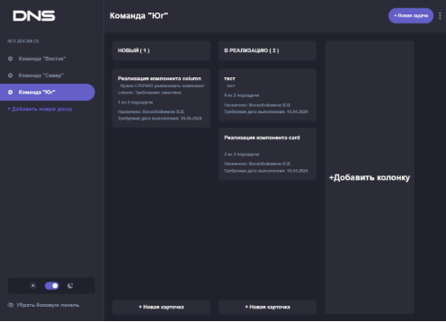

     Рисунок 45 – Внешний вид проекта

     Также на рисунке 46 показана светлая тема проекта.

     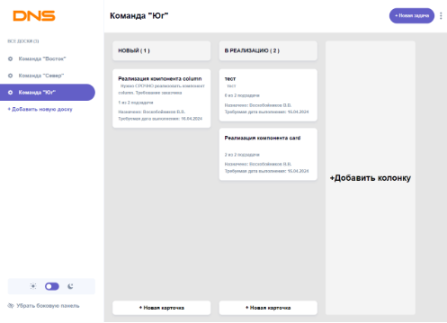

     Рисунок 46 – Внешний вид проекта (светлая тема)

     Визуальный результат представлен руководителю проекта и заказчику, оба полностью удовлетворены проделанной работой.
1. # Технико-экономическое обоснование
   Стоит оценить экономическую и техническую эффективность разработки системы распределения задач для ООО «ДНС Технологии». В рамках данного технико-экономического обоснования вычислим затраты предприятия на реализацию проекта, проведем сравнительный анализ скорости работы на новой канбан-доске и старой SDMS, а также рассчитаем время полной окупаемости проекта.
   1. ## Расчет затрат на разработку
      Рассмотрим все затраты, связанные с реализацией проекта. Под основными затратами подразумевается оплата труда сотрудников и расходы на сервер.

      Оплата труда составляет значительную часть расходов на проект. Будем считать, что в проекте участвовало пять специалистов-джунов. Средняя зарплата такого сотрудника составляет 60000 рублей [36]. С учетом налога на доходы физических лиц в размере 13%, фактические затраты организации на зарплату одного сотрудника в месяц составляют 68966 рублей. Разработка проекта длилась около двух месяцев. Таким образом, используя простую формулу (рисунок 47), можем рассчитать расходы на оплату труда за всю разработку.

       

      Рисунок 47 – формула расчета размера оплаты труда за реализацию проекта

      Итого затраты компании ООО «ДНС Технологии» на выплату заработной платы всем сотрудникам по проекту «Разработка системы распределения задач на проектах по разработке программ» составили 689660 рублей.
   1. ## Сравнение скорости работы в новой системе и в SMDS.
      Для оценки скорости работы новой системы управления задачами по сравнению с SMDS, проведем их сравнительный анализ.

      SMDS использует традиционные методы управления задачами, которые часто включают в себя ручное обновление статусов, раздельное отображение каждой задачи, размещение основного функционала по разным разделам. Данные решения усложняют работу пользователя с системой, заставляя его разбираться в не интуитивно понятном интерфейсе для того, чтобы внести изменения по задаче или найти необходимую информацию. Это, в свою очередь, негативно сказывается на прибыли предприятия, ведь сотрудник мог потратить эти минуты на разработку важного и выгодного для компании продукта. 

      Внедрение новой системы позволяет значительно ускорить рабочие процессы. Основные причины ускорения работы сотрудников заключаются в следующем:

- улучшение визуализации процессов. Все необходимое хранится на одной странице: проекты, задачи и их свойства – больше нет необходимости переключаться по различным страницам и вкладкам в поиске нужной информации. Также сотрудники теперь могут видеть общую картину проекта – что и на каком этапе разработки находится на данный момент;
- возможность быстрого изменения статусов. Связано это с тем, что колонки как раз и представляют из себя статус задачи. И, для того чтобы изменить этот статус, достаточно взять карточку и переместить в нужную колонку-статус.

  Проведенный сравнительный анализ показывает, что скорость работы в новой системе значительно выше по сравнению с SDMS. Время, требуемое на создание задачи, сократилось на 27,6%, на изменение задачи – на 36,2%, а на поиск необходимой информации - на 43,3%, что является отличным результатом.
  1. ## Окупаемость проекта
     Выделим основные расходы и выгоды компании после разработки проекта.

     В качестве экономии возьмем денежные средства, не потраченные на оплату подписки в сервисе Trello. В среднем, в компании «ДНС Технологии» работает около 100 программистов. Стоимость подписки на Trello для бизнес-команды составляет 17,5 долларов на человека в месяц [37], что, в переводе по нынешнему курсу, равняется 1569 рублям. Соответственно, компании теперь не нужно отдавать по 156900 рублей в месяц за подписку на Trello, так как данный проект полностью их замещает.

     Для поддержания системы распределения задач требуются такие серверные мощности, которые смогут обеспечить стабильную работу. Было выделено 10 гигабайт пространства для хранения базы данных и данного проекта. Примерная стоимость 1 гигабайта выделенного пространства составляет 50 рублей в месяц. Также необходимо учитывать требования к вычислительной мощности сервера для обработки и взаимодействия системы. Примерная оценочная стоимость сервера, необходимого для корректной работы системы, составляет 2000 рублей в месяц. Тогда минимальные общие расходы на серверные мощности составят 2500 рублей в месяц.

     Также стоит предположить, что на развитие и администрирование системы потребуется один программист с заработной платой в размере 60000 рублей. С учетом НДФЛ, общие затраты на программиста составят 68966 рублей в месяц.

     `	`Таким образом, на поддержание работоспособности системы всего необходимо тратить 71466 рублей в месяц.

     Имея информацию о затратах на разработку системы распределения задач, о будущих расходов на поддержание функционирования системы и об экономии из-за отказа от использования чужого сервиса, можем построить диаграмму затрат, отображающую экономическую эффективность вложения в проект (рисунок 48).

     

     Рисунок 48 – Диаграмма затрат

     Сравнение с Trello показало, что использование собственной системы управления задачами является более выгодным. Проект окупится примерно через шесть с половиной месяцев, что подтверждает его целесообразность и значимость для компании. 

     Таким образом, внедрение системы управления задачами не только повысило общую эффективность работы сотрудников, но и сократило расходы путем перехода от использование сторонних сервисов на собственные, что в долгосрочной перспективе приведет к улучшению финансовых показателей компании.
  1.
     # Заключение
     В ходе выполнения выпускной квалифицированной работы были закреплены знания и умения в области выбранного направления, полученных в процессе теоретического обучения; приобретен опыт в реализации реальных профессиональных проектов и исследовании актуальных проблем на предприятиях.

     Были выполнены следующие задачи:	

- составлена общая характеристика предприятия ООО «ДНС Технологии»;
- проведено исследование состояния и стратегий развития предприятия, выполнен анализ существующих в компании программных комплексов;
- спроектирована и скорректирована система распределения задач. Описана среда проектирования и основные компоненты системы;
- описано распределение ролей в проекте;
- выполнен подготовительный этап к реализации системы. Описан проектный инструментарий, выбрана и настроена среда разработки;
- приведен свод рекомендаций по кодированию;
- составлен сценарий взаимодействия с системой и перечень задач проекта;
- описана реализации компонентов системы;
- представлено взаимодействия с внутренними и внешними системами в проекте;
- отображен визуальный результат проекта;
- составлено технико-экономическое обоснование разработанного проекта.

  Выполненная работа также внесла вклад в развитие информационных технологий на предприятии, улучшив процессы управления проектами.

  # Список использованных источников
1. Описание компании «ДНС Технологии – О нас» [Электронный ресурс] – https://dns-tech.ru/about-us (дата обращения – 22.04.2024)
1. Структура компании «ДНС Технологии» [Электронный ресурс] – https://career.habr.com/companies/dns-tech (дата обращения - 22.04.2024)
1. Статья «AGILE-методология: фреймворк для гибкого управления командами и проектами» [Электронный ресурс] – https://blog.click.ru/glossary/agile/ (дата обращения – 23.04.2024)
1. Статья «Канбан: что это за методолгия, ее инструменты и принципы» [Электронный ресурс] – https://shtab.app/blog/vsio-chto-nuzhno-znat-o-mietodologhii-kanban-instrumienty-mietriki-i-pravila/ (дата обращения – 24.04.2024)
1. Описание сервиса Trello [Электронный ресурс] – https://trello.com/ (дата обращения – 25.04.2024)
1. Новость о прекращении работы Trello в России [Электронный ресурс] – https://vc.ru/services/516045-atlassian-polnostyu-svorachivaet-rabotu-v-rossii-i-belarusi (дата обращения – 25.04.2024)
1. Описание сервиса Figma [Электронный ресурс] – https://www.figma.com/ (дата обращения – 29.04.2024)
1. Статья «What Are Story Points and Why Do We Use Them?» [Электронный ресурс] – https://www.mountaingoatsoftware.com/blog/what-are-story-points (дата обращения – 6.05.2024)
1. Описание использования поиска в приложении Discord [Электронный ресурс] – https://support.discord.com/hc/ru/articles/115000468588-Использование-Поиска (дата обращения – 8.05.2024)
1. Статья «Agile команда» [Электронный ресурс] – https://ionovpartners.ru/blog/agile-team/ (дата обращения – 10.05.2024)
1. Документация Vue.js [Электронный ресурс] - https://ru.vuejs.org/ (дата обращения – 14.05.2024)
1. Документация Vite [Электронный ресурс] – https://vite-docs-ru.vercel.app/guide/#обзор (дата обращения – 14.05.2024)
1. Документация Node.js [Электронный ресурс] – https://nodejs.org/en/about (дата обращения – 14.05.2024)
1. Документация Pinia [Электронный ресурс] – https://pinia-ru.netlify.app/ (дата обращения – 14.05.2024)
1. Документация Tailwind CSS [Электронный ресурс] – https://tailwindcss.ru/docs/installation/ (дата обращения – 14.05.2024)
1. Статья «IDEs vs. Code Editors: Everything You Need to Know» [Электронный ресурс] – https://blog.jetbrains.com/webstorm/2024/03/ides-vs-code-editors/ (дата обращения – 15.05.2024)
1. Статья «8 Reasons Why Do We Need IDE» [Электронный ресурс] – https://www.geeksforgeeks.org/why-do-we-need-an-ide/ (дата обращения – 15.05.2024)
1. Статья «Редакторы кода: что умеют, где используются» [Электронный ресурс] – https://practicum.yandex.ru/blog/obzor-redaktorov-koda/ (дата обращения – 15.05.2024)
1. Подборка IDE и редакторов кода для разработчиков [Электронный ресурс] – https://habr.com/ru/companies/serverspace/articles/693374/ (дата обращения – 15.05.2024)
1. Справочник по Visual Studio Code [Электронный ресурс] – https://code.visualstudio.com/docs/supporting/faq (дата обращения – 15.05.2024)
1. Руководство по установке Visual Studio Code [Электронный ресурс] – https://code.visualstudio.com/docs/setup/setup-overview (дата обращения – 16.05.2025)
1. Руководство по установке Node JS [Электронный ресурс] – https://nodejs.org/en/learn/getting-started/how-to-install-nodejs (дата обращения – 16.05.2025)
1. Руководство на быстрое развертывание Vite проекта [Электронный ресурс] – https://vite-docs-ru.vercel.app/guide/#быстрое-развёртывание-вашего-vite-проекта-scaffolding (дата обращения – 16.05.2024)
1. Расширение Vetur [Электронный ресурс] – https://vuejs.github.io/vetur/ (дата обращения – 16.05.2024)
1. Статья «Use Case - что это. Примеры» [Электронный ресурс] – https://partnerkin.com/blog/articles/use-case-2022 (дата обращения – 16.05.2024)
1. Статья «Поговорим об SDMS» [Электронный ресурс] – https://telegra.ph/SDMS-12-03 (дата обращения – 16.05.2024)
1. Описание платформы 1С:Предприятие 8.3 [Электронный ресурс] – https://www.avtomatizator.ru/articles/produkty-1s/1s-8-3-chto-eto-takoe-i-kakie-voprosy-reshaet/ (дата обращения – 17.05.2024)
1. Документация ESLint [Электронный ресурс] – https://eslint.org/ (дата обращения – 17.05.2024)
1. Статья «How to Add Drag and Drop to Your VueJS Project» [Электронный ресурс] – https://learnvue.co/articles/vue-drag-and-drop (дата обращения – 17.05.2024)
1. Сайт «Темный режим – Tailwind CSS» [Электронный ресурс] – https://tailwindcss.ru/docs/dark-mode/ (дата обращения – 18.05.2024)
1. Сайт «How to use Local Storage with Pinia» [Электронный ресурс] – https://runthatline.com/how-to-use-local-storage-pinia/ (дата обращения – 18.05.2024)
1. Документация JSON [Электронный ресурс] – https://www.json.org/json-en.html (дата обращения – 18.05.2024)
1. Статья «JWT-авторизация на сервере» [Электронный ресурс] – https://ru.hexlet.io/courses/go-web-development/lessons/auth/theory\_unit (дата обращения – 18.05.2024)
1. Документация ClickHouse [Электронный ресурс] – https://clickhouse.com/docs (дата обращения – 19.05.2024)
1. Статья «Матрица трассировки требований» [Электронный ресурс] –https://testengineer.ru/rtm-matrix/ (дата обращения - 20.05.2024)
1. Список вакансий компании «ДНС Технологии» [Электронный ресурс] – https://vladivostok.hh.ru/employer/9311920?hhtmFrom=vacancy\_search\_list (дата обращения – 27.05.2024)
1. Тарифы подписки на Trello [Электронный источник] – https://trello.com/pricing (дата обращения – 29.05.2024)

   # **Приложение А**
   # **Код компонента Header**
   <template>

   `  `<header class="bg-white dark:bg-dark-grey top-0 left-0 w-full flex items-center sm:pr-4">

   `    `

   `      `

   `      `

   `    `

   `    `

   `      `

   `        `

   `      `

   `      `

   `        `<h1 class="text-black dark:text-white font-bold text-lg cursor-pointer">{{ boardsStore.getCurrentBoard?.name }}

   `        `</h1>

   `        `<IconArrowDown v-if="!managerStore.sidebarMobile" />

   `        `<IconArrowUp v-else />

   `      `

   `      `<h1 class="text-black dark:text-white font-bold hidden text-2xl sm:block">

   `        `{{ boardsStore.getCurrentBoard?.name }}

   `      `</h1>

   `      `

   `        `<AddButtonMobile />

   `        `<PrimarySmall @click="addTask" class="hidden sm:block">+ Добавить новую задачу</PrimarySmall>

   `        `<Dropdown @onClickStatistics="Statistics" @onClickInfo="Info" @onClickExit="Exit" />

   `      `

   `    `

   `  `</header>

   </template>

   # **Приложение Б**
   # **Код компонента «Боковая панель»**
   <template>

   `  `

   `    `

   `      `
ВСЕ ДОСКИ ({{ boardsStore.boards.length }})

   `      `

   `        `<IconBoard />

   `        `{{ board.name }}

   `      `

   `      `

        

   `        `+ Добавить новую доску

   `      `

   `      `

   `        `<DarkModeSwitch class="w-10/12 mx-auto " />

   `        `<HideSidebar class="w-11/12" />

   `      `

   `    `

   `  `

   </template>

   
   # **Приложение В**
   # **Поддержание здорового образа жизни персонала на предприятии**
   Поддержание здорового образа жизни персонала в компании ООО «ДНС Технологии» является важным фактором успешного функционирования предприятия. Это особенно важно при постоянной одинаковой сидячей работе, которая может привести к ряду негативных последствий:

- физическая нагрузка. Пассивный образ жизни и однообразные движения могут привести к нарушению осанки, развитию туннельного синдрома, ожирению и множеством других проблем, связанным со здоровьем;
- стресс и выгорание. Работа в одном режиме может вызвать снижение интереса к работе и мотивации, хронические головные боли, депрессию, ухудшить отношения с коллегами из-за раздражительности, тем самым снизив продуктивность;

  ` `Для решения этих проблем компания внедряет систему направленных на поддержание здорового образа жизни сотрудников мероприятий, приведенную в таблице В.1.

  Таблица В.1 – Мероприятия по поддержанию здорового образа жизни персонала

  |Мероприятие|Описание|
  | :-: | :-: |
  |Скидки на тренажерные залы от партнеров.  |Компания предоставляет сотрудникам большие скидки на абонементы в физкультурно-оздоровительные комплексы, что стимулирует их заниматься спортом.|
  |Обустройство зоны отдыха.|В офисе созданы специально оборудованные комфортные зоны, где сотрудники могут ненадолго отдохнуть в течение рабочего дня.|
  |Ретроперспектива «mad/sad/glad».|Еженедельные  ретроспективные собрания позволяют сотрудникам выражать свои эмоции по работе, улучшая отношение с коллегами и ментальное здоровье.|
  |Периодические медицинские осмотры.|Позволяют определить и предупредить общие и профессиональные заболевания.|

  Благодаря данным мероприятиям поддерживается здоровый образ жизни, улучшается настроение и повышается удовлетворенность от работы, что положительно влияет на общую работоспособность сотрудников.

  
  # **Приложение Г**
  # **Обеспечение безопасности жизнедеятельности**
  Рабочие места организованы согласно нормам, указанным в СанПиН 2.2.2/2.4.1340-03 «Гигиенические требования к персональным электронно-вычислительным машинам и организации работы».

  Рекомендуемый проход слева, справа и спереди от стола 500 мм. Слева от стола допускается проход 300 мм. Рекомендуемое расстояние от спинки стула до границы должно быть не менее 300 мм. Рекомендуемая компоновка рабочего места по отношению к оконным проемам: свет падает с левой стороны, допустимая: свет падает с правой стороны. В случае чрезвычайной ситуации человек, выходя с рабочего места, должен двигаться только вперед к двери, не допускается делать никаких поворотов более, чем на 90°.

  Требования к эвакуационному пути:

1) ширина принимается 0,6 м при одностороннем выходе на эвакуационный путь. При двустороннем выходе ширина увеличивается в два раза и составляет 1,2 м;
1) в рабочих помещениях дверь должна открываться наружу, и при двустороннем движении по эвакуационному пути дверь – двухстворчатая.

   Рабочие места не рекомендуется располагать вплотную к несущим конструкциям, поэтому при расстановке рабочих мест необходимо учитывать дополнительно следующие требования:

1) расстояние от стенки (окна) до границы площади рабочего места – не менее 0,3 м;
1) расстояние от передней стенки помещения до границы первого рабочего места – не менее 0,8 м;
1) расстояние между боковыми поверхностями видеомониторов – не менее 1,2 м;
1) при размещении рабочих мест с ПЭВМ расстояние от задней стенки видеомониторами до спины впереди сидящего должно быть не менее 2,0 м.

   Площадь помещения – 132,88 м2. Рассчитав площадь помещения, определяется объём помещения (1) и объём воздуха, приходящийся на человека (2).

   `	`Vпом=S×h	(1)

   где *V*пом – объём помещения,

   *S* – площадь помещения,

   *h* – высота помещения.

   `	`Vчел=Vпомn	(2)

   где *V*чел – объём воздуха, приходящийся на одного человека,

   *n* – количество человек.

   При расчете объёма необходимо учитывать:

1) высота производственных помещений – 3 м;
1) минимальный объём воздуха на 1 человека при работе с компьютерами в офисах, административных помещениях составляет 20 м3;
1) оптимальный объём воздуха на 1 человека при отсутствии вредностей в воздухе рабочей зоны – 40 м3.

   Объём помещений – 398,64 м3. В помещении находятся 6 человек, объём помещения на человека – 66,44 м3, что соответствует норме. На рисунке Г.1 представлена планировка рабочего помещения, в котором была пройдена практика.

   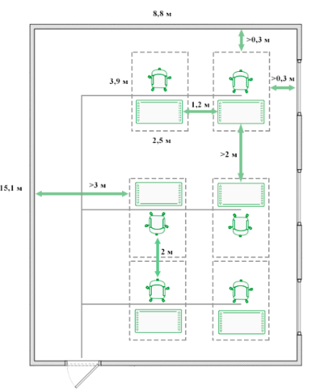

   Рисунок Г.1 – Планировка рабочего помещения

   Таким образом, рабочее помещение и рабочее место полностью соответствуют всем нормам и обеспечивают безопасность жизнедеятельности.
