2

МИНОБРНАУКИ РОССИИ

ВЛАДИВОСТОКСКИЙ ГОСУДАРСТВЕННЫЙ УНИВЕРСИТЕТ 

ИНСТИТУТ ИНФОРМАЦИОННЫХ ТЕХНОЛОГИЙ И АНАЛИЗА ДАННЫХ

КАФЕДРА ИНФОРМАЦИОННЫХ ТЕХНОЛОГИЙ И СИСТЕМ

РЕКОМЕНДОВАНО

к защите

Заведующий кафедрой

канд. экон. наук, доцент

\_\_\_\_\_\_\_\_\_ Е.В. Кийкова 

БАКАЛАВРСКАЯ РАБОТА

Разработка системы оформления электронных подарочных карт

Б-ИН-20-157004.3484-с.19.000.БР

Студент

гр. БИН–20	\_\_\_\_\_\_\_\_\_\_\_\_\_\_\_\_\_\_\_\_\_\_\_\_\_\_	Рындин А.А.

Руководитель 

Профессор, д.т.н.	\_\_\_\_\_\_\_\_\_\_\_\_\_\_\_\_\_\_\_\_\_\_\_\_\_\_	Гриняк В.М.

Нормоконтролер 	\_\_\_\_\_\_\_\_\_\_\_\_\_\_\_\_\_\_\_\_\_\_\_\_\_\_	Тювеев А.В.

Владивосток 2024

МИНОБРНАУКИ РОССИИ

ВЛАДИВОСТОКСКИЙ ГОСУДАРСТВЕННЫЙ УНИВЕРСИТЕТ 

ИНСТИТУТ ИНФОРМАЦИОННЫХ ТЕХНОЛОГИЙ И АНАЛИЗА ДАННЫХ

КАФЕДРА ИНФОРМАЦИОННЫХ ТЕХНОЛОГИЙ И СИСТЕМ

УТВЕРЖДАЮ

Заведующий кафедрой

канд. экон. наук, доцент

\_\_\_\_\_\_\_\_\_ Е.В. Кийкова

ЗАДАНИЕ

на бакалаврскую работу

Студенту гр. БИН-20 Рындину Андрею Александровичу

**1 Тема работы:** «Разработка системы оформления электронных подарочных карт»

Утверждена приказом по университету № 3484-с от 26.04.2024 г.

**2 Срок сдачи работы:** XX.XX.2024 г.

**3 Содержание бакалаврской работы:**

*Введение*:** определить актуальность темы, объект исследования, предмет исследования, цель и задачи работы.

1. Общая характеристика предприятия ООО «ДНС Технологии». Описание предметной области и постановка задачи
1. Проектирование системы;

Изучение потоков данных. Проектирование клиентской части. Проектирование серверной части; 

1. Разработка системы;

Подход к разработке применявшийся в ходе работы;

Требование к программному обеспечению;

Разработка приложения;

Тестирование продукта

Технико-экономическое обоснование

*Заключение***:** сделать общие выводы по работе, показать, какие задачи решены в ходе выполнения работы, какие особенности деятельности организации выявлены, какова эффективность предложенных мероприятий

*Список использованных источников*: 

составить список литературы с использованием профессиональных баз данных и профессиональных Интернет-ресурсов

*Приложения***:** Приложение А «Обеспечение безопасности жизнедеятельности», Приложение Б «Поддержание здорового образа жизни в ООО «ДНС Технологии»», Приложение В, Приложение Г «Код модуля api-app», Приложение Д «Код модуля api-config», Приложение Е «Код модуля api-payment», Приложение Ж «Пример описания метода для Swagger», Приложение З, Приложение И «Код компонента checkout-payment», Приложение Й «Код маски ввода даты», Приложение К «Код шаблона выбора даты отправки», Приложение Л, Приложение М «Код метода get-gift-config приложения checkout-api». 

Работу следует оформить в соответствии со стандартами ВГУЭС.

**4 Раздаточные материалы** для членов ГАК (4-5 страниц - схемы, рисунки, таблицы и т.п. формата А4) – 6 экземпляров. 

**5 Календарный график работ**

Первая глава: 24.04.2024

Вторая глава: 11.05.2024

Третья глава: 24.05.2024

Четвертая глава: 13.06.2024

Оформление отчетности:17.06.2024

Время консультаций: понедельник 13:30 – 14:30

Электронная почта руководителя: Viktor.Grinyak@vvsu.ru

Телефон руководителя: 8 (423) 240-40-66

**6 Срок предоставления ВКР на кафедру**: ??.07.2023

**7 Консультант по нормоконтролю** – Сачко М.А.

Дата выдачи задания: 16.05.2022

Руководитель ВКР
канд. тех. наук, профессор	\_\_\_\_\_\_\_\_\_\_\_\_\_\_\_\_\_\_\_\_\_\_\_\_\_\_	В. М. Гриняк

Нормоконтролер	\_\_\_\_\_\_\_\_\_\_\_\_\_\_\_\_\_\_\_\_\_\_\_\_\_\_	А. В. Тювеев

Задание получил	\_\_\_\_\_\_\_\_\_\_\_\_\_\_\_\_\_\_\_\_\_\_\_\_\_\_	А. А. Рындин

# Аннотация
ВКР на тему: «Разработка системы оформления электронных подарочных карт».

Автор: студент гр. БИН-20, Рындин А.А.

Руководитель: канд. техн. наук, профессор Гриняк В.М.

Цель данной ВКР – разработать приложение страницы оформления электронных подарочных карт для компании ООО «ДНС Технологии».

В данной работе в целом описывается разработка микросервисного приложения для оформления электронных подарочных карт компании ДНС. Сперва были были изучены предметная область, текущее состояние информационной системы компании, система оформления заказов и её сервисы. Проведено проектирование страницы электронных подарочных карт, что включает в себя клиентское и серверное представление программного интерфейса, использование микросервисной архитектуры и компонентов дизайн-системы компании. В ходе работы рассмотрены особенности подхода компании к процессу разработки, а также регламенты и правила команды. Результатом является приложение с микросервисной архитектурой, а также проведена оценка стоимости и времени окупаемости проекта. Помимо описания проделанной работы и описания разрабатываемого сервиса были описаны меры по обеспечению безопасности жизнедеятельности, а также по поддержанию здорового образа жизни.

Работа состоит из 49 страниц, содержит 36 источников, 40 изображений, 2 таблицы и 13 приложений.
59 

# Содержание
[Введение	4](#_toc168876511)

[1 Описание предметной области	5](#_toc168876512)

[1.1 Общая характеристика предприятия ООО «ДНС Технологии»	5](#_toc168876513)

[1.2 Состояние информационной системы предприятия	5](#_toc168876514)

[1.3 Описание системы оформления заказа	7](#_toc168876515)

[1.4 Описание серверного приложения предприятия	9](#_toc168876516)

[1.5 Описание клиентского приложения предприятия	11](#_toc168876517)

[1.6 Постановка задачи	12](#_toc168876518)

[2 Проектирование сервиса оформления электронных подарочных карты	14](#_toc168876519)

[2.1 Проектирование API приложения	14](#_toc168876520)

[2.1.1 Изучение потоков данных приложения оформления подарочных карт	14](#_toc168876521)

[2.1.2 Проектирование клиентского API микросервиса оформления ЭПК	15](#_toc168876522)

[2.1.3 Проектирование серверного API микросервиса оформления  ЭПК	17](#_toc168876523)

[2.2 Проектирование клиентской части приложения	20](#_toc168876524)

[3 Разработка страницы оформления электронной подарочной карты	25](#_toc168876525)

[3.1 Подход к разработке применявшаяся в ходе работы над проектом страницы оформления подарочной карты	25](#_toc168876526)

[3.1.1 Описание ролей участников команды	25](#_toc168876527)

[3.1.2 Система управления  задачами	26](#_toc168876528)

[3.1.3 Процесс планирования работы над заявками	28](#_toc168876529)

[3.1.4 Жизненный цикл задачи	29](#_toc168876530)

[3.1.5 Система контроля версий	30](#_toc168876531)

[3.2 Требование к разрабатываемому программному обеспечению	30](#_toc168876532)

[3.2.1 Описание рекомендаций по кодированию и процессу решения задачи	30](#_toc168876533)

[3.2.2 Описание процесса проведения code review	31](#_toc168876534)

[3.3 Общая информация о разработки проекта	32](#_toc168876535)

[3.3.1 Общие представления о странице оформления электронных подарочных карт	32](#_toc168876536)

[3.3.2 Заявки и задачи проекта	32](#_toc168876537)

[3.4 Разработка клиентской части приложения	34](#_toc168876538)

[3.4.1 Основное приложение и базовая структура	34](#_toc168876539)

[3.4.2 Основная верстка приложения	36](#_toc168876540)

[3.5 Разработка клиентского API приложения	40](#_toc168876541)

[3.6 Разработка серверной части приложения	41](#_toc168876542)

[3.7 Взаимосвязь с другими приложениями-сервисами и их доработки	42](#_toc168876543)

[3.7.1 Лэндинг электронных подарочных карт	42](#_toc168876544)

[3.7.2 Страница финала оформления заказа	43](#_toc168876545)

[3.8 Тестирование проекта	44](#_toc168876546)

[3.9 Технико-экономическое обоснование	46](#_toc168876547)

[Заключение	49](#_toc168876548)

[Список использованных источников	50](#_toc168876549)

[Приложение А	53](#_toc168876550)

[Приложение Б	55](#_toc168876551)

[Приложение В	56](#_toc168876552)

[Приложение Г	57](#_toc168876553)

[Приложение Д	59](#_toc168876554)

[Приложение Е	62](#_toc168876555)

[Приложение Ж	65](#_toc168876556)

[Приложение** З	66](#_toc168876557)

[Приложение И	67](#_toc168876558)

[Приложение Й	69](#_toc168876559)

[Приложение К	71](#_toc168876560)

[Приложение** Л	72](#_toc168876561)

[Приложение М	73](#_toc168876562)

# Введение
Выпускная квалификационная работа посвящена разработке страницы оформления электронных подарочных карт для компании ДНС. Главная цель работы – разработка микросервисного приложения, что включает в себя проектирование архитектуры программного интерфейса, использование пакетного менеджера и компонентов дизайн-системы компании с целью поддержания актуальности визуального представления проекта, а также ознакомление с уже имеющимися проектами и внесение изменений в них, для реализации нового функционала.

Работа начинается с описания предметной области, где приводится общая характеристика предприятия ООО «ДНС Технологии» и анализ текущего состояния его информационной системы. Особое внимание уделяется системе оформления заказов, её структуре и сервисах, что реализуют функциональность системы.

Проектирование страницы электронных подарочных карт включает клиентское и серверное представление программного интерфейса. Представлены имеющиеся подходы компании и выявлена необходимость использования микросервисной архитектуры. Также описана структура клиентской части приложения и используемые в нём компоненты, применяемые из пакетного менеджера, что также являются элементами дизайн-системы компании.

В ходе разработки внутри команды рассматривается особенности подхода компании к процессу планирования задач, системе в которой происходит отслеживание статусов и оценка стоимости работы. Регламенты работы внутри команды, например, процесс проведения code-review или требования к написанию кода. 

Также описана общая информация о проекте и сама разработка частей приложения, реализуемых в процессе квалификационной работы, какие проблемы решает переход приложения на микросервис, и какие нововведения принесёт данный проект в процесс оформления электронных подарочных карт. Оценка стоимости и время окупаемости проекта тоже высчитывается в результате выполнения работы.

1. # Описание предметной области
   1. ## Общая характеристика предприятия ООО «ДНС Технологии»
ООО «ДНС Технологии» – это IT-Компания, базирующаяся на Дальнем Востоке, в городе Владивосток, Россия. Основана в 2020 году как IT подразделение крупнейшей российской розничной сети по продаже электроники и бытовой техники – DNS. Штаб-квартира расположена во Владивостоке, а её офисы также находятся в Москве, Санкт-Петербурге, Екатеринбурге и многих других городах России. В компании трудится более 600 сотрудников в разных областях работы с программным обеспечением, таких как: разработка программного обеспечения, администрирование систем, тестирование систем, информационная безопасность и других IT-направлениях.[1] Но основная специализация компании всё же направлена на создание высоконагруженных сервисов автоматизации, решающих проблемы бизнеса. Компания предоставляет широкий спектр услуг:

\- разработка систем внутренних продаж;

\- сопровождение информационных систем компании;

\- разработка систем управления контентом;

\- поддержка систем управления хранилищ данных; 

\- автоматизация бухгалтерского учета;

\- обучение и повышение квалификации сотрудников;

\- аутсорсинг IT-услуг.

Миссия и основные цели компании ООО «ДНС Технологии» заключаются в создании новой функциональности за приемлемое для бизнеса количество рабочих дней, что обеспечивает конкурентное преимущество на рынке. Стремление создавать качественный и используемый продукт. Улучшение качества работы сотрудников, путем поддержания высокого качества корпоративной культуры и повышением квалификации каждого специалиста, для того чтоб они вкладывали силы в развитие конечного продукта, которым пользуется огромное количество пользователей по всей стране[2].
1. ## Состояние информационной системы предприятия
Компания «ДНС Технологии» широко использует информационные технологии для автоматизации различных процессов своей деятельности, с целью повышения эффективности работы и улучшение качества обслуживания клиентов. Информационная система (ИС) компании имеет высокую степень автоматизации процессов управления. Используются различные программные продукты для правления финансами, персоналом, продажами, логистикой и производством. Все эти продукты имеют высокую степень интеграции в рабочие процессы. Различные ИС компании взаимодействуют друг с другом, что позволяет обмениваться данными между различными подразделениями компании[3]. Основным программным обеспечением, которое используется в информационных системах компании, являются продукты компании «1С». Среди них можно выделить программу «1С: Бухгалтерия» для управления финансами, «1С: Управление персоналом» для работы с кадрами и «1С: Документооборот» для автоматизации процессов документооборота. При разработке программного обеспечения используется широкий спектр технологий. Языки программирования, такие как: PHP, JavaScript, TypeScript, PHP, GO, Swift, Kotlin, C# – могут встречаться в разных проектах, для решения различных задач. Также сервисы разворачиваются как на собственных серверах компании, так и на арендованных у крупных поставщиков услуг инфраструктур. Для распределения нагрузки используются решения Kubernetes и Nginx. Мониторинг систем осуществляется при помощи собственной системы логирования, инструмента Grafana, Kibana и также Sentry. Базы данных базируются на SQL и NOSQL технологиях. Реляционные базы данных используются для хранения структурированных данных, NoSQL базы данных используются для работы с неструктурированными данными. Информационная система компании хранит множество различных данных, таки как: данные о сотрудниках, клиентах, товарах, заказах, обращениях и ещё множество других данных, появляющихся в результате деятельности компании. Информационная система компании «ДНС Технологии» играет значительную роль в повышении эффективности работы. Компания имеет высокий уровень технической компетенции и готова к внедрению новых технологий. 

Подразделение разработки сайта занимается разработкой и поддержанием систем информационного портала ДНС, куда входит разработка сайта, систем оформления заказ, систем работы с заказами, терминалы самообслуживания, системы работы с контентом и в целом поддержка всего программного обеспечения компании. Участники подразделения делятся также на несколько основных частей по родам деятельности:

\- продукт-менеджеры – специалисты, занимающиеся развитием продукта команд, они руководят бизнес-задачами конкретного проекта, формируют требования, которым должен отвечать информационный продукт.

\- программисты – сотрудники, отвечающие за реализацию задач, развитие и поддержание работоспособности выпускаемого ими продукта.

\- DevOps – внедрение информационных продуктов в жизненный цикл, развёртывание и поддержка программного обеспечения сайта; 

\- QA – сопровождение и тестирование программного обеспечения;  

\- поддержка – обработка пользовательской обратной связи и реагирование на инциденты.

Все вышеперечисленные объединяются в различные команды или относятся к различным доменам – определенным направлениям разработки у компании.  

В данной работе будет рассмотрена команда разработки сайта «Восток» и её зона ответственности – оформление заказа. 
1. ## Описание системы оформления заказа
Команда разработки «Восток», является частью домена разработки «Оформление заказа»[4]. Графическое представление домена изображено на рисунке 1.

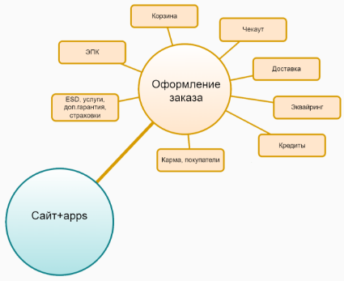
Рисунок 1 – Домен «Оформление заказа»

Система оформления заказа является зоной ответственности команды и состоит из множества различных модулей. Изначально при разработке была использована монолитная архитектура, но впоследствии от неё стали отходить и на данный момент представляет из себя систему с микросервисной архитектурой. Микросервисы создаются с целью вынесения определенного функционала, который может использоваться в различных проектах, для унификации и разгрузки больших приложений[5]. На данный момент система оформления заказа состоит из нескольких сервисов:

\- API оформления заказа – основная серверная (бэк-энд) часть системы, написанная на PHP с использованием фреймворка Yii2[6]. Через неё идут все запросы, что связанны с оформлением заказа, любое приложение которому нужно что-либо для оформления заказа будет обращаться именно к этому программному интерфейсу;

\- GO оформление заказа – сервис на языке программирования GO, также отвечающий за определенные кейсы оформление заказа;

\- страница оформления заказа – основная клиентская (фронт-энд) часть системы в виде веб-страницы, реализованной с использованием фреймворка vue3[7]. Приложение, с которым взаимодействует пользователь при оформлении обычного заказа, заказа уценки или электронного ключа. Этот сервис путем общения с API проводит пользователя по всем этапам оформления заказа;

\- страница оформления заказа терминала самообслуживания и киоска – приложение, что используется для работы с оформлением заказа на терминалах и киосках компании, в связи с спецификой работы на физических терминалах, вынесены в отдельные приложения;

\- страница оформления электронной подарочной карты – приложение, что используется для работы с оформлением электронных карт, которыми можно воспользоваться при оплате заказа;

\- страница финала – приложение, являющиеся конечным этапом в цепочке онлайн-оформления заказа. На нём изображена вся информация, что нужно пользователю после процесса оформления;

\- сервис информации о заказе – бэк-энд сервис, написанный на языке программирования GO, в который вынесено получение всех данных о совершенном заказе;

\- сервис статуса заказа – также GO приложение, отвечающее за изменение статусов заказа и связанные с ними действия, например, смс-оповещение пользователей о каком-либо изменении заказа;

\- сервис расчета времени резерва – GO сервис, отвечающий за определение резерва заказа, исходя из данных покупателя, товаров и каких-либо обстоятельств.

Общую структуру системы оформления заказа можно увидеть на рисунке 2.

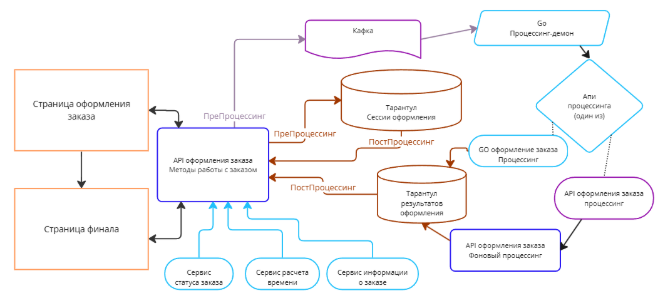
Рисунок 2 – Структура системы оформления заказа

Приложения, с которыми взаимодействует пользователь связываются только лишь с серверным API оформления заказа, путем реализации клиентского API. Бэк-энд в свою очередь имеет множество связей с другими сервисами, как входящими в зону ответственности команды, так и относящимся к другим разработчикам. 
1. ## Описание серверного приложения предприятия
Компания «ДНС Технологии» не всегда использовала микросервисной подход к разработке продукта, изначально в компании использовали большое монолитное приложение, называемое: Универсальная Платформа Сайта. Такое приложение не имело деление на клиентскую часть или серверную, это одно PHP приложение, содержащее в себе контроллеры и действия для вызова определенных методов, а также представления для вывода информации пользователю. Но работа с таким проектом затруднительна, в связи с увеличением сложности разработки, по мере развития разработки. Каждый новый компонент, добавляемый в приложение, делает его более трудным для понимания и обслуживания. Это может привести к ошибкам и проблемам с производительностью. К тому же работа разных команд над одним огромным приложением создает всяческие кодовые конфликты разработки, когда, например, изменения происходят в одном месте. Также такую работу сложно масштабировать. Во избежание вышеперечисленных проблем, все новые системы, создаваемые в компании, реализуются в виде микросервисов. Серверные приложения, что будут общаться с клиентскими создаются в виде REST API сервисов. Визуальное представление разницы в монолитном и микросервисном подходе изображена на рисунке 3.

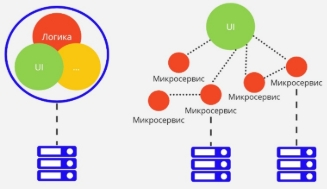
Рисунок 3 – Представление монолитной и микросервисной архитектуры 

REST API – Это архитектурный стиль, что определяет правила обмена данными между сервером и клиентом. Для доступа клиентских приложений к данным сервера, используются запросы протокола HTTP. Модель REST API приложения изображена на рисунке 4.

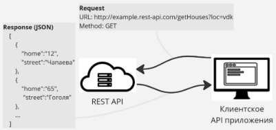
Рисунок 4 – Модель REST API приложения

Каждый отправляемый запрос является самодостаточным и содержит всю информацию, необходимую для его обработки, благодаря чему мы всегда точно знаем о результате выполнения и можем его корректно обработать [8].

В компании такое приложение пишется на языке программирования PHP с использованием фреймворка Yii2. Yii2 – это современный широконаправленный PHP фреймворк, реализующий парадигму Модель-представление-контроллер. Инструмент включает в себя полноценный набор средств для реализации REST API, реализуются точки входа API как действия контроллеров, что используются для организации действий. Ресурсы, запросы и ответы являются моделями данных и всегда представлены в явном виде [9].

Команда «Восток» на данный момент в процессе переноса своих решений на микровервисную архитектуру, из серверной части внутри монолитного приложения остались лишь методы работы с электронными подарочными картами и создание документов об оформлении заказа.
1. ## Описание клиентского приложения предприятия
Клиентские приложения внутри компании реализуются в виде одностраничных приложений (SPA, Single-Page Applications) с использованием фреймворка Vue.js третьей версии. Vue – прогрессивный Фреймворк для создания пользовательских интерфейсов. Его ядро в первую очередь решает задачи уровня представления. С его помощью приложения разбиваются на различные компоненты, которые могут использоваться в различных частях программы.

При создании приложения, у которого нету внутри себя реализации серверной части, в него закладывается функционал для работы с внешними REST API. Клиент и сервер не знают ничего друг о друге, поэтому на клиентском решении нужно собрать всю нужную информацию и каким-либо образом отправить на обработку. Для решения такого рода задач, в компании решили создавать клиентские API.

Фронтенд-API представляет из себя дополнительные скрипты для приложения, что может связывать не только методы сервера, но и разные компоненты одного сервиса. Подобные решения есть у микросервисов и микрофронтендов, чтобы они оставались независимыми, даже несмотря что они могут использоваться внутри какого-либо приложения. Структура приложения с клиентским API изображено на рисунке 5.

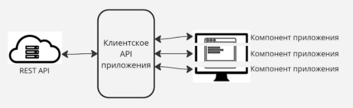
Рисунок 5 – Структура приложения с клиентским API

В компании клиентские API пишутся на языке программирования TypeSript. Причин использовать именно эту технологию несколько. Фронтенд-приложения пишутся на фреймворке Vue, являющиеся модулем для программной платформы Node.js, что ставит ограничение на используемые языки, а именно JavaScript и компилируемые в него. TypeScript является обратно совместимым с JavaScript и компилируется в последний, но имеет ряд особенностей, что являются критериями для выбора именно этого языка[10].

` `Первым является статическая типизация, при работе с этим языком необходимо объявлять типы для переменных. Когда мы смотрим на такой код, мы можем сразу понять, что и с какими данными будет работать, это ускоряет чтение и понимание проекта, что очень важно при работе с большими проектами и при командной работе. Помимо удобства данная особенность позволяет отлавливать ошибки ещё на этапе разработки, ведь проект не соберётся, при явно указанном одном типе, а используемом – другом[11].

Следующая особенность языка, что используется в проектах – наличие классов и интерфейсов. Использование таких типов данных при разработке микросервиса позволяет также повысить читаемость и понимание кода. Например, при запросе на сервер используется объект определенного класса, структуру которого можно в любой момент посмотреть и изменить. Точно такая же ситуация и с ответом сервера, берётся результат и приводится к определенному классу, тем самым конкретизируя ответ. Пример цепочки событий в которых используются модели изображён на рисунке 6.

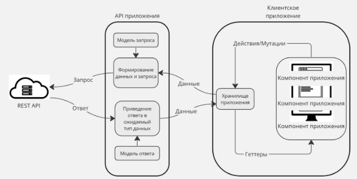
Рисунок 6 – Использование моделей при запросах к серверу

Команда «Восток» перевела на клиентские микросервисы некоторое количество своих страниц, но на монолитном приложении ещё остались: страница оформления электронных подарочных карт, страница оформления заказа терминала самообслуживания, страница оформления заказа киоска.
1. ## Постановка задачи
В прошлом разделе были описаны разные виды представления проектов на предприятии «ДНС Технологии», а также указано, что идёт переход от монолитного архитектурного решения к микросервисному. В компании был запрос на улучшение страницы оформления электронных подарочных карт, что является частью монолитного приложения. В связи с сложностью разработки, работа откладывалась и было решено отделить страницу от универсальной платформы в виде самостоятельного микросервиса. Приложение что было реализовано внутри большой системы с использованием MVC подхода, и её компоненты не имеют возможности прямого использования как сервиса, из-за чего, необходимо реализовать весь клиентский функционал самостоятельно. Методы что используются во время работы страницы оформления подарочной карты – требуют переноса на API оформления заказа и рефакторинга. 

В результате проработки проекта было установлено что в рамках работы необходимо внести дополнительные правки в имеющиеся приложения-сервисы команды и реализовать новый микросервис удовлетворяющий следующим требованиям:

\- независимость проекта от монолитного приложения;

\- повышенная отказоустойчивость;

\- сохранение функционала оформления электронной подарочной карты;

\- возможность внедрения актуальных компонентов дизайн-системы;

\- структура приложения соответствует имеющимися проектам для удобства ориентирования сотрудников; 

\- функционал серверных методов реализован внутри имеющегося общего решения. 

Исходя из представленных требований, необходимо реализовать микросервис, полностью отделенный от монолитного приложения.

Внедрение нового функционала не должно вызывать проблем как с разработкой, так и запуском решения на локальной машине для тестирования и отображения результата.

Система должна работать стабильно и обрабатывать ошибки, возникающие в процессе работы. Система не должна приводить к поломкам других сервисов и также не должна ломаться сама, при неисправности другого сервиса.

Приложение должно иметь всю функциональность прошлой страницы, такую как: оформление подарочной карты, функционал отложенной отправки, оформление на почту и номер телефона, валидация введенных данных, подтверждение пользователя путем отправки СМС кода.

В проект должны интегрироваться компоненты дизайн-системы компании, с целью использования общего оформления для всех страниц и очевидности поведения компонентов приложения.

Структура приложения должна быть схожа с обычной страницей оформления заказа, конфигурационные файлы должны иметь сходства, подход к размещению файлов в проекте не должен запутывать разработчика, ранее работавшего с страницей оформления заказа, но не работавший с электронными подарочными картами.

Серверные методы, должны реализоваться внутри API оформления заказа или использоваться уже реализованные методы.
1. # Проектирование сервиса оформления электронных подарочных карты
   1. ## Проектирование API приложения
      1. ### **Изучение потоков данных приложения оформления подарочных карт**
В рамках проектирования API необходимо было изучить, откуда и какие данные берутся для страницы оформления электронной подарочной карты (далее ЭПК), что с ними происходит и куда отправляются. Результат изучения представлен на рисунке 7.

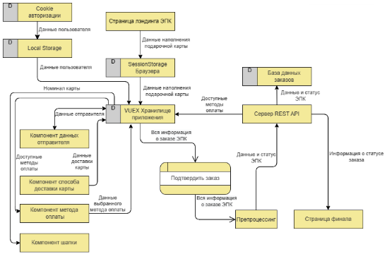
Рисунок 7 – DFD-диаграмма, связанная с процессами страницы оформления ЭПК

Прежде чем попасть на страницу оформления, пользователь находится на странице лэндинга ЭПК, где выбирает номинал, подпись, комментарий и изображения для карты. Данная страница является отдельным микросервисом, и по завершению работ, все данные о карте кладутся в session storage браузера и происходит перенаправление на страницу оформления. При оформлении данные берутся из session storage и записываются в хранилище приложения, откуда после перемещаются в свои компоненты. 

Также пользователь может быть авторизован на сайте. Данные авторизации хранятся в cookie файлах. При наличии таковых, данные отправителя должны взяться из local storage браузера, записаться в хранилище приложения и передаться в компонент. 

Ещё одни данные поступают в приложение уже путём связи с сервером REST API, это информация о доступных методах оплаты.

Чтобы правильно и удобно управлять всем этим потоком данных и нужен клиентский API, внутри которого будет выполнятся сбор всех данных с других сервисов, приводится к понятной модели, а после или помещаться в хранилище приложения, откуда информацию берут компоненты, или отправляться на сервер, например, для обработки заказа.
1. ### **Проектирование клиентского API микросервиса оформления ЭПК**
Клиентское API необходимо для того чтоб связывать один сервис с другим, что-то вроде моста. Несмотря на то, что клиентское приложение имеет связь только с одинм бэк-энд сервисом, функционал может оказаться достаточно объемным для определения внутри одного файла-представления, к тому же некоторые компоненты требуют имплементации своего интерфейса API. 

В рамках изучения было выявлено, что для реализации клиентской части функционала приложения оформления подарочных карт, требуется спроектировать четыре модуля фронтенд-API. Графическое представление спроектированного API предоставлено в Приложении В. 

Первый модуль, api-app, представляет из себя интерфейс данных для корневого компонента app. Данный API объявляется на этапе монтирования корневого компонента[12]. 

При его помощи для страницы задаётся валюта с которой будет работать приложение. Определение валюты берётся из мета-данных страницы. Также с данный интерфейс получает данные, что были заполнены на странице лэндинга ЭПК. Информация о подарочной карте хранится в сессионном хранилище браузера – sessionStorage, данные будут доступны в рамках сессии одной вкладки, и представляют из себя объект содержащий номинал, идентификатор изображения, заголовок для сообщения и комментарий для получателя карты. Модель информации электронной подарочной карты изображена на рисунке 8.

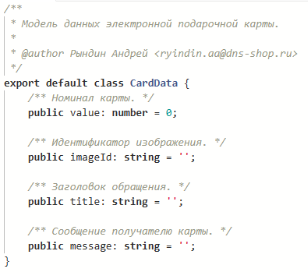 
Рисунок 8 – Модель данных электронной подарочной карты

Модель передаётся от API в компонент и запоминается в его области data. Из важнейших функций интерфейс реализует инициализацию сессии оформления, нужной для корректной работы бэк-энд сервиса и генерацию идентификатора процесса оформления. Эти данные необходимы для понимания сервером с каким заказом идёт работа, например, при окончании оформления заказа и переходе на страницу финала, никакие данные не передаются на бэк-энд, кроме файлов cookie, в которых и хранятся идентификаторы. Также API отправляет запрос на проверку брошенного заказа, такого что начал оформление пользователем, но остался неоплаченным. Код прототипа модуля представлен в Приложении Г.

Следующий модуль является таким же важным как и api-app, и используется также в корневом компоненте. Api-config – программный интерфейс что получает информацию, которую использует почти каждый компонент приложения, соответственно, это конфигурация всей страницы. API конфигурации создаётся на этапе монтирования компонента app, вместе с программным интерфейсам api-app. Рисунок 9 изображает код создания и использования перечисленных API.

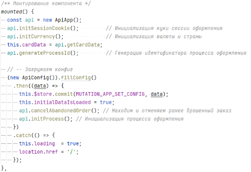
Рисунок 9 – Объявление и использование класса ApiApp и ApiConfig

При создании вызывается асинхронный метод fillConfig, для заполнения данных конфигурации, что вызывает цепочку вызова иных методов. Код getCityId вызывается для получения идентификатора города, особенностью получения является то, что мы узнаём город без обращения к серверу, ведь как раз именно он нужен для получения конфигурации. Информация о городе берётся путём обработки данных Cookie файлов. Город записывается в куки при попадании на главную страницу сайта dns-shop.ru. Метод getLocalStorageData требуется для получения информации о пользователе, если он ранее использовал сервис, и данные не устарели. Таким образом мы уменьшаем количество обращений к серверу, снижая нагрузку. Если данных в хранилище браузера нет, то выполняется запрос к REST API страницы оформления заказа, путём вызова getConfigFromBackend. По выполнению операции, данные записываются в LocalStorage, для использования без запроса на сервер и в VUEX хранилище приложения, чтобы доступ к информации был у любого компонента. Код прототипа модуля представлен в Приложении Д. 

Ещё одно API реализует получение данных для выбора методов оплаты. Данное решение является имплементацией API сразу нескольких компонентов, работающих с оплатой. Интерфейс api-payment проверяет наличие информации о действующих группах оплаты в localStorage, и если не встречает её, то отправляет запрос на сервер, чтоб получить эти данные. После получения групп, их необходимо привести в правильный формат, нужный для использования в компоненте. Также этот API получает методы оплаты онлайн, для оформления подарочной карты. Результатом работы данного интерфейса, например, является формирование всего блока способа оплаты, представленного на рисунке 10. Фрагменты прототипа модуля представлены в Приложении Е.

Рисунок 10 – Блок выбора способа оплаты

Последний из API реализует доступ к методу для перехода на оформление самой карты, где происходит оплата, генерация карты.

По итогу проектирования, разработанный прототип клиентского API уже выполняет часть требуемого функционала и при этом его удобно расширять, писать новые модули и код является лаконичным, всегда понятно, что и где выполняется
1. ### **Проектирование серверного API микросервиса оформления  ЭПК**
При проектировании серверного API для микросервиса, было выявлено, что методы работы с оформлением заказа и методы подарочных карт не то чтобы похожи, а буквально одни и те же. Для checkout-api, подарочная карта является точно таким же товаром, как и смартфон, или компьютерная мышь. Основные отличия создания самой подарочной карты происходит во время процессинга, где идёт оформление заказа, работа с базами данных, apache Kafka и другими системами[13]. Данный процесс выходит за зону ответственности команды разработки, и данный не рассматривается в рамках реализации API.

От серверного приложения требуется получить несколько данных: конфигурацию для страницы оформления ЭПК, методы и группы для оплаты. В рамках дополнения checkout-api необходимо реализовать получение методов оплаты, доступных для электронных подарочных карт. Диаграмма серверного приложения API изображена на рисунке 11.

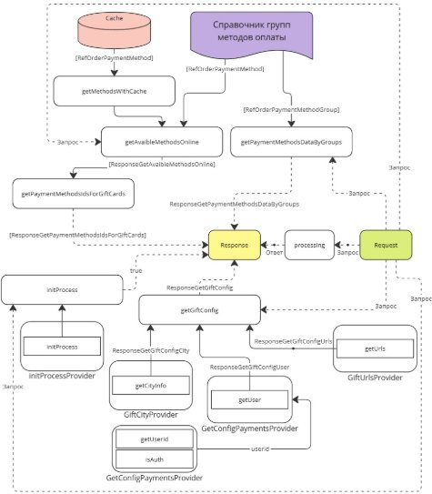
Рисунок 11 – Диаграмма получения данных для запроса внутри checkout-api 

При разработке нового метода выявляются некоторые особенности подхода разработки в команде. Использование паттерна Model-Controller, обеспечивает разделение ответственности между элементами, что делает приложения более гибкими и масштабируемыми[14]. Модель отвечает за хранение данных приложения и предоставление доступа к ним другим компонентам. В нашем случае моделями будут все запросы и ответы, в их названиях будет отражено к чему он относится, что описывает и где используется. Примеры таких моделей изображены на рисунке 12.

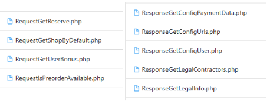
Рисунок 12 – Request и response именование моделей 

Контроллер отвечает за обработку приходящих запросов. Представляет из себя набор методов которые принимают и отдают определенные модели[15]. Соответственно, методы для работы с подарочными картами реализуются внутри нового контроллера – CheckoutGiftController, на уровне контроллера происходит валидация данных пришедших от клиента, маппинг данных, если он требуется, а также передача полученной информации другим объектам – провайдерам. Провайдер создан с целью вынесения какой-либо сложной или громоздкой логики от контроллера, к тому же такой функционал можно переиспользовать в других местах.

Также для серверного приложения собирается веб-сервис Swagger. Это набор инструментов для спецификации RESTful API. Особенность в том, что он дает возможность интерактивно просматривать спецификацию, и отправлять запросы, что очень полезно для тестирования[16]. Приложение собирается автоматически, данные для него формируются исходя из PHPDoc комментариев указанных перед методом[17]. Пример описания метода продемонстрирован в Приложении Ж. Через Swagger есть возможность посмотреть в подробностях на методы и модели. Примеры таковых изображены на рисунке 13 и рисунке 14.

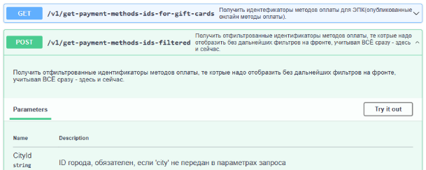
Рисунок 13 – Отображение методов API в Swagger

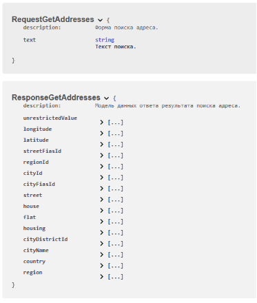
Рисунок 14 – Отображение моделей данных в Swagger

Итогом проектирования серверного API микросервиса для оформления электронной подарочной было выяснено что логика работы с ЭПК является аналогичной обычному товару, благодаря чему не потребовалось множество изменений в REST API, и были дописаны необходимые методы, для полноценной работы бэкенд-приложения
1. ## Проектирование клиентской части приложения
Клиентская часть приложения оформления электронных подарочных карт реализуется на фреймворке vue3, из чего следует, что вся заработка будет вестись с использованием компонентного подхода. В целом всё приложение должно состоять из небольшого количества основных компонентов: шапки, данных отправителя, способа доставки карты, способа оплаты, блок информации о правилах и комонент дополнительной информации о всей странице.

Внешний вид страниц должен в основе своей остаться неизменным, по сравнению с приложением, реализованным внутри монолитного решения. Изображение монолитного решения представленно в приложении З. На странице должны использоваться новые компоненты дизайн-системы компании, в связи с чем необходимо продумать структуру приложения. 

Фундаментом приложения является компонент app. В нём должна производиться инициализация всех основных данных для приложения. Через данный компонент вызываться клиентский api-app, заполняющий основные данные, а также api-config определяющий, необходимо ли выполнить запрос к бэк-энд части, для получения конфигурации. В основном компоненте располагаются главные блоки приложения. Структура элемента app представленна на рисунке 15.

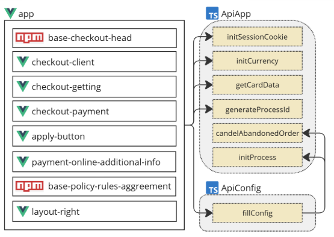
Рисунок 15 – Структура компонента app

Компонент шапки существует в виде npm-пакета base-checkout-head, и импортируется посредством установки через пакетный менеджер Node.js[18]. Во время монтирования базовой части приложения вызываются методы для инициализации сессии оформления, валюты, получение информации о приобретаемой карте и генерация идентификатора процесса, нужного для бэк-энд сервиса. После успешного выполнения действий, вызывается программный интерфейс конфигурации, который наполняет соответственные данные, в случае успешной работы, процесс сгенерированный ранее передаётся на сервер для инициализации. В случае если пользователь оборвал выполнение заказа и вернулся на страницу, выполняется отмена брошенного заказа.

Данная структура повторяет подход к реализации заказа основой страницы, не связанной с оформлением электронных подарочных карт, благодаря чему, любой сотрудник, ранее работавший с другим проектом команды без труда, сможет разобраться в процессах.

Раздел «Данные отправителя», имеет название checkout-client содержит в себе поля ввода, учитывающие корректность формата данных, а именно: номер телефона и электронная почта. Поля ввода являются унифицированными объектами из дизайн-системы компании и поставляются в виде npm-пакета base-input-row-validation. Правильность вводимых значений должна определяется при помощи объекта-маски и объекта валидации. Поле ввода электронной почты не является обязательным к заполнению в отличие от номера телефона. Структура данного компонента изображена на рисунке 16.

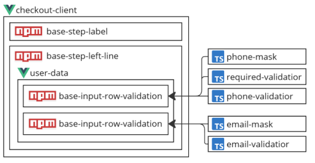
Рисунок 16 – Структура компонента checkout-client

Блок «Способ доставки карты» представляет из себя компонент, с возможностью выбора способа доставки и телефона получателя, данные параметры будут передаваться на оформление, и от него будет завесить кому и когда придёт информация о электронной карте. Разделы «Отправка по SMS» и «Отправка по E-mail» должны также иметь выбор даты отправки при помощи календаря, а ещё последний раздел добавляет поле для ввода почты получателя. По итогу в зависимости от выбранного пункта должны использоваться разные компоненты, но в совокупности используется две вариации блоков: текстовая, календарь. Если элемент изображен на странице, то он должен быть обязательным к заполнению, это делается при помощи назначения элементам required-validator, также к каждому полю необходимо добавить иные валидаторы и маски, ранее упомянутые для номера телефона и почты, а также для даты и времени получения. Несмотря на то, что выбор даты получения является календарём, он также позволяет вписывать данные пользователю самостоятельно, поэтому для него также необходима маска и объект валидации. Структура компонента с выбором способа доставки продемонстрирована на рисунке 17.

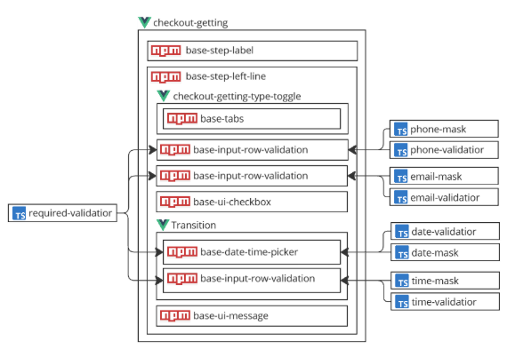
Рисунок 17 – Структура компонента checkout-getting

Шаг «Выберите способ оплаты», для пользователя является последним действием необходимым для подтверждения заказа. Хоть компонент и является пакетным, но для него необходимо реализовать API работы с методами оплаты, а также реализовать внутренние методы для корректной работы со стилем в виде слайдера. Структура checkout-payment изображена на рисунке 18.

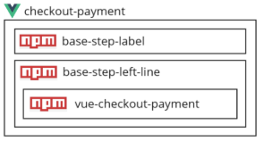
Рисунок 18 – Структура компонента checkout-payment

После выбора оплаты остаётся лишь кнопка подтвердить, но под простым компонентом на самом деле скрывается много действий. После нажатия «Подтвердить заказ», идёт проверка подверженности номера телефона, а после сбор всех данных по проекту, маппинг их в необходимую модель и отправка на метод оформления заказа. В случае отсутствия подтверждения показывается компонент base-phone-confirm-modal, что взаимодействует с api-phone-confirm, отправляя код в смс, для подтверждения действий. После также собирая данные и отправляя их на оформление. Структура компонента apply-button продемонстрирована на рисунке 19.

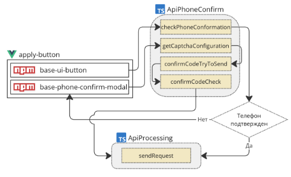
Рисунок 19 – Структура компонента apply-button

Помимо основных элементов страницы, с которыми взаимодействует пользователь, также необходимы блоки с дополнительной информацией. Так payment-online-additional-info предоставляет выбор отправки чека на электронную почту или номер телефона, а base-policy-rules-aggreement является универсальным npm-пакетом и содержит в себе всю информацию о политике конфиденциальности, правилах продажи товара и электронных подарочных карт. Также имеется компонент layout-right, на котором описана дополнительная информация, например, возможность вернуть товар или номер технической поддержки.

После проведения комплексного проектирования клиентской части приложения формируется понимание всего предстоящего процесса разработки, известны все необходимые для работы компоненты и пакеты, благодаря чему можно разбивать работу на задачи, связанные с реализацией конкретной части, ожидаемым его поведением и вследствие чего – определенным функционалом, что можно протестировать. Например, во время верстки блока определенного шага необязательно иметь готовый прошлый, ведь весь смежный функционал объединён в отдельные компоненты. Вся структура приложения соответствует имеющимся у команды проектам, но при этом визуально и функционально повторяет решение, реализованное внутри монолита сайта, хотя и реализация у него во многом иная и методы взаимодействия перенесены в отдельный микросервис.

1. # Разработка страницы оформления электронной подарочной карты
   1. ## Подход к разработке применявшаяся в ходе работы над проектом страницы оформления подарочной карты 
В разделе рассмотрен процесс формирования ролей участников проекта, выбор инструментов для командного взаимодействия, а также этапы формирования заявок и рекомендации по оформлению и проверке кода.

В ходе работы над проектом команда активно применялись методологии Agile и Scrum. Agile представляет собой подход к управлению проектами, основанный на наборе принципов и ценностей, которые помогают командам разработчиков ПО эффективно реагировать на изменения. Scrum же является Agile-методикой, позволяющей командам структурировать работу с помощью коротких циклов разработки, называемых спринтами[19].

Использование методологий обеспечило команде гибкость в реагировании на изменения требований, возможность оперативно адаптироваться к новым задачам и эффективную работу в команде.
1. ### **Описание ролей участников команды**
В процессе разработки или модификации некоторого продукта взаимодействуют немало людей, и у каждого участника естественно есть своя отведённая роль во всем процессе. 

Всего можно выделить несколько ролей:

\- продукт-менеджер – специалист, являющийся связующим звеном между бизнесом и разработчиками. Задачами продуктолога является составление заявки на реализацию нового функционала или на доработки имеющегося, при этом специалист должен понимать специфику разработки в команде, для которой он составляет заявку, поэтому зачастую продукт-менеджеры имеют привязку либо к домену, либо к определенной команде разработке, так как понимают возможности и зоны ответственности команды;

\- team lead – руководитель команды. В компании «ДНС Технологии» множество небольших команд, в каждой есть свой руководитель, полностью ответственный за разработку определенных решений компании. Задачами такого руководителя является организация процесса планирования, для распределения заявок и создание по ним отдельных задач, над которыми можно работать. Также team lead в целом руководит командой разработки, следит за ходом решения задач и проводит их code review;

\- разработчик – основная рабочая единица команды. Данный человек является тем, кто собственно решает поставленную задачу, пишет программный код и взаимодействует со всеми участниками проекта. Помимо написания кода, разработчики также участвуют в code review задач участников команды. Разработчику чаще всего приходится взаимодействовать с другими ролями, потому что именно в процессе решения задачи возникают уточнения, проблемы и какие-либо дополнения;

\- тестировщик – работник, проводящий тестирование определенных задач. В соответствии с техническим заданием, пользователь проводит ряд действий, для определения того, что новый функционал работает, старый не сломался и что задачу можно считать решённой. 

В целом каждая роль, каждый участник проекта должен иметь высокий уровень вовлеченности в процесс разработки и планирования. При работе над любым этапом решения задачи зачастую необходимо учитывать контекст ранее существовавших задач, и каждая роль вносит свой необходимый вклад в разработку конечного продукта.
1. ### **Система управления  задачами**
Для отслеживания и управление процессом решения задач в компании «ДНС Технологии» используется система SDMS (рис. 2), созданная внутри компании, разработанная на платформе 1С: Предприятие[20].

Внутри системы множество разделов для управления задачами и получением необходимой информации для сотрудника. Разделы изображены на рисунке 20.

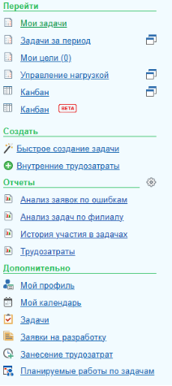
Рисунок 20 – Разделы системы SDMS

Основными разделами, с которым приходится взаимодействовать в рамках работы над проектом это: «Мои задачи», «Канбан» и «Мой календарь». 

Раздел «Мои задачи» – представляет из себя список из двух колонок, где указаны задачи, закрепленные за пользователем, или созданных им. Это список даёт достаточное количество информации для сотрудника, показывая номер задачи (указывается в квадратных скобках), полное название и изображая иконкой текущий статус выполнения. Наполнение раздела можно увидеть на рисунке 21.

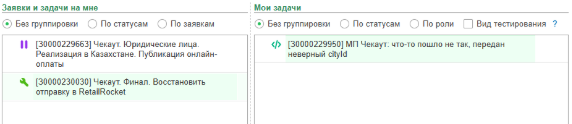
Рисунок 21 – Раздел «Мои задачи» системы SDMS

Канбан представляет из себя доску, где распределены задачи, по их статусам. Благодаря ему можно отслеживать состояние задач разных сотрудников, и, например, узнать, когда работа требует проведения code review или была протестирована тестировщиком. Декомпозиция элемента канбан доски предоставлена на рисунке 22.

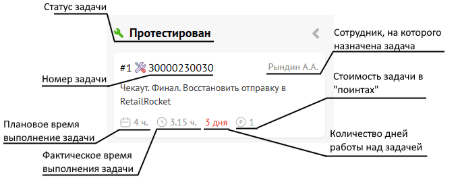
Рисунок 22 – Декомпозиция элемента канбан доски системы SDMS

Раздел «Мой календарь» является таблицей, где по определённым датам распределены запланированные события, например, сдача зачёта или планирование задач. То, как выглядят элементы календаря, представлено на рисунке 23.

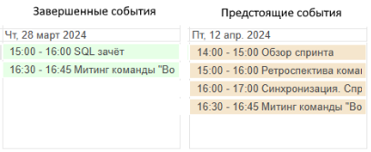
Рисунок 23 – Элементы календаря в системе SDMS

Вышеописанные разделы системы позволяют всегда быть в курсе предстоящих события, состояния задач и отслеживать выполнение разных работ.

1. ### **Процесс планирования работы над заявками**
В компании используется Scrum-методология управления проектами, и все задачи распределяются на спринт – двухнедельный промежуток в рамках которого и будет выполнена основная работа. Каждый спринт заканчивается «обзором спринта», проводится совещание, в рамках которого идёт рассуждение, какие заявки мы можем взять в работу, из тех, что предоставляет нам продукт-менеджер. Руководитель команды сообщает запланированное количество story points, и вся команда оценивает стоимость заявок путём – покер планирования, когда каждый участник оценивает задачу и итоговый результат выбирается по договоренности. Команда «Восток» делает запись таких встреч, совместно в онлайн-таблице, что позволяет помнить о выбранных заявках. Таблица проведения таких планирований представлена на рисунке 24.

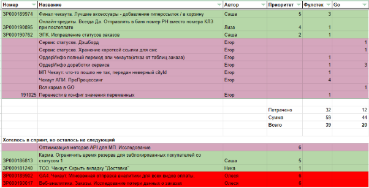
Рисунок 24 – Таблица проведения обзора

После проведения обзора, с начала спринта, происходит планирование, где заявки разделяются на задачи, и распределяются по сотрудникам. Результатом также является таблица, где отображена вся нужная информация: статус, номер заявки, номер задачи, статус, дата выполнения. В процессе спринта также появляются и внеплановые задачи, которые входят в статистику, но оцениваются отдельно.
1. ### **Жизненный цикл задачи**
Задача проходит достаточный путь от статуса «новый» до «завершён». С момента создания задачи, статус у неё считается «Новый», и задача требует заполнения описания, и прочих данных. Статус «В реализацию», подразумевает что все необходимые данные для работы над задачей – готовы и разработчик может переводить задачу в следующий статус, «В работе». Тут задача будет находиться до того момента, пока разработчик не завершит работу, а после, изменения загружаются в систему контроля версий, и задача переводится в «Code review», где каждый участник команды проводит инспекцию кода, и, если нет замечаний, задача переводится в «Публикацию», при наличии замечаний, возвращается на доработки. В публикации, является промежуточным статусом, чтобы, потому что загружать изменения можно в определенный промежуток времени, и когда изменения можно применять, задача переводится в «Тестирование». Соответственно, по окончанию тестирования, задача будет переведена в «Протестирован» или в случае замечаний – вернётся на доработки. Также после того как задача была протестирована, статус меняют на «Решен», и задача закрывается. Диаграмма изменения статуса задачи представлена на рисунке 25.

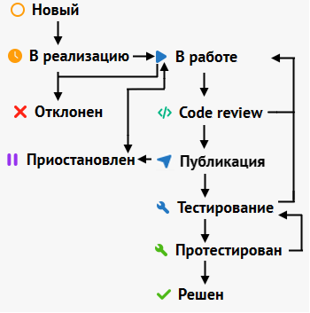
Рисунок 25  Диаграмма изменения статуса задачи

Также задача может быть переведена в «Отклонен», например, если была заведена ошибочна, или в «Приостановлен», если есть блокирующие факторы, не позволяющие продолжить работу.
1. ### **Система контроля версий**
Система контроля версий является важной частью производства программного кода, при её помощи записываются все изменения в течение решения задачи, и всегда можно вернуться к определенному этапу разработки.

В качестве системы контроля версий на предприятии используется Git. Хостингом для репозиториев выступает GitLab - данный инструмент объединяет в себе систему контроля версий и систему непрерывной интеграции и развёртывания, позволяя, применять изменения кода в системе вовремя его релиза[21].

Порядок работы с системой контроля версий в команде «Восток»:

\- создается новая ветка, от main и называются #{номер задачи}\_{название}; 

\- по окончанию работ с задачей, создаётся merge request на добавление в main;

\- задача переводится в статус «Code review» и ожидает результата инспекции;

\- проинспектированные задачи разработчик сливает в ветку rc и dev;

\- в вышеописанных ветках разработчик проводит самостоятельное тестирование;

\- после самотестирования, задача передаётся тестировщику;

\- по результатам тестирования вводятся доработки или merge request готовится к публикации;

\- загружать изменения в main можно ежедневно до 12 часов дня;

\- merge request сливается в main, и задача снова переводится в тестирование.

Следуя этим пунктам регламента работы с контролем версий, формируется релизная 

версия продукта.
1. ## Требование к разрабатываемому программному обеспечению
   1. ### **Описание рекомендаций по кодированию и процессу решения задачи**
В процессе написания кода необходимо придерживаться регламентов, созданных для единообразия проектов. В целом в команде «Восток» есть один регламент по написанию кода, с некоторыми уточнениями для проектов на PHP и TypeScript.

Во время написания frontend приложения, при написании TypeScript файлов, существует автоматическая проверка при помощи инструмента ESLint, что выявляет ошибки при отклонении от регламента. В целом регламент представляет из себя такой набор правил: 

\- переменные пишутся в camelCase;

\- отступом является таб;

\- все присвоения выравниваются пробелами для удобного чтения;

\- стиль переноса строк – unix;

\- сравнение переменных происходит в yoda стиле;

\- Использование одинарных кавычек (за исключением строк, содержащих одинарные кавычки);

\- Пробел перед/после ключевых слов (if, else, for, as, from и др.);

\- Пустая строка между членами класса (свойствами, атрибутами);

\- Пустая строка перед return;

\- Необходимо создавать модели запросов/ответов и производить маппинг данных;

\- Используем let/const вместо var;

\- Не должно быть использования не определенных переменных;

\- Обязательное использование точки с запятой;

Данные требования в целом подходят как к написанию PHP кода, так и при работе над JS/TS проектами, в разных командах могут быть небольшие отклонения, но они не могут быть кардинальными. Следование регламенту позволяет всем разработчикам с легкостью изучить и приняться за разработку внутри другой команды, если для этого есть необходимость.
1. ### **Описание процесса проведения code review**
Перед проведением инспекции кода, необходимо ознакомится с рекомендациями проведения code review, что были составлены в результате исторически сложившихся ситуаций внутри компании:

\- фокусировка на багах, которые не эффективно обнаруживать тестированием;

\- необходимо мелко декомпозировать задачи;

\- назначаем ревьюверами владельцев кода;

\- говорим: «Нет!» боксу по переписке;

\- не делаем из плохого кода идеальный;

\- боремся со вкусовщиной;

\- пишем описание реквеста;

\- проводим саморевью, перед изменением статуса задачи;

\- ссылка на реквест всегда прикрепляется в задаче в SDMS;

\- помним о равномерной нагрузке и о знании контекста;

\- в случае необходимости в самом реквесте можно сделать уточнения.

Учитывая вышеописанные рекомендации можно приступать к процессу инспекции. После того как разработчик решил, что его задача выполнена и он провел саморевью, создаётся merge request на странице GitLab проекта, а задача переводится в статус «Code review». После изменения статуса, разработчик ожидает, когда минимум два коллеги проведут ревью его изменений. Все замечания указываются на странице реквеста. Замечания могут решаться путём исправления кода, или в процессе разговора, например, если инспектор неправильно понял сути решения.

После решения всех замечаний в реквесте, задача переводится в публикацию и отдельно проверяется руководителем команды. По итогу проверки задача идёт дальше по своему жизненному пути, в зависимости от решения руководителя.
1. ## Общая информация о разработки проекта
   1. ### **Общие представления о странице оформления электронных подарочных карт**
Страница оформления электронных подарочных карт (далее ЭПК) представляет из себя одностраничное приложение реализованное на фреймворке vue3,в котором заполняются все данные, необходимые для оформления заказа с покупкой подарочной карты К команде поступали заявки на внедрение нового функционала в рамках работы над подарочными картами, например внедрение персонализации ЭПК, но эти запросы откладывались, по причине того, что страница оформления заказа является частью монолитного приложения, из-за чего её сложно обновлять и порог вхождения программиста в проект достаточно сильно повышается. Также из-за старого кода, проблемой является невозможность использовать актуальные версии компонентов, например, на старой странице оформления ЭПК невозможно было добавить способ оплаты через систему быстрых платежей, поскольку использовалось монолитное, устаревшее решение, что потенциально уменьшало общее количество оформляемых карт.
1. ### **Заявки и задачи проекта**
Любое нововведение или приложение не может начать свою разработку спонтанно, нужны некоторые факторы, которые приведут к решению проблемы в виде отдельного микросервиса. В компании такими решениями являются заявки на разработку – технического задания, созданного на основе какой-либо пользовательской истории. В процессе работы были сформированные следующие пользовательские истории:

\- «Как продукт-менеджер, я хочу повысить число продаваемых электронных подарочных карт, путём внедрения функционала персонализации и новых методов оплаты»;

\- «Как разработчик я хочу иметь удобство во время работы над задачами продукта, в виде локального развертывания и независимости приложения».

Опираясь на вышеописанные истории, был сформирован ряд заявок на разработку и доработку разных проектов, в которые необходимо было внести изменения, чтобы весь цикл оформления заказа с электронной подарочной картой был корректен и был готов к внедрению нового функционала. Список заявок приведён в таблице 1.

Таблица 1 – Заявки на разработку в рамках страницы оформления ЭПК

|Заявка на разработку|Название|Короткое описание|Стоимость заявки|
| - | - | - | - |
|ЗР000172545|СОЗ-ЭПК 3.0|Перевод вендор пакета чекаута ЭПК на докер по принципу как СОЗ 3.0.|349 470|
|ЗР000175331|Финал чекаута (новый). Итерация 2.|Отказываемся от использования групсовых элементов на финале чекаута (десктопная, планшетная, мобильная версии). Преводим финал в микросервис|
194 860

(ЭПК – 19 230)
|
|ЗР000185629|ЭПК. Лэндинг. Персонализация оформления подарочных карт|Создание функционала оформления персонализированныз подарочных карт с целью увеличения доли проданных ЭПК.|162 215|

В рамках вышеописанных заявок, был сформирован ряд задач, каждая задача представляет из себя ряд изменений, которые нужно внести в проект. В целом они затрагивали новое приложение, кусок монолитного приложения, бэкенд-сервис и сервис финальной страницы оформления заказа. Список задач приведён в таблице 2.

Таблица 2 – Список задач проекта

|Название задачи|` `Описание задачи|
| - | - |
|ЭПК 3.0. Основа. Базовое приложение и структура.|` `Создать пустое приложение в docker, для последующей разработки в нем СОЗ ЭПК 3.0|
|ЭПК 3.0. Шапка. подгрузка номинала|` `Разработать компонент шапки для страницы и получить номинал, передаваемый в SessionStorage.|
|ЭПК 3.0. Оплата|` `Добавить новый компонент оплаты со слайдером. Реализовать бэкенд-методы получения списка доступных методов оплаты. Реализовать API для оплат.|
|ЭПК 3.0. Отложенная отправка|` `Реализовать функционал отложенной отправки ЭПК.|
|ЭПК 3.0. Получение города|` `Для последующей реализации получения конфига необходимо знать выбранный город пользователя, необходимо исследовать откуда его можно получить, и разработать получение.|
|ЭПК 3.0. Убрать моки. |` `Убрать все замоканные, захардкоденные данные|

Продолжение таблицы 2

|Название задачи|` `Описание задачи|
| - | - |
|Финал чекаута (новый). Итерация 2 - блок информации (часть 2). Кейс с ЭПК|` `В приложении финала оформления заказа, реализовать кейс с отображением информации электронной подарочной карты.|
|Чекаут ЭПК 3.0. Планирование оставшихся задач|` `Исследовать и распланировать ряд оставшихся работ по СОЗ ЭПК 3.0|
|СОЗ-ЭПК 3.0. Реализация своего конфига|` `Реализовать конфиг, приходящий с бэкенда, для корректной работы приложения|
|СОЗ-ЭПК 3.0. Капча и подтверждение телефона|` `Внедрить капчу и подтверждение телефона, перед оформлением заказа в СОЗ ЭПК 3.0|
|СОЗ-ЭПК 3.0. Процессинг|` `Реализовать использование методов оформления заказа.|
|ЭПК. Лэндинг. Персонализация оформления подарочных карт. Палитра|` `На странице лэндинга электронных подарочных карт, реализовать выбор цвета для подарочной карты. |
|ЭПК. Лэндинг. Персонализация оформления подарочных карт. Передача конфига|`  `Реализовать передачу данных с лэндинга ЭПК на страницу оформления ЭПК|

Данный список не перечисляет все задания по проекту, но именно эти задачи выполнялись во время прохождении практики.
1. ## Разработка клиентской части приложения
Клиентская часть приложения, или фронт-энд представляет из себя одностраничное приложение, написанное с использованием JavaScript фреймворка Vue3, сборка производится при помощи webpack. Такое приложение запускается внутри docker-контейнера, внутри используя функционал Node.js.
1. ### **Основное приложение и базовая структура**
В процессе разработки было необходимо создать базовое приложение. Главным условием было чтоб оно запускалось в Docker-контейнере[22] с целью удобства последующей разработки. Такое приложение было сделано на основе уже имеющейся страницы оформления заказа, путем удаления всего функционала, пока не осталась пустая страница. Результатом послужил пустой проект, файловая структура которого изображена на рисунке 26.

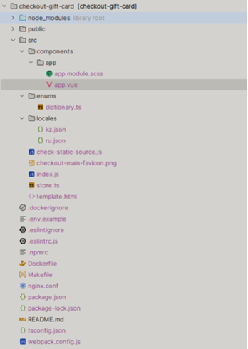
Рисунок 26  Файловая структура пустого проекта СОЗ ЭПК 3.0

Результатом выполнения задачи был проект, который можно было без труда дополнять новыми компонентами и API. Команды для сборки и запуска проекта описаны в Makefile, что позволяет без труда работать с проектом. Код получившегося файла инструкций изображён на рисунке 27.

 
Рисунок 27 – Содержимое файла Makefile

Путем вызова изображенных выше команд можно как собрать проект, так и запустить его в виде Node.js приложения внутри docker контейнера.
1. ### **Основная верстка приложения**
После создания базового, пустого приложения, необходимо сверстать все компоненты и внедрить их в компонент-фундамет – app. Каждый компонент что создаётся внутри проекта, а не устанавливается при помощи пакетного менеджера[23], реализуется в отдельном каталоге, где имеет всё необходимое для независимой работы. Каталог имеет основной файл: компонент.vue, файл модуля стилей препроцессора SCSS[24]: компонент.module.scss, также по необходимости могут создаваться каталоги с изображениями, хранилищами или моделями данных. Пример каталога компонента изображен на рисунке 28.

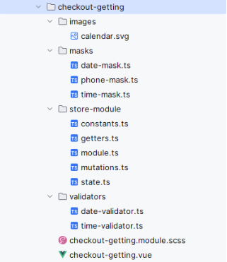
Рисунок 28 – Файловая структура компонента checkout-getting

Первым блоком страницы стала шапка. Данная часть страницы представлена в виде npm-пакета, требуемого импортирования. После импорта «@dns-modules/base-checkout-head» был реализован функционал отображения номинала. Для этого требовалось написать метод форматирования цены, а также добавить константу с выводимым текстом. Далее написанные части вставляются в slot[25] тэг компонента шапки. Результат верстки показан на рисунке 29.

Рисунок 29 – Компонент шапки, страницы оформления ЭПК

Для того, чтоб получить номинал, приложению необходимо обратиться в хранилище SessionStorage, куда кладёт данные об подарочной карте, страница лэндинга. На этом разработка компонента завершена.

` `Следующим компонентом в рамках работ стал блок выбора методов оплаты, изображенный на рисунке 30.

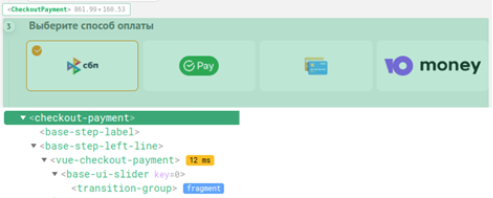
Рисунок 30 – Вид и структура компонента выбора способа оплаты

Данный компонент является модулем, импортируемым в проект, и для его корректной работы необходимо было имплементировать API для работы с методами оплаты и обернуть его в блок, для того, чтоб он считался шагом заказа. Код компонента представлен в приложении И.

Следующим необходимым компонентом на разработку был шаг заполнения способа доставки карт. Данный компонент разрабатывался совместно с командой и требовалось реализовать функционал отложенной отправки карты. Изначально отображен только лишь чек-бокс, при нажатии на который, с постепенным появлением появляются поля ввода информации о доставки в виде двух input элементов. Первое поле является раскрывающимся списком в виде календаря, а второе имеет проверку на введенные данные и принимает только в формате времени. Для того, чтоб поля принимали нужные данные, для них необходимо написать валидаторы и маски.  Валидаторы – некоторые классы, наследующиеся от какого-либо интерфейса для проверки корректности вводимых данных в компонент. Такие классы были реализованы для формата даты и времени, они определяют метод check, а проверка входных данных делается при помощи регулярного выражения[26]. Валидаторы даты и времени изображены на рисунке 31.

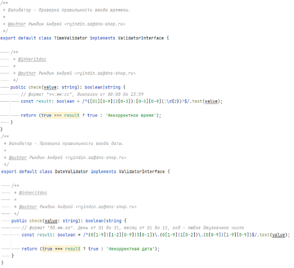
Рисунок 31 – Валидаторы времени и даты

Маски же в свою регулируют входные данные, например, запрещая использовать определенные символы и в целом задавая некоторый паттерн для ввода данных. Пример кода маски продемонстрирован в приложении Й.

Для плавного появления и скрытия блока с выбором доставки, компоненты были обернуты тегом transition, которому были заданы стилевые параметры. Для ввода данных использовался модуль base-input-row-validation, являющийся частью дизайн-системы компании. В его props-параметры были переданы экземпляры валидаторов, маски и другие необходимые для корректного отображения данные[27]. Также были реализованы методы, что обрабатываю нажатия на различные части компонента и закрытие выбора даты доставки. Код шаблона компонента представлен в приложении К, а результат верстки изображен на рисунке 32.

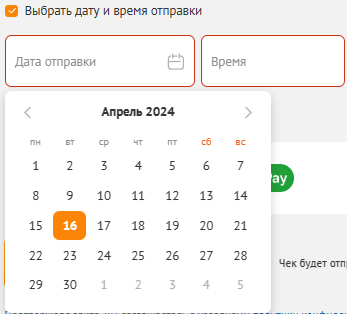
Рисунок 32 – Компонент ввода данных отложенной отправки 

Последним достаточно важным элементом на странице, над которым велась работа, является компонент подтверждения номера телефона. Данный компонент является импортируемым модулем и изображен на рисунке 33.

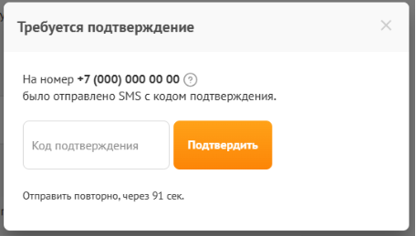
Рисунок 33 – Компонент подтверждения номера телефона

Для корректной работы данного модуля, необходимо было реализовать API для работы с методами подтверждения телефона и отправки кода. Если пользователь уже авторизирован, то данный компонент не отображается, также он отсутствует, если пользователь совсем недавно подтвердил номер телефона.

1. ## Разработка клиентского API приложения
Клиентское приложение само по себе является вполне независимым, но для корректной работы, оно должно иметь коммуникацию с серверным приложением. Для этого на клиентской части разрабатывается API, программный интерфейс приложения, позволяющий обратиться к нему один раз, и тем самым отправить запрос на сервер, для получения какой-либо информации. В рамках выполнения работ необходимо было реализовать несколько таких интерфейсов:

\- интерфейс получения основного конфига приложения;

\- интерфейс получения методов оплаты;

\- интерфейс подтверждения номера телефона;

\- интерфейс оформления электронной подарочной карты.

Все вышеперечисленные решения представляют из себя в основном fetch запросы, что отправляются на сервер. Все необходимые данные для методов, что используются в интерфейсах, описаны в swagger приложении бэкенд-сервиса, пример такого описания изображен в Приложении Л. Такое описание метода служит не только ради удобства просмотра, а также является контрактом, описывающим какие данные можно отправлять на сервис, и какой ответ будет получен[28].

Получение конфигурационных реализовано в несколько этапов. Существует метод fillConfig, который вызывается при создании корневого компонента app, в нем определяется, использовал ли пользователь ранее страницу оформления электронной подарочной карты, путем просмотра данных localStorage, если существуют данные о пользователе или конфигурации страницы, то на сервер не отправляются запросы, тем самым экономя ресурсы и уменьшая нагрузку на бэк-энд. Код реализованного интерфейса представлен в приложении Д.

Для корректной работы компонента выбора методов оплаты, также необходимо было реализовать API, а точнее имплементировать методы, что используются пакетом. В реализации вызываются fetch-запросы, инициатором которых является сам компонент. Для того, чтоб интерфейс применился, в приложении, в главном скриптовом файле index.js импортируется мутация на присвоение определенного API. Данное действие изображено на рисунке 34.

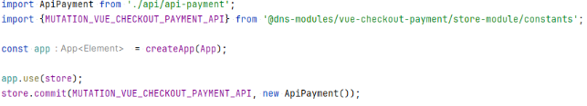
Рисунок 34 – Присвоение API для компонента vue-checkout-payment

Также требовалось сделать подтверждение номера телефона. Бэк-энд функционал для это уже был реализован, как и собственно компонент, который должен принимать данные и отправлять запросы, требовалось лишь имплементация API. Все те же fetch-запросы, только с разницей, что теперь нам важно тело запроса, а для тела каждого – необходимо реализовать модель. Результатом получился каталог файлов, изображенный на рисунке 35.

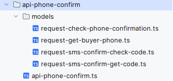
Рисунок 35 – Каталог с реализацией API работы подтверждения телефона. 

Полученные модели вызывались в коде путем создания нового экземпляра класса, а далее вставлялись в поле body запроса к серверу.

Последним, для чего необходима реализация интерфейса, является процессинг – действия, выполняемые для оформления заказа. Данные собираются в объект formData при помощи вызова геттеров разных компонентов и форма, содержащая всю информацию о заказе отправляется на оформление[29]. При возникновении ошибки, об этом сообщается пользователю, в случае её отсутствия, происходит переход на страницу финала.
1. ## Разработка серверной части приложения
Серверная часть проекта реализовывалась в уже имеющемся сервисе – checkout-api. Данный сервис был создан с целью покрытия всех нужд, связанных с процессом оформления заказа. Написан он на языке программирования PHP с использованием фреймворка Yii2.

Для корректного отображения страницы оформления электронной подарочной карты, были использованы имеющиеся методы сервиса, и также реализованы новые.

Основным методом для работоспособности клиентской части является метод get-gift-config. При обращении к нему, необходимо передать токен авторизации в заголовке запроса, и в очереди запроса – идентификатор города, что был выбран пользователем на главной станице сайта[30]. По полученной информации, сервер проводит аутентификацию пользователя, и в случае если он авторизирован – возвращает его данные, чтоб заполнить некоторые поля, а город, в свою очередь, необходим для отображения корректной информации, связанной с обратной связью. Также данный метод является единственным, о наличии которого можно узнать на клиентской части приложения, ссылки на все остальные методы получаются именно вместе с ответом получения конфигурации. Код get-gift-config изображен в приложении М.

Метод get-payment-methods-ids-for-gift-cards является способом получения всех доступных онлайн методов оплаты. При вызове, на сервере выполняется запрос к базе данных, для получения опубликованных способов оплаты, и после эти данные передаются клиентскому приложению.

Остальные методы используемые на станице оформления электронной подарочной карты, являются унифицированными, и их адаптация не потребовалась
1. ## Взаимосвязь с другими приложениями-сервисами и их доработки
В процессе работы над приложением возникла необходимость доработки нескольких сервисов, связанных с процессом оформления электронной подарочной карты, для того, чтоб заказ мог пройти весь цикл и считаться завершённым.
1. ### **Лэндинг электронных подарочных карт**
Лэндинг электронных подарочных карт, это страница, находящаяся внутри монолитного приложения сайта dns-shop.ru. После того как основные работы по странице оформления ЭПк были завершены, необходимо было внести новый функционал в работу лэндинга, а именно – добавить возможность персонализации подарочных карт для пользователей.

Для этого был реализован новый компонент в виде блока, с возможностью выбора дизайна изображения и фонового цвета, при помощи слайдеров. Результат разработки изображен на рисунке 36.

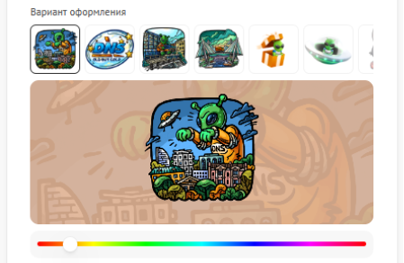
Рисунок 36 – Блок персонализации подарочной карты

Фоновый цвет выбирается при помощи вращения hue параметра цвета, дальше конвертируется в цвет, а изображение загружается посредством работы основного приложения сайта, возможного благодаря интеграции с системой администрирования, где был реализован функционал управления дизайнами подарочных карт.
1. ### **Страница финала оформления заказа**
Конечным этапом оформления любого заказа является – страница финала, что также является отдельным приложением-сервисом. Необходимо было реализовать корректный вывод информации по заказу с ЭПК. Данные заказа, по которым формируется страница собираются сервисом order-info, а после checkout-api конвертирует их, и добавляет иную нужную информацию. Для реализации клиентской части были предоставлены макеты и произведена верстка. Результат изображен на рисунке 37.

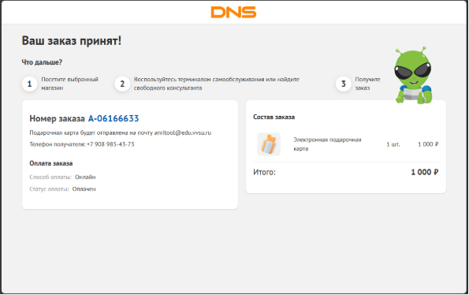
Рисунок 37 – страница финала оформления электронной подарочной карты

Запуск финала знаменовал конечный этап разработки приложения оформления ЭПК, ведь теперь заказ мог пройти полный цикл обработки, от выбора дизайна, заполнения данных пользователя, оформления, оплаты и собственно отображением финальной страницы. Также на странице финала собирается статистика по оформленным заказам, что является не менее важной частью работ.
1. ## Тестирование проекта
В процессе выполнения каждой задачи по проекту, проходил этап тестирования. Для того чтоб попасть в тест, задача проходила через код-ревью, а после сливалась на dev-окружение, где тестировщик проверял работоспособность внесённых изменений и сообщал об ошибках разработчику. В команде «Восток» явно проводится только ручное тестирование в связи с тем, что вся система модульная и ручной проверки достаточно чтоб покрыть функциональность проекта, но также внутри команды тестировщиков, вне зоны ответственности «Востока», создаются автоматические тесты для проекта, в случае некорректной работы какого-либо кейса на dev-окружении, разработчику сообщается о поломке. Решение тестировщика является конечным, по поводу публикации задачи в продакшн, но на этом работа над задачей не заканчивается. После обновления приложения, тестировщик также проверяет корректность всей работы и в случае ошибки делается revert изменений, либо задача закрывается и считается решённой[31].

Для того чтоб протестировать первую задачу из заявки по разработке страницы оформления ЭПК, а именно «ЭПК 3.0. Основа. Базовое приложение и структура», достаточно было удостовериться, что по определенному адресу существует страница, а также проверить что она доступна лишь из внутренней сети компании.

«ЭПК 3.0. Шапка, подгрузка номинала» требовало проверки корректности получения данных со страницы лэндинга подарочных карт, где заполняется номинал и основные данные карты. В рамках тестирования проверялась корректность получаемых данных посредством sessionStorage.

Компонент оплаты, реализуемый в задаче «ЭПК 3.0. Оплата» должен отображать все доступные методы, которыми можно расплатиться за подарочную карту. Оплачивать ЭПК можно лишь при помощи онлайн-средств, следовательно, тестировщик проверял являются ли демонстрируемые методы оплаты – онлайн оплатой, а также проверял через запросы в базу данных, что полученные им данные являются доступными и опубликованными, исключая варианта нерабочего способа приобретения товара. Также необходимо вне зависимости от клиентского приложения проверить и серверный метод, например, его реакцию на оправку различных значений, с целью найти неисправность, которую нельзя получить со стороны клиентской части. Такие запросы выполняются при помощи приложения-сервиса тестирования и разработки API – Postman[32].

Задача «ЭПК 3.0. Отложенная отправка» представляла из себя доработки блока «Способ доставки карты», а именно, добавление возможности выбора отложенной отправки. Тестировщик проверял поля ввода на различные данные, как буквы, цифры, так и спецсимволы.

Для того, чтоб в последующем реализовать метод получения конфигурации, на стороне клиентской части приложения необходимо было выполнить получение города. Итогом стало определение города оформления заказа из cookie страницы. Соответственно проверялась корректность определения города при попадании на страницу оформления ЭПК.

«ЭПК 3.0. Убрать моки» является задачей очистки фронт-энд приложения от всех прописанных и имитированных данных, что были сделаны по причине отсутствия реализации методов серверного API. Пока методы не были реализованы, единственное что мог проверить тестировщик, это то, что страница больше не отрабатывает корректно в тех местах, где должны быть обращения к серверу. Было обговорено что в данной задаче все запросы должны отрабатывать с ожидаемой ошибкой.

Задача «Финал чекаута (новый). Итерация 2 - блок информации (часть 2). Кейс с ЭПК» требовал проверить корректность отображаемых данных электронной подарочной карты на странице финала заказа, на которую будет переходить пользователь после оплаты.

«СОЗ-ЭПК 3.0. Реализация своего конфига» требовало тестирование серверного метода get-gift-config, корректность передаваемых им ссылок на иные методы, а также проверка авторизации и информации о пользователе. А также протестировать его использование в клиентском приложении

Проверка подверженности номера телефона производилась в задаче в «СОЗ-ЭПК 3.0. Капча и подтверждение телефона». Была проведена проверка отправки СМС сообщений, а также функциональность запоминание ранее подтверждённого номера. Помимо отправки кодов подтверждения, был реализован функционал защиты от множественных отправок, путём использования капчи[33].

Оформления электронной подарочной карты заканчивается процессингом, его реализация была в задаче «СОЗ-ЭПК 3.0. Процессинг». Результатом выполнения данной работы должна стать возможность пройти весь путь заказа товара, от заполнения данных, до собственно получения электронной подарочной карты. Помимо передачи данных на сервер, тестировалась вся страница в целом, для определения возможности публикации сервиса для всех пользователей.

После проведения тестирования и закрытия вышеперечисленных задач, состоялся релиз страницы оформления электронных подарочных карт, и разработчики ещё несколько дней наблюдали за результатом выполнения запросов и отсутствием ошибок в системе Sentry[34].

Далее были выполнены работы с целью дополнения функционала покупки подарочных карт. Такие доработки были в приложении лэндинга ЭПК и страницы оформления. В задаче «ЭПК. Лэндинг. Персонализация оформления подарочных карт. Палитра» был реализован блок выбора цвета дизайна ЭПК, а также его запоминание. А в задаче «ЭПК. Лэндинг. Персонализация оформления подарочных карт. Передача конфига» – отправка со стороны лэндинга и принятие со стороны страницы оформления ЭПК нового формата данных. Соответственно, тестировщику необходимо было проверить что существует возможность отредактировать, а также оформить подарочную карту, используя данные, создаваемые при помощи новых компонентов персонализации.
1. ## Технико-экономическое обоснование
Для определения затрат на разработку достаточно обратиться к внутреннему инструментарию ведения проектов и отслеживания задач в компании, под названием «SDMS». В системе есть возможность определения стоимости заявки на разработку где учитываются часы, и затраты на них в процессе разработки.

Страница оформления электронной подарочной карты создавалась в рамках заявки на разработку ЗР000172545 «СОЗ-ЭПК 3.0». Общая стоимость заявки изображена на рисунке 38.

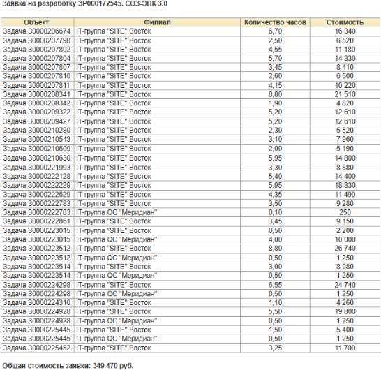
Рисунок 38 – Стоимость заявки на разработку ЗР000172545 «СОЗ-ЭПК 3.0»

Помимо затрат на «СОЗ-ЭПК 3.0» также была заявка – ЗР000175331 «Финал чекаута(новый). Итерация 2 – блок информации (часть 2)» в которой была задача на адаптацию страницы финала, для корректной работы с электронными подарочными картами. Стоимость задачи продемонстрирована на рисунке 39.

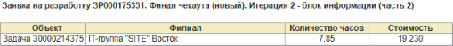
Рисунок 39 – Стоимость заявки на разработку ЗР000175331 «Финал чекаута(новый). Итерация 2 – блок информации (часть 2)»

А также были работы над заявкой по персонализации оформления электронных подарочных карт, это ЗР000185629 «ЭПК Админка+Лендинг. Персонализация оформления электронных подарочных карт». Стоимость заявки изображена на рисунке 40.

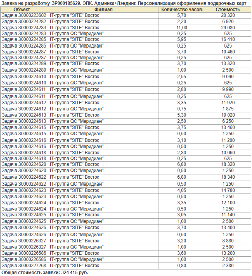
Рисунок 40 – Стоимость заявки на разработку ЗР000185629 «ЭПК Админка+Лендинг. Персонализация оформления электронных подарочных карт»

Исходя из вышеуказанных задач и заявок, стоимость работ оценивается в 693115 руб. В эту стоимость входит общая работа всех сотрудников, приложивших свою руку к любой задаче из заявок. 

Вследствие работ по добавлению персонализации ЭПК ожидается что вырастет общее количество проданных электронных подарочных карт, а результатом использования микросервисного приложения checkout-gift-card должно стать увеличение продаж посредством метода оплаты СБП.

Релиз приложения оформления ЭПК был произведён в январе 2024 года, а функционал персонализации подарочных карт выпущен в начале февраля того же года. За точку отчета будет взят отрезок с февраля по июнь 2023 и 2024 года.

При помощи CRM системы компании и поиска заказов по покупке ЭПК, было выявлено, что за период с 2023-02-01 по 2023-06-01 было приобретено 3231 электронных подарочных карт. А за тот же самый промежуток по дням, но в 2024 году было оформлено 9565 подарочных карт, среди которых 1941 карта, что составляет 20% среди всех ЭПК, была оформлена при помощи системы быстрых платежей, облагаемой пониженной комиссией по сравнению с привычной оплатой через эквайринг. При оплате товара при помощи банковских карт, стоимость комиссии составляет от 1% до 3% в зависимости от различных условий[35]. Система быстрых платежей в свою очередь имеет комиссию 0.7% для компании, в любом случае[36]. Средняя стоимость подарочных карт за описанные промежутки выросла с Х до У, что в процентном соотношении показывает рост на X%.

Если учесть только нововведения в виде оплаты СБП, и рассчитать время окупаемости проекта за счет экономии на комиссии с оплаты. За значение комиссии с эквайринга возьмем 2%, в свою очередь за оплату по QR-коду комиссия сосотавяет 0.7%, получается что за одну единицу подарочных карт, после внедрения изменений, компания получает Х рублей, в сравнении с У в 2023 году, а экономия составляет Z рублей. Итого только при помощи системы быстрых платежей проект окупится за Х дней.
# Заключение
Опыт работы над микросервисом для электронных подарочных карт стал ценным этапом в профессиональном развитии. В рамках проекта были реализованы функции, направленные на повышение удобства разработки и расширение возможностей системы. В часности внедрение новых методов оплаты и реализация возможности кастомизации подарочных карт привели к росту прибыли компании от продажи такого вида товара.

Использование Docker-контейнера в совокупности с Node.js упростило развертывание и масштабирование сервиса, сделав локальный запуск быстрым и доступным, снизив порог входа для новых сотрудников. Использование фреймворка vue3.js в проекте дает понятное и структурированное представление о всем проекте в целом. Работа над компонентами не вызывает сложностей, а понятная структура приложения также положительно влияет на разработку.

К тому же работа над проектом дала ценный опыт в изучении архитектуры API, как клиентской, так и серверной. Освоены как принципы работы REST API, так и то, как такому интерфейсу обращаться с пользовательской части приложения. а использование методологий Agile и Scrum позволили быстро влиться в процессы команды и гибко реагировать на изменения требований, оперативно решать задачи и обеспечивать непрерывную поставку ценности для клиента.

В целом, работа над микросервисом электронных подарочных карт не только позволила приобрести практические навыки разработки ПО, но и продемонстрировала способность эффективно применять современные технологии, методологии, а также дало ценные знания и опыт работы в команде над большим продуктом для крупной компании.
# Список использованных источников
1. Структура компании «ДНС» [Электронный ресурс] – 
   https://career.habr.com/companies/dns-tech (дата обращения 16.03.2024).
1. Общее описание компании «ДНС Технологии» [Электронный ресурс] – https://www.dns-tech.ru/culture (дата обращения 16.03.2024).
1. Технологический радар «ДНС Технологий» [Электронный ресурс] – https://www.dns-tech.ru/ (дата обращения 16.03.2024).
1. Статья «Domain-Driven Design (DDD)» [Электронный ресурс] – https://www.geeksforgeeks.org/domain-driven-design-ddd/ (дата обращения 20.03.2024).
1. Микросервисы от архитектуры до релиза. Пошаговое руководство / Митра Р., Надареишвили И. – 2023. – С. 20-25 (дата обращения 20.03.2024).
1. Описание фреймворка Yii2 [Электронный ресурс] – 
   https://www.yiiframework.com/ (дата обращения 25.03.2024).
1. Описание фреймворка vue3 [Электронный ресурс] – 
   https://vueframework.com/ (дата обращения 25.03.2024).
1. Статья от Yandex Cloud «REST API: для чего нужен и как работает» [Электронный ресурс] – https://cloud.yandex.ru/ru/docs/glossary/rest-api. (дата обращения – 25.03.2024).
1. Статья «Полное руководство по Yii 2.0» [Электронный ресурс] – 
   https://www.yiiframework.com/doc/guide/2.0/ru/rest-quick-start. (дата обращения – 25.03.2024).
1. Статья о языке программирования TypeScript [Электронный ресурс] – https://ru.wikipedia.org/wiki/TypeScript. (дата обращения – 26.03.2024).
1. Статья «JavaScript vs TypeScript. Почему Вы должны изучить TypeScript?» [Электронный ресурс] – https://habr.com/ru/articles/660791/. (дата обращения – 26.03.2024).
1. Статья «Хуки жизненного цикла, монтирование» [Электронный ресурс] – https://vueframework.com/docs/v3/ru/ru/api/options-lifecycle-hooks.html#mounted (дата обращения – 28.03.2024).
1. Статья «Для чего нужен брокер сообщений Apache Kafka и как он устроен» [Электронный ресурс] – https://practicum.yandex.ru/blog/broker-soobsheniy-apache-kafka. (дата обращения – 29.03.2024)
1. Статья о паттерне «Model-View-Controller» [Электронный ресурс] – https://ru.wikipedia.org/wiki/Model-View-Controller (дата обращения – 29.03.2024).
1. Статья «MVC Framework: большое введение для начинающих» [Электронный ресурс] – https://habr.com/ru/articles/49718/ (дата обращения – 29.03.2024).
1. Статья «Swagger (OpenAPI 3.0)» [Электронный ресурс] – 
   https://habr.com/ru/articles/541592/ (дата обращения – 29.03.2024).
1. Стандарт документирования PHPDoc [Электронный ресурс] – 
   https://phpdoc.org/ (дата обращения – 29.03.2024).
1. Пакетный менеджет npm для Node.js [Электронный ресурс] – https://www.npmjs.com/ (дата обращения – 10.04.2024).
1. Статья «Scrum/Agile/Kanban/Lean — как выравнивать процессы, убирать посредников, максимизировать ценность» [Электронный ресурс] – 
   https://habr.com/ru/articles/656165/ (дата обращения – 10.04.2024).
1. Статья «Поговорим об SDMS» [Электронный ресурс] – 
   https://telegra.ph/SDMS-12-03 (дата обращения – 13.04.2024)
1. Статья «The most comprehensive AI-powered DevSpecOps Platform» [Электронный ресурс] – https://about.gitlab.com/. (дата обращения – 17.04.2024)
1. Статья «Use containers to Buid, Share and Run tour applications» [Электронный ресурс] – https://www.docker.com/resources/what-container/ (дата обращения – 17.04.2024)
1. Установка npm-пакетов Node.js [Электронный ресурс] – https://docs.npmjs.com/cli/v8/commands/npm-install/ (дата обращения – 20.04.2024).
1. Препроцессор SCSS [Электронный ресурс] – https://sass-lang.com/ (дата обращения – 20.04.2024).
1. Статья «Элемент <slot>» [Электронный ресурс] – 
   https://vuejs.org/guide/components/slots.html (дата обращения – 22.04.2024).
1. Статья «Регулярные выражения» [Электронный ресурс] – 
   https://developer.mozilla.org/ru/docs/Web/JavaScript/Guide/Regular\_expressions (дата обращения – 22.04.2024).
1. Статья «Props» [Электронный ресурс] – 
   https://vuejs.org/guide/components/props.html(дата обращения – 22.04.2024).
1. Статья «What is an API contract, and how is it used?» [Электронный ресурс] –  https://www.adobe.com/acrobat/business/hub/what-s-included-in-an-api-contract.html (дата обращения – 26.04.2024).
1. Статья «FormData» [Электронный ресурс] – https://learn.javascript.ru/formdata (дата обращения – 03.05.2024).
1. Статья «Запросы, Параметры запроса, HTTP заголовки» [Электронный ресурс] – https://www.yiiframework.com/doc/guide/2.0/ru/runtime-requests#http-headers (дата обращения – 05.05.2024).
1. Описание функции отката изменений системы контроля версий git [Электронный ресурс] –  https://git-scm.com/docs/git-revert (дата обращения – 18.05.2024).
1. Сервис-приложение для проверки API «Postman» [Электронный ресурс] –  https://www.postman.com/ (дата обращения – 18.05.2024).
1. Система «reCaptcha» от компании Google [Электронный ресурс] – https://www.google.com/recaptcha/about/ (дата обращения – 20.05.2024).
1. Система мониторинга работы программного обеспечения  «Sentry» [Электронный ресурс] – https://sentry.io/welcome/ (дата обращения – 25.05.2024).
1. Статья «Из чего складывается комиссия за эквайринг» [Электронный ресурс] –https://kontur.ru/market/spravka/25147-kak\_rabotaet\_oplata\_cherez\_ekvajring#header\_53355\_2 (дата обращения – 01.06.2024).
1. Статья «Оплата через СБП: что это такое, чем выгодно продавцам и покупателям» [Электронный ресурс] – https://online-kassa.ru/blog/oplata-cherez-sbp-chto-eto-takoe-chem-vygodna-prodavtsam-i-pokupatelyam/#single\_\_title-id1 (дата обращения – 01.06.2024).
# Приложение А
(обязательное)
# Обеспечение безопасности жизнедеятельности сотрудников ООО «ДНС Технологии»
Одними из ключевых требований при организации рабочего места являются создание безопасных и комфортных условий для работы, предотвращение профессиональных заболеваний и несчастных случаев. Общие требования к организации рабочих мест регулируются Трудовым кодексом, санитарно-эпидемиологическими правилами и нормативами (СанПиН) и другими правовыми документами.

Согласно пункту 3 «Требования к помещениям для работы с ПЭВМ», подпункту 4 СанПиН 2.2.2/2.4.1340-03, площадь рабочего места должна быть не менее 6 квадратных метров. Согласно пункту 9 «Общие требования к организации рабочих мест пользователей ППЭВМ», расстояние между рабочими столами должно быть не менее 2 метров, а расстояние между боковыми поверхностями видеомониторов — не менее 1,2 метра. Рабочие места рекомендуется разделять перегородками высотой от 1,5 до 2 метров. Экран видеомонитора должен находиться от глаз пользователя на расстоянии не менее 50 сантиметров.

Конструкция рабочего стола должна обеспечивать оптимальное размещение оборудования с учётом его количества и особенностей, а также характера выполняемой работы. Согласно пункту 10 «Требования к организации и оборудованию рабочих мест с ПЭВМ для взрослых пользователей», высота рабочей поверхности стола должна составлять не менее 72,5 сантиметра. Рабочий стол должен иметь пространство для ног высотой не менее 60 сантиметров, шириной — не менее 50 сантиметров, глубиной на уровне колен — не менее 45 сантиметров и на уровне вытянутых ног — не менее 65 сантиметров.

В рабочем кабинете окна должны выходить на северо-запад и юго-восток, оконные рамы должны быть оснащены жалюзи, а потолочное освещение обеспечивать достаточную освещённость. В помещении должна быть возможность регулировки климата благодаря встроенным кондиционерам и отопительным приборам. Уровень шума от техники должен соответствовать нормам и не влиять на работоспособность сотрудников.

Требования к эвакуационным выходам включают ширину не менее 60 сантиметров при одностороннем эвакуационном пути и 1,2 метра при двустороннем. Двери в рабочих помещениях должны открываться наружу, а при двустороннем движении по эвакуационному пути они должны быть двухстворчатыми.

Для соблюдения рекомендаций по расположению рабочих мест необходимо учитывать следующие требования: расстояние от стены или окна до границ площади рабочих мест должно быть не менее 30 сантиметров, расстояние от передней стенки помещения до границы первого рабочего места — не менее 80 сантиметров, расстояние между боковыми поверхностями видеомониторов — не менее 1,2 метра, а расстояние от задней стенки видеомонитора до спины впереди сидящего — не менее 2 метров.

Соблюдение всех этих требований позволяет обеспечить безопасность жизнедеятельности сотрудников, минимизировать риски травматизма и профессиональных заболеваний.
# Приложение Б
(обязательное)
# Поддержание здорового образа жизни персонала в компании в ООО «ДНС Технологии»
В современных реалиях человеческий фактор становится всё более значимым. Здоровье работающей части населения должно находиться под усиленным вниманием. Рабочее место ограничивает физическую активность, поэтому чрезвычайно важно то, как сотрудник проводит свободное время. Так для повышения устойчивости человека к условиям монотонности и гипокинезии задачами организации свободного времени являются: компенсация неблагоприятных физиологических изменений, предупреждение и устранение отрицательных психофизиологических и социально-психологических последствий монотонности. Для предупреждения негативных влияний сидячего положения при работе за компьютером, в компании есть ряд условий для сотрудников, улучшающих ситуацию со здоровьем.

В современном мире человеческий фактор приобретает особую значимость. Здоровье работающего на предприятии сотрудника требует повышенного внимания. Рабочее место ограничивает физическую активность, поэтому важно, как сотрудник проводит свободное время. Чтобы повысить устойчивость к монотонности и гипокинезии, организация свободного времени должна решать следующие задачи: компенсировать неблагоприятные физиологические изменения, предупреждать и устранять негативные психофизиологические и социально-психологические последствия монотонности. Чтобы предотвратить негативное влияние сидячей работы за компьютером, компания предлагает сотрудникам условия, улучшающие здоровье, такие как:

\- скидки на партнерские спортивные залы;

\- приглашения на различные спортивные мероприятия;

\- выделение свободного промежутка времени, в течение рабочего дня;

\- проведение корпоративов на свежем воздухе.

Физпаузы и физминутки также являются важными составляющими здорового образа жизни сотрудников. Они помогают устранить затекание мышц, снизить раздражительность и поднять общий тонус организма. Организационные мероприятия поддерживают здоровый образ жизни, повышают настроение и удовлетворённость от работы, что положительно влияет на работоспособность в целом.

# Приложение В 
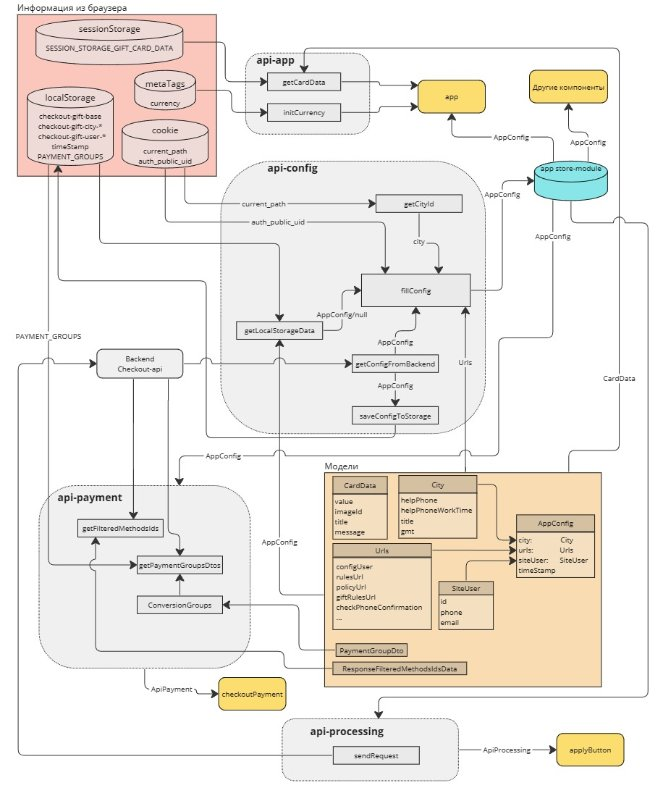
Рисунок В.1 – Схема клиентского API микросервиса оформления электронных подарочных карт
# Приложение Г 
Код модуля api-app

import {SESSION\_STORAGE\_GIFT\_CARD\_DATA} from '@dns-modules/cross-app-constants';
import {GETTER\_APP\_PROCESS\_ID, MUTATION\_APP\_SET\_PROCESS\_ID, GETTER\_APP\_CONFIG,} from '../components/app/store-module/constants';
import CardData from '../components/app/models/card-data';
import {*getCookie*} from '../scripts/cookie-utils';
import store from '../store';
*/\*\*
` `\* Апи компонента оформления подарочной карты.
` `\*
` `\* @author Рындин Андрей <ryindin.aa@dns-shop.ru>
` `\*/*
export default class ApiApp {
`    `*/\*\*
`     `\* Получение информации о подарочной карте из Session storage
`     `\*
`     `\* @author Рындин Андрей <ryindin.aa@dns-shop.ru>
`     `\*/*
`    `public get getCardData(): CardData {
`       `const data: string | null = sessionStorage.getItem(SESSION\_STORAGE\_GIFT\_CARD\_DATA);

`       `if (null === data) {
`          `return new CardData();
`       `}

`       `return JSON.parse(data);
`    `}
`    `*/\*\* Идентификатор процесса оформления. \*/*
`    `public get processId(): string {
`       `return store.getters[GETTER\_APP\_PROCESS\_ID];
`    `}
`    `*/\*\* Конфиг. \*/*
`    `public get config(): any {
`       `return store.getters[GETTER\_APP\_CONFIG];
`    `}
`    `*/\*\*
`     `\* Инициализация валюты и страны.
`     `\*
`     `\* @author Рындин Андрей (ryindin.aa@dns-shop.ru)
`     `\*/*
`    `public async initCurrency() {
`       `const meta = <HTMLMetaElement>document.querySelector('meta[name="currency"]');
`       `if (undefined !== process.env.LOCAL\_CURRENCY) { meta.content = process.env.LOCAL\_CURRENCY;}
`    `}
`    `*/\*\*
`     `\* Генерация идентификатора процесса оформления.
`     `\*
`     `\* @return {string}
`     `\*
`     `\* @return {boolean}
`     `\*
`     `\* @author Текутьев Андрей (tekutev.aa@dns-shop.ru)
`     `\*/*
`    `public generateProcessId(): boolean {
`       `const md5 = require('md5');
`       `const {v5: uuidv5} = require('uuid');
`       `store.commit(MUTATION\_APP\_SET\_PROCESS\_ID,
`          `uuidv5(md5(JSON.stringify(this.getCardData) + *String*(*getCookie*('auth\_public\_uid'))), '00000000-0000-0000-0000-000000000000'),
`       `);
`       `return true;
`    `}
`    `*/\*\*
`     `\* Установка идентификатора процесса оформления.
`     `\*
`     `\* @return {Promise<string>}
`     `\*
`     `\* @author Текутьев Андрей (tekutev.aa@dns-shop.ru)
`     `\*/*
`    `public async initProcess() {
`       `const processId = this.processId;

`       `const form = new *FormData*();
`       `form.append('processId', processId);
`       `form.append('userId', '');

`       `*fetch*(this.config.urls.initProcessUrl, {method:'POST',body:form,cache:'no-cache',credentials:'include',mode:'cors',redirect:'follow',referrer: 'no-referrer',})
.then((response) => {return response.json();})
.then((data) => {
`             `if (null === data || true !== data.data) {
`                `throw new *Error*();
`             `}
`          `}).catch(() => { });
`    `}
`    `*/\*\*
`     `\* Инициализация куки сессии оформления.
`     `\*
`     `\* @return {string}
`     `\*
`     `\* @author Текутьев Андрей (tekutev.aa@dns-shop.ru)
`     `\*/*
`    `public initSessionCookie() {
`       `const cookieName = 'dPiek4cae72\_t31';
`       `const currentId = *getCookie*(cookieName);
`       `if (null === currentId) {
`          `const {v4: uuidv4} = require('uuid');
`          `const date = new Date();*
`          `date.setDate(date.getDate() + 1);
`          `document.cookie = cookieName + '=' + uuidv4() + ';expires=' + date.toUTCString()
`          `+ ';path=/;domain=' + ('.' + window.location.hostname.split('www.').pop()) + ';';
`       `}
`    `}
`    `*/\*\*
`     `\* Находим и отменяем ранее брошенный заказ.
`     `\*
`     `\* @author Текутьев Андрей (tekutev.aa@dns-shop.ru)
`     `\*/*
`    `public cancelAbandonedOrder() {
`       `return *fetch*(this.config.urls.cancelAbandonedOrderUrl, {cache: 'no-cache', credentials: 'include', method: 'GET', mode: 'cors', redirect:'follow',referrer:'no-referrer',});
`    `}
}
# Приложение Д
Код модуля api-config

import AppConfig from '../config/app-config';

import {getCookie} from '../scripts/cookie-utils';

import Currency from '@dns-modules/currency';

import {urls} from '../config/url-config';

/\*\*

` `\* Апи получения конфигурации чекаута ЭПК.

` `\*

` `\* @author Рындин Андрей (ryindin.aa@dns-shop.ru)

` `\*/

export default class ApiConfig {

`	`/\*\*

`	 `\* Наполнение конфига.

`	 `\*

`	 `\* @return {Promise<AppConfig>}

`	 `\*

`	 `\* @author Рындин Андрей (ryindin.aa@dns-shop.ru)

`	 `\*/

`	`protected async fillConfig(): Promise<AppConfig> {

`		`const cityId                = await this.getCityId();

`		`const authPublicUid = String(getCookie('auth\_public\_uid'));

`		`const storageData    = this.getLocalStorageData(cityId, authPublicUid);

`		`const timeStamp       = (null !== storageData ? storageData.timeStamp : 0);

`		`let url = urls.getConfigUrl + '?city=' + cityId;

`		`if ('т' === Currency.symbol) { // КЗ

`			`url = url.replace('.ru/', '.kz/');

`		`}

`		`// Если в localStorage есть данные не старше суток, то возвращаем

`		`if (null !== storageData && 86400 > (Date.now() - timeStamp) / 1000) {

`			`// Если в localStorage есть данные старше 10 минут, то делаем запрос на апи и обновляем localStore

`			`if (600 < (Date.now() - timeStamp) / 1000) {

`				`this.getConfigFromBackend(url + '&lazy')

.then((data) => {

`						`if (null !== data) {

`							`this.saveConfigToStorage(data, cityId, authPublicUid);

`						`}

`					`})

.catch(() => {});

`			`}

`			`// -- -- --

`			`return storageData;

`		`}

`		`// -- -- --

`		`// Запрашиваем конфиг через апи, записываем в localStore и возвращаем

`		`return this.getConfigFromBackend(url)

.then((data) => {

`				`if (null !== data) {

`					`return this.saveConfigToStorage(data, cityId, authPublicUid);

`				`}

`				`// Если в localStorage есть более старые данные, то возвращаем

`				`if (null !== storageData) {

`					`return storageData;

`				`}

`				`throw new Error();

`			`});

`	`}

`	`/\*\*

`	 `\* Получение идентификатора города

`	 `\*

`	 `\* @return {Promise<string>}

`	 `\*

`	 `\* @author Рындин Андрей (ryindin.aa@dns-shop.ru)

`	 `\*/

`	`private async getCityId(): Promise<string> {

`		`const cookieValue      = decodeURIComponent(String(getCookie('current\_path')));

`		`const objectFromCookie = ('null' === cookieValue

`			`? null

`			`: JSON.parse(cookieValue.slice(cookieValue.indexOf('"{"') + 1, cookieValue.indexOf('"}"') + 2))

`		`);

`		`// Возвращаем хардкодом город, если куков нет

`		`if (null === objectFromCookie || objectFromCookie.city === undefined) {

`			`return '30b7c1ea-03fb-11dc-95ee-00151716f9f5'; //Владивосток

`		`}

`		`return objectFromCookie.city;

`	`}

`	`/\*\*

`	 `\* Получение данных конфигурации с бэкенда.

`	 `\*

`	 `\* @param {string} url    Урл запроса конфига.

`	 `\*

`	 `\* @return {Promise<any>}

`	 `\*

`	 `\* @author Рындин Андрей (ryindin.aa@dns-shop.ru)

`	 `\*/

`	`protected async getConfigFromBackend(url: string): Promise<any> {

`		`const controller = new AbortController();

`		`setTimeout(() => controller.abort(), 10000);

`		`return await fetch(url, {

`			`cache:    'no-cache',

`			`method:   'GET',

`			`referrer: 'no-referrer',

`			`signal:   controller.signal,

`		`})

.then((response) => response.json())

.then((response) => {

`				`return response.data;

`			`})

.catch(() => {

`				`return null;

`			`});

`	`}

`	`/\*\*

`	 `\* Получение данных из localStorage.

`	 `\*

`	 `\* @param {string} cityId Идентификатор города.

`	 `\* @param {string} authPublicUid Публичный идентификатор авторизованного пользователя из куки.

`	 `\*

`	 `\* @return {AppConfig|null}

`	 `\*

`	 `\* @author Рындин Андрей (ryindin.aa@dns-shop.ru)

`	 `\*/

`	`private getLocalStorageData(cityId: string, authPublicUid: string): AppConfig | null {

`		`const storageBase = JSON.parse(localStorage.getItem('checkout-gift-base') || 'null');

`		`const storageCity = JSON.parse(localStorage.getItem('checkout-gift-city-' + cityId) || 'null');

`		`const storageUser = JSON.parse(localStorage.getItem('checkout-gift-user-' + authPublicUid) || 'null');

`		`// -- Если в localStorage есть все данные, то возвращаем

`		`if (null !== storageBase && null !== storageCity && null !== storageUser) {

`			`const config       = new AppConfig();

`			`config.urls        = storageBase.urls;

`			`config.city        = storageCity.city;

`			`config.siteUser    = storageUser.siteUser;

`			`config.timeStamp   = Math.min(storageBase.timeStamp, storageCity.timeStamp);

`			`return config;

`		`}

`		`return null;

`	`}

/\*\*

`	 `\* Запись конфига в localStorage.

`	 `\*

`	 `\* @param {any}    data   Результат запроса.

`	 `\* @param {string} cityId Идентификатор города.

`	 `\* @param {string} authPublicUid Публичный идентификатор авторизованного пользователя из куки.

`	 `\*

`	 `\* @return {AppConfig}

`	 `\*

`	 `\* @author Рындин Андрей (ryindin.aa@dns-shop.ru)

`	 `\*/

`	`protected saveConfigToStorage(data: any, cityId: string, authPublicUid: string): AppConfig {

`		`const config = new AppConfig();

`		`config.urls             = data.urls;

`		`config.city             = data.city;

`		`config.siteUser         = data.siteUser;

`		`config.timeStamp        = Date.now();

`		`localStorage.setItem('checkout-gift-base', JSON.stringify({'urls': config.urls, 'timeStamp': Date.now()}));

`		`localStorage.setItem('checkout-gift-city-' + cityId, JSON.stringify({'city': config.city, 'timeStamp': Date.now()}));

`		`localStorage.setItem('checkout-gift-user-' + authPublicUid, JSON.stringify({'user': config.siteUser, 'timeStamp': Date.now()}));

`		`return config;

`	`}

}

73
# Приложение Е
Код модуля api-payment

import ApiVueCheckoutInterface from '@dns-modules/vue-checkout-payment/api/api-interface';

import PaymentGroupDto from '@dns-modules/vue-checkout-payment/models/payment-group-dto';

import PaymentGroupResctrictions from '@dns-modules/vue-checkout-payment/models/payment-group-restrictions';

import PaymentGroupMethodDto from '@dns-modules/vue-checkout-payment/models/payment-group-method-dto';

import ResponseFilteredMethodsIdsData from '@dns-modules/vue-checkout-payment/models/response-filtered-methods-ids-data';

// @ts-ignore

import bbcode from 'bbcodejs';

import store from "../store";

import {GETTER\_APP\_CONFIG} from "../components/app/store-module/constants";

/\*\*

` `\* Апи компонента оплаты.

` `\*

` `\* @author Рындин Андрей (ryindin.aa@dns-shop.ru)

` `\*/

export default class ApiPayment implements ApiVueCheckoutInterface {

`	`public get config(): any {

`		`return store.getters[GETTER\_APP\_CONFIG];

`	`}

`	`/\*\*

`	 `\* @inheritdoc

`	 `\*

`	 `\* @author Рындин Андрей <ryindin.aa@dns-shop.ru>

`	 `\*/

`	`public getGroups(): Promise<PaymentGroupDto[]> {

`		`return this.getPaymentGroupsDtos();

`	`}

`	`/\*\* Идентификаторы дефолтных методов оплаты. \*/

`	`private get defaultMethodsIds(): string[] {

`		`return [

`			`"bd2115b7-ed76-45e4-9f81-289c93185f05", //СБП

`			`"01083b5b-4661-4fd3-8f45-77ed33c17bf2", //SberPay

`			`"abdcf767-6e74-4f1f-a443-7f44b281b431", //Банковская карта

`		`];

`	`}

`	`/\*\*

`	 `\* @inheritdoc

`	 `\*

`	 `\* @author Рындин Андрей <ryindin.aa@dns-shop.ru>

`	 `\*/

`	`public async getFilteredMethodsIds(): Promise<ResponseFilteredMethodsIdsData> {

`		`const controller = new AbortController();

`		`setTimeout(() => controller.abort(), 10000);

`		`return fetch(this.config.urls.getPaymentMethods, {

`			`cache:    'no-cache',

`			`method:   'POST',

`			`referrer: 'no-referrer',

`			`signal:   controller.signal,

`		`})

.then((response) => response.json())

.then((response) => {

`				`if (null === response.data) {

`					`throw new Error();

`				`}

`				`const data                   = response.data;

`				`const filteredMethodsIdsData = new ResponseFilteredMethodsIdsData();

`				`filteredMethodsIdsData.methodsIds = Object.values(data);

`				`filteredMethodsIdsData.restrictionsIds = [];

`				`return filteredMethodsIdsData;

`			`})

.catch(() => {

`				`const filteredMethodsIdsData           = new ResponseFilteredMethodsIdsData();

`				`filteredMethodsIdsData.methodsIds      = this.defaultMethodsIds;

`				`filteredMethodsIdsData.restrictionsIds = [];

`				`return filteredMethodsIdsData;

`			`});

`	`}

`	`/\*\*

`	 `\* @inheritdoc

`	 `\*

`	 `\* @author Рындин Андрей <ryindin.aa@dns-shop.ru>

`	 `\*/

`	`afterChangeCurrentMethod(PaymentGroups: PaymentGroupDto[]): PaymentGroupDto[] {

`		`return PaymentGroups;

`	`}

`	`/\*\*

`	 `\* @inheritdoc

`	 `\*

`	 `\* @author Рындин Андрей <ryindin.aa@dns-shop.ru>

`	 `\*/

`	`useSliderStyle(): boolean {

`		`return true;

`	`}

`	`/\*\*

`	 `\* Получить группы методов оплаты.

`	 `\*

`	 `\* @return Promise<PaymentGroupDto[]>

`	 `\*

`	 `\* @author Рындин Андрей <ryindin.aa@dns-shop.ru>

`	 `\*/

`	`private async getPaymentGroupsDtos(): Promise<PaymentGroupDto[]> {

`			`// даем отдельный ключ хранилищу чтобы интрфейсы у компонента оплаты чекаута и нового компонента оплаты разные Leonov Vladimir <leonov.vv2@dns-shop.ru>

`			`const key = 'PAYMENT\_GROUPS';

`			`// -- Если в локальном хранилище есть данные не старше суток, то возвращаем

`			`const storageData = JSON.parse(localStorage.getItem(key) || 'null');

`			`if (null !== storageData) {

`				`const timestamp = storageData.timestamp;

`				`const groups = storageData.groups;

`				`if (3600 > (Date.now() - timestamp) / 1000) { 

`					`return new Promise((resolve) => resolve(groups));

`				`}

`			`}

`			`const controller = new AbortController();

`			`setTimeout(() => controller.abort(), 10000);

`			`// @ts-ignore

`			`return fetch(this.config.urls.getPaymentGroups, {

`				`cache: 'no-cache',

`				`credentials: 'include',

`				`method: 'GET',

`				`redirect: 'follow',

`				`referrer: 'no-referrer',

`				`signal: controller.signal,

`			`})

.then((response) => response.json())

.then((response) => {

`					`if (0 !== response.data.length) {

`						`const groups = this.conversionGroups(response.data.paymentMethodGroups);

`						`// -- Записываем данные в localStorage

`						`const storageData = {

`							`timestamp: Date.now(),

`							`groups,

`						`};

`						`localStorage.setItem(key, JSON.stringify(storageData));

`						`return groups;

`					`}

`					`if (null !== storageData) {

`						`const groups = storageData.groups;

`						`return new Promise((resolve) => resolve(groups));

`					`}

`					`return false;

`				`})

.catch(() => {

`					`if (null !== storageData) {

`						`const groups = storageData.groups;

`						`return new Promise((resolve) => resolve(groups));

`					`}

`					`return false;

`				`});

`	`}

`	`/\*\*

`	 `\* Конвертирование данных групп оплаты.

`	 `\*

`	 `\* @param {Array} paymentGroups группы оплаты.

`	 `\*

`	 `\* @return PaymentGroupDto[]

`	 `\*

`	 `\* @author Рындин Андрей <ryindin.aa@dns-shop.ru>

`	 `\*/

`	`private conversionGroups(paymentGroups: []): PaymentGroupDto[] {

`		`const groups: PaymentGroupDto[] = [];

`		`const parser = new bbcode.Parser();

`		`paymentGroups.forEach((groupSrc: any) => {

`			`const group = new PaymentGroupDto();

`			`group.groupId = groupSrc.groupId;

`			`group.title = groupSrc.title;

`			`group.restrictions = [];

`			`group.methods = [];

`			`for (const [id, description] of Object.entries(groupSrc.restrictions)) {

`				`const restriction = new PaymentGroupResctrictions();

`				`restriction.id = Number(id);

`				`restriction.description = String(description);

`				`group.restrictions.push(restriction);

`			`}

`			`groupSrc.methods.forEach((methodSrc: any) => {

`				`const method          = new PaymentGroupMethodDto();

`				`method.id             = methodSrc.methodId;

`				`method.title          = methodSrc.title;

`				`method.description    = parser.toHTML(methodSrc.hint);

`				`method.image          = methodSrc.image;

`				`method.discountAmount = 0;

`				`group.methods.push(method);

`			`});

`			`groups.push(group);

`		`});

`		`return groups;

`	`}

}

# Приложение Ж 
Пример описания метода для Swagger

`	`/\*\*

`	 `\* Получить идентефикаторы методов оплаты для ЭПК(опубликованные онлайн методы оплаты).

`	 `\*

`	 `\* @return string[]

`	 `\*

`	 `\* @OA\Get(

`	 `\*     path="/v1/get-payment-methods-ids-for-gift-cards",

`	 `\*     summary="Получить идентефикаторы методов оплаты для ЭПК(опубликованные онлайн методы оплаты).",

`	 `\*     tags={"Методы работы с заказами"},

`	 `\*     @OA\Response(

`	 `\*         response=200,

`	 `\*         description="OK",

`	 `\*         @OA\JsonContent(

`	 `\*             allOf={

`	 `\*                 @OA\Schema(ref="#/components/schemas/Response"),

`	 `\*                 @OA\Schema(

`	 `\*                     @OA\Property(property="data", type="string")

`	 `\*                 )

`	 `\*             }

`	 `\*         )

`	 `\*     ),

`	 `\*     @OA\Response(

`	 `\*         response=500,

`	 `\*         description="Ошибка сервера",

`	 `\*         @OA\JsonContent(

`	 `\*             oneOf={

`	 `\*                 @OA\Schema(example={{"message": "string", "data": "null"}})

`	 `\*             }

`	 `\*         )

`	 `\*     ),

`	 `\*     @OA\Response(

`	 `\*         response="default",

`	 `\*         description="Ответ",

`	 `\*         @OA\JsonContent(

`	 `\*             oneOf={

`	 `\*                 @OA\Schema(ref="#/components/schemas/Response"),

`	 `\*                 @OA\Schema(type="boolean")

`	 `\*             }

`	 `\*         )

`	 `\*     )

`	 `\* )

`	 `\*

`	 `\*

`	 `\* @author Рындин Андрей (ryindin.aa@dns-shop.ru)

`	 `\*/

`	`public function getPaymentMethodsIdsForGiftCards(): array {

`	`…

# Приложение** З

Рисунок З.1 – Основной блок страницы оформления подарочных карт в старом виде

# Приложение И 
Код компонента checkout-payment

checkout-payment.vue

<template>
`  `

`   `<base-step-label
`    `:number="stepNumber"
`    `:title="LANG\_ВЫБЕРИТЕ\_СПОСОБ\_ОПЛАТЫ"
`   `></base-step-label>
`   `<base-step-left-line>
`    `<vue-checkout-payment :class="$style['checkout-payment\_\_vue-checkout-payment']"/>
`   `</base-step-left-line>
`  `

</template>

checkout-payment.module.scss

.checkout-payment {

`    `&\_\_payment-warning {
`       `margin-left:   41px;
`       `background:    #fdf7da;
`       `padding:       20px;
`       `margin-bottom: 28px;
`       `border-radius: 8px;
`    `}
}

@media (min-width: 320px) and (max-width: 767px) {*//xs*
.checkout-payment {
`       `margin: 0 10px;
`       `&\_\_step-label {
`          `padding-left: 10px;
`       `}

`       `&\_\_payment-warning {
`          `margin:  0 10px;
`          `padding: 20px;
`       `}

`       `&\_\_vue-checkout-payment {
`          `padding-left:  10px;
`          `padding-right: 10px;
`       `}
`    `}
}

models/PaymentMethodDto.ts

*/\*\*
` `\* Модель данных метода оплаты.
` `\*
` `\* @author Рындин Андрей (ryindin.aa@dns-shop.ru)
` `\*/*
export default class PaymentMethodDto {

`    `*/\*\* Идентификатор метода. \*/*
`    `public id: string;

`    `*/\*\* Название метода. \*/*
`    `public title: string;
}

# Приложение Й 
Код маски ввода даты

import MaskInterface from '@dns-modules/base-ui-input-row/mask-interface';
import MaskResult from '@dns-modules/base-ui-input-row/mask-result';

*/\*\*
` `\* Маска ввода даты отложенной отправки ЭПК.
` `\*
` `\* @author Рындин Андрей (ryindin.aa@dns-shop.ru)
` `\*/*
export default class DateMask implements MaskInterface {

`    `protected readonly MASK\_TEMPLATE: string = 'дд.мм.гг';

`    `*/\*\*
`     `\* @inheritdoc
`     `\*
`     `\* @author Рындин Андрей (ryindin.aa@dns-shop.ru)
`     `\*/*
`    `public mask(value: string): MaskResult {
`       `const result = new MaskResult();
`       `let copyValue = value.substring(0, 8);

`       `if ('' === copyValue) {
`          `result.value       = copyValue;
`          `result.placeholder = this.MASK\_TEMPLATE;

`          `return result;
`       `}
`       `const dateValue = copyValue.replace(/[^0-9]/g, '');

`       `*// -- Замена даты по маске*
`       `let charIndex = 0;
`       `copyValue = this.MASK\_TEMPLATE.replace(/[дмг]/g, () => {
`          `return dateValue.charAt(charIndex++);
`       `});
`       `*// -- -- -- --

`       `// -- Определяем длину заполненной даты*
`       `let maskedDateLength = 1; *// Минимальная длина*
`       `if (0 !== dateValue.length) {
`          `maskedDateLength = copyValue.lastIndexOf(dateValue.substr(-1)) + 1;
`       `}
`       `*// -- -- -- --

`       `// Обрезаем незаполненную часть строки*
`       `result.value = copyValue.substr(0, maskedDateLength);
`       `*// -- -- --

`       `// Обрезаем заполненную часть плейсхолдера*
`       `result.placeholder = '' + this.MASK\_TEMPLATE.substr(0, maskedDateLength) + '' + this.MASK\_TEMPLATE.substr(maskedDateLength);
`       `*// -- -- --*

`       `return result;
`    `}

`    `*/\*\*
`     `\* @inheritdoc
`     `\*
`     `\* @author Рындин Андрей (ryindin.aa@dns-shop.ru)
`     `\*/*
`    `public clear(value: string): string {
`       `return value;
`    `}

`    `*/\*\*
`     `\* @inheritdoc
`     `\*
`     `\* @author Рындин Андрей (ryindin.aa@dns-shop.ru)
`     `\*/*
`    `public isEmpty(value: string): boolean {
`       `return ('' === value);
`    `}
}

# Приложение К 
Код шаблона выбора даты отправки

<Transition
`  `:enter-from-class="$style['checkout-getting\_\_calendar-wrap\_enter-from']"
`  `:enter-active-class="$style['checkout-getting\_\_calendar-wrap\_enter-active']"
`  `:leave-active-class="$style['checkout-getting\_\_calendar-wrap\_leave-active']"
`  `:leave-to-class="$style['checkout-getting\_\_calendar-wrap\_leave-to']"
\>
`  `

`   `

`    `<base-input-row-validation
`     `:key="dateKey"
`     `:class="$style['checkout-getting\_\_calendar-wrap-date\_\_input']"
`     `:label="LANG\_ДАТА\_ОТПРАВКИ"
`     `:value="formatedDelayedSendDate"
`     `:mask="dateMask"
`     `:validators="delayedDateValidators"
`     `:validateOnBlur="true"
`     `:validateOnInput="true"
`     `:validateOnMount="('' !== delayedSendDate)"
`     `:validate-now="true"
`     `@validated="afterValidateDateHandler"
`    `/>
`    `
`    `

`     `<base-date-time-picker
`      `:show="calendarIsShown"
`      `@picker:open="*stop*"
`      `@picker:close="pickerCloseHandler"
`      `@date:checked="afterValidateDateHandler"
`      `@mousedown="pickerClickHandler"
`     `/>
`    `

`   `

`   `<base-input-row-validation
`    `:class="$style['checkout-getting\_\_calendar-wrap-time\_\_time-input']"
`    `:label="LANG\_ВРЕМЯ"
`    `:value="delayedSendTime"
`    `:mask="timeMask"
`    `:validators="delayedTimeValidators"
`    `:validateOnBlur="true"
`    `:validateOnInput="true"
`    `:validateOnMount="('' !== delayedSendTime)"
`    `@validated="afterValidateTimeHandler"
`   `/>
`  `

</Transition>
# Приложение** Л
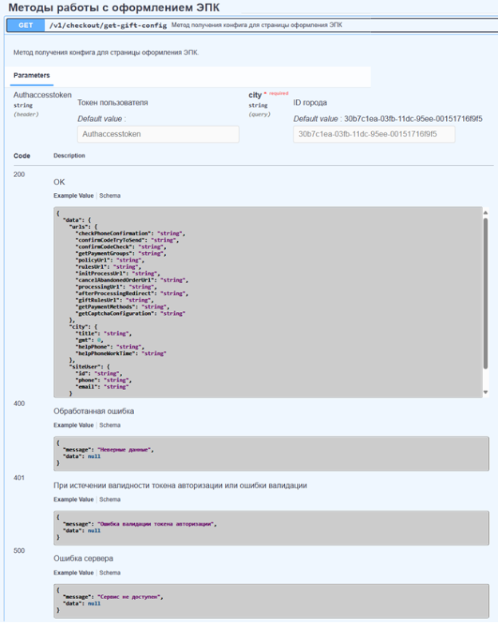
Рисунок К.1 – Описание метода get-gift-config в Swagger

# Приложение М 
Код метода get-gift-config приложения checkout-api

public function getGiftConfig(): ResponseGetGiftConfig {
`    `$cityId = Yii::*$app*->request->get(static::*REQUEST\_PARAM\_CITY*);

`    `if (false === GuidValidator::*isValid*($cityId)) {
`       `throw new ProcessedException('Неверный параметр города');
`    `}

`    `$response = new ResponseGetGiftConfig();

`    `*// -- Пользователь*
`    `$authComponent = new AuthComponent();
`    `$userGuid      = ($authComponent->isAuth() ? $authComponent->getUserId() : null);

`    `$responseUser = new ResponseGetGiftConfigUser();

`    `if (null !== $userGuid) {
`       `$userDto = (new GiftUserProvider())->getUser($userGuid);

`       `$responseUser->id    = $userDto->id;
`       `$responseUser->phone = $userDto->phone;
`       `$responseUser->email = $userDto->email;
`    `}

`    `$response->siteUser = $responseUser;
`    `*// -- -- -- --

`    `// -- Город*
`    `$cityDto = (new GiftCityProvider())->getCityInfo($cityId);

`    `$responseCity = new ResponseGetGiftConfigCity();

`    `$responseCity->title             = $cityDto->title;
`    `$responseCity->gmt               = $cityDto->gmt;
`    `$responseCity->helpPhone         = $cityDto->helpPhone;
`    `$responseCity->helpPhoneWorkTime = $cityDto->helpPhoneWorkTime;

`    `$response->city = $responseCity;
`    `*// -- -- -- --

`    `// -- Ссылки*
`    `$urlsDto = (new GiftUrlsProvider())->getUrls();

`    `$responseUrls                          = new ResponseGetGiftConfigUrls();
`    `$responseUrls->processingUrl           = $urlsDto->processingUrl;
`    `$responseUrls->afterProcessingRedirect = $urlsDto->afterProcessingRedirect;
`    `$responseUrls->getPaymentGroups        = $urlsDto->getPaymentGroups;
`    `$responseUrls->checkPhoneConfirmation  = $urlsDto->checkPhoneConfirmation;
`    `$responseUrls->confirmCodeTryToSend    = $urlsDto->confirmCodeTryToSend;
`    `$responseUrls->confirmCodeCheck        = $urlsDto->confirmCodeCheck;
`    `$responseUrls->policyUrl               = $urlsDto->policyUrl;
`    `$responseUrls->rulesUrl                = $urlsDto->rulesUrl;
`    `$responseUrls->giftRulesUrl            = $urlsDto->giftRulesUrl;
`    `$responseUrls->getPaymentMethods       = $urlsDto->getPaymentMethods;
`    `$responseUrls->getCaptchaConfiguration = $urlsDto->getCaptchaConfiguration;
`    `$responseUrls->initProcessUrl          = $urlsDto->initProcessUrl;
`    `$responseUrls->cancelAbandonedOrderUrl = $urlsDto->cancelAbandonedOrderUrl;

`    `$response->urls = $responseUrls;
`    `*// -- -- -- --*

`    `return $response;
}

public const *ACTION\_GET\_GIFT\_CONFIG* = 'getGiftConfig';

